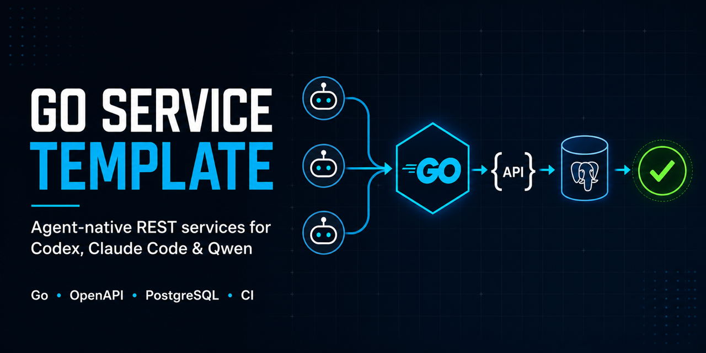
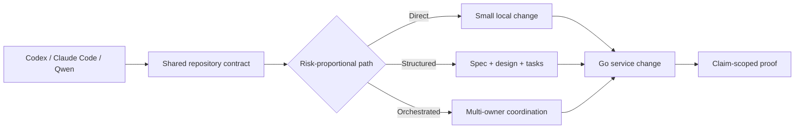
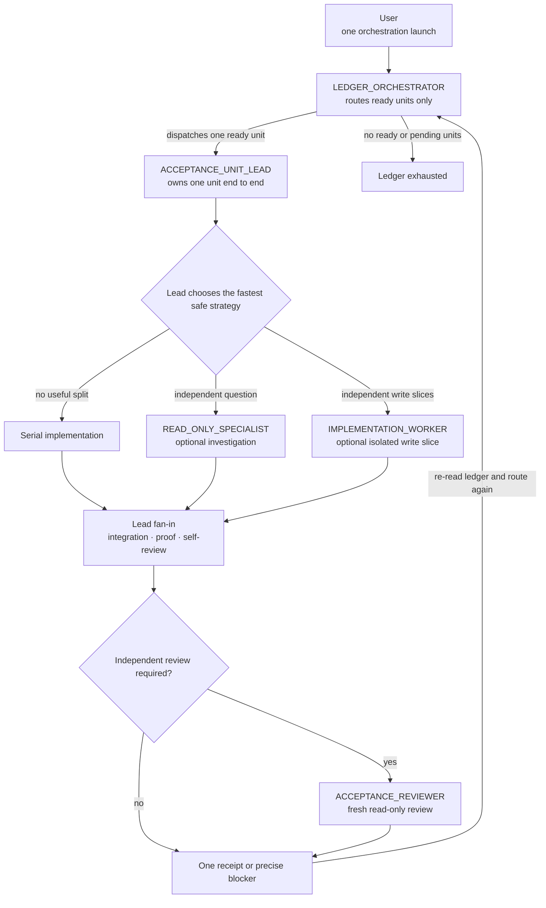

<p align="center">
  
</p>

<h1 align="center">Go REST API &amp; Microservice Template</h1>

<p align="center">
  An OpenAPI-first Go service template with safe runtime defaults, optional PostgreSQL and agent-workflow profiles, observability, and CI.
</p>

<p align="center">
  <a href="https://github.com/Dankosik/go-service-template-rest/actions/workflows/ci.yml"></a>
  <a href="https://github.com/Dankosik/go-service-template-rest/actions/workflows/nightly.yml"></a>
  <a href="https://scorecard.dev/viewer/?uri=github.com/Dankosik/go-service-template-rest"></a>
  <a href="go.mod"></a>
  <a href="LICENSE"></a>
</p>

<p align="center">
  <a href="https://github.com/new?template_owner=Dankosik&template_name=go-service-template-rest"><strong>Use this template</strong></a>
  ·
  <a href="#quickstart">Quickstart</a>
  ·
  <a href="#documentation">Documentation</a>
</p>

## Quickstart

Create a repository from the template and start the service:

```bash
gh repo create my-service \
  --template Dankosik/go-service-template-rest \
  --public \
  --clone

cd my-service
make template-init \
  MODULE=github.com/your-org/my-service \
  CODEOWNER=@your-org/backend \
  DATABASE=none \
  OUTBOX=none \
  INBOX=none \
  GRPC=none \
  AUTHN=none \
  OUTBOUND_HTTP=none \
  MESSAGING=none
make check
make run
```

The defaults create a service with no database dependency. The complete agent
workflow is always retained. Choose `DATABASE=postgres` when the service owns
PostgreSQL, and choose `OUTBOUND_HTTP=bounded` only when a shared
fixed-authority client removes repeated provider code.
<!-- profile:object-storage:start -->
Choose `OBJECT_STORAGE=s3` only when this service needs the S3-compatible
capability. It requires a complete static tuple supplied by deployment and
does not certify a provider or configure a bucket; see
[S3-compatible object storage](docs/s3-compatible-object-storage.md).
<!-- profile:object-storage:end -->
<!-- profile:http-idempotency-postgres:start -->
Choose `HTTP_IDEMPOTENCY=postgres` only with `DATABASE=postgres`. It retains the
reusable PostgreSQL idempotency pack; an adopting operation still owns its
registration and deployment quantities. See [PostgreSQL HTTP idempotency](docs/postgres-http-idempotency.md).
<!-- profile:http-idempotency-postgres:end -->
<!-- profile:outbound-auth-oauth2-client-credentials:start -->
Choose `OUTBOUND_AUTH=oauth2-client-credentials` only with
`OUTBOUND_HTTP=bounded`, `GRPC=enabled`, or both; it retains one fixed machine
credential owner. See [outbound machine authentication](docs/outbound-machine-authentication.md).
<!-- profile:outbound-auth-oauth2-client-credentials:end -->
<!-- profile:outbox-postgres:start -->
Choose `DATABASE=postgres OUTBOX=postgres` when a request transaction must
durably record an outbound event for a separately deployed relay. Publication
is at-least-once, so consumers must tolerate duplicate event IDs; see the
[PostgreSQL transactional outbox](docs/postgres-transactional-outbox.md).
<!-- profile:outbox-postgres:end -->
<!-- profile:inbox-postgres:start -->
Choose `DATABASE=postgres INBOX=postgres` when a consumer must suppress a
logical message duplicate in the same PostgreSQL transaction as its feature
effect; see the [PostgreSQL idempotent inbox](docs/postgres-idempotent-inbox.md).
<!-- profile:inbox-postgres:end -->
<!-- profile:webhooks-durable:start -->
Choose `DATABASE=postgres WEBHOOKS=durable` when a feature transaction must
atomically accept an immutable webhook fan-out for a separately deployed
worker. Receiver processing is at-least-once; see
[outbound webhook delivery](docs/outbound-webhook-delivery.md).
<!-- profile:webhooks-durable:end -->
<!-- profile:authn-oidc-jwt:start -->
Choose `AUTHN=oidc-jwt` for strict OIDC discovery and signed JWT access-token
authentication; see [OIDC/JWT authentication](docs/authentication.md).
<!-- profile:authn-oidc-jwt:end -->
<!-- profile:grpc:start -->
Choose `GRPC=enabled`
when the service publishes or consumes native gRPC; see the
[gRPC guide](docs/grpc.md).
<!-- profile:grpc:end -->
<!-- profile:messaging-nats-jetstream:start -->
Choose `MESSAGING=nats-jetstream` for bounded direct JetStream publishing and a
separate durable pull-consumer worker; see [durable messaging](docs/durable-messaging.md).
Together with `DATABASE=postgres OUTBOX=postgres`, it also composes the outbox
relay's production NATS publisher and stored W3C trace continuity. Outbox
without messaging keeps its fail-closed adapter registration seam.
<!-- profile:messaging-nats-jetstream:end -->

`examples/reference-service` is a worked feature slice kept in this template for
reference; initialization removes it so a generated service does not inherit a
second OpenAPI contract to maintain. Pass `REFERENCE_EXAMPLE=keep` to retain
it, and read it here or in
[first production feature](docs/first-production-feature.md) either way.

## What You Get

| Area | Included |
| --- | --- |
| Service foundation | Go 1.26, `chi v5`, `koanf v2`, graceful shutdown, health and readiness |
| API contract | OpenAPI 3.0 and `oapi-codegen v2` with generated request bindings and typed responses |
| Data | No database by default; optional PostgreSQL 17, `pgx v5`, `goose v3`, and `sqlc` profile |
<!-- profile:outbox-postgres:start -->
| Transactional outbox | Optional PostgreSQL intent store and separately deployed bounded relay; the NATS profile supplies the selected adapter, while outbox-only stays fail-closed |
<!-- profile:outbox-postgres:end -->
<!-- profile:inbox-postgres:start -->
| Idempotent inbox | Optional permanent per-consumer logical-message claims joined to one same-PostgreSQL feature effect |
<!-- profile:inbox-postgres:end -->
<!-- profile:webhooks-durable:start -->
| Outbound webhooks | Optional PostgreSQL acceptance store and independent bounded delivery worker with HMAC signing and public-HTTPS enforcement |
<!-- profile:webhooks-durable:end -->
| Outbound HTTP | Standard library by default; optional fixed-authority transport bounds and response-size protection |
<!-- profile:messaging-nats-jetstream:start -->
| Messaging | Optional direct NATS JetStream producer and separate bounded durable pull-consumer worker |
<!-- profile:messaging-nats-jetstream:end -->
<!-- profile:authn-oidc-jwt:start -->
| Authentication | Optional strict OIDC discovery and RS256 JWT access-token verification for HTTP and native gRPC |
<!-- profile:authn-oidc-jwt:end -->
| Observability | OpenTelemetry 1.x traces and metrics, Prometheus export, and structured logs |
| Testing | Race detection and goroutine leak checks; PostgreSQL Testcontainers coverage in the database profile |
| Delivery | Docker and GitHub Actions security gates; opt-in GHCR publishing with Cosign, CycloneDX, and durable migration-history enforcement |
| Agent workflow | The complete Codex, Claude Code, and Qwen workflow, always retained ([what that costs](#what-the-agent-workflow-costs)) |

<!-- profile:grpc:start -->
The optional native gRPC profile adds gRPC-Go client/server support, Buf v2,
Edition 2023 Opaque messages, all four RPC cardinalities, standard health, and
bounded drain.
<!-- profile:grpc:end -->

Major versions describe the supported stack. [`go.mod`](go.mod) owns runtime
and test dependencies; [`tools/go.mod`](tools/go.mod) owns development tools.

### What the agent workflow costs

Initialization keeps the workflow byte-for-byte; there is no option to decline
it. Be deliberate about that, because a generated service owns all of it:

| Inherited | Size |
| --- | --- |
| `.agents/skills/` | 35 skills, 304 files, ~17,200 lines, 1.7 MB |
| `.codex/agents/`, `.claude/agents/`, `.qwen/agents/` | 18 specialist definitions each |
| `docs/` | 29 files, ~4,600 lines |

Across the repository that is roughly 383 Markdown files and 22,600 lines of
prose against about 27,600 lines of Go. If your team is going to drive changes
through Codex, Claude Code, or Qwen, that content is the point of this template
and the largest thing it gives you. If not, plan to delete it: keep
[`AGENTS.md`](AGENTS.md) and `docs/`, and drop `.agents/`, `.codex/`,
`.claude/`, and `.qwen/`.

`specs/` is not in that table because initialization deletes it. Those bundles
record decisions about building this template, and a generated service that kept
them would be handing its agents authoritative-looking records for a repository
it does not have.

This is a working service scaffold, not only a prompt collection. The code,
generated sources, database lifecycle, CI, and agent instructions share one
ownership model.

## Why This Template

Generic agent prompts often miss the constraints that make a Go service safe
to change: package ownership, `context`, error identity, generated sources,
migrations, partial failure, shutdown, and current proof.

Traditional Go templates provide code and commands but rarely tell an agent
how to make a non-trivial change without inventing architecture or declaring
success from an unrelated test.

This template connects both sides:

- one repository contract instead of a heavyweight prompt in every request;
- direct handling for small changes and durable artifacts only when decisions
  must survive;
- OpenAPI, PostgreSQL, telemetry, tests, security, and delivery already wired;
- completion claims tied to fresh evidence of the same scope.

Before adding the first production feature, use the maintained
[first production feature guide](docs/first-production-feature.md).

## How It Works



The workflow keeps three paths:

- **Direct** — clear, local, reversible work with one owner and bounded proof.
- **Structured** — non-trivial work whose decisions need a `spec.md`,
  `tasks.md`, and only the design or test artifacts that add value.
- **Orchestrated** — broad, multi-owner, hard-to-reverse, or multi-session work.

Public contracts, persisted data, security, money, concurrency, deployment,
and cross-service ownership receive explicit decisions and matching proof
without forcing every task through the heaviest process.

### Autonomous implementation tree

Once Planning has produced a ready implementation ledger, a person launches
orchestration once. The system then runs autonomously until the ledger is
exhausted or it reaches an exact user-owned, external, or unrecoverable native
boundary.



The orchestrator does not implement or review units. Each fresh Lead chooses
whether its unit benefits from parallel leaves, selects the model and reasoning
effort for every direct child from that child's exact work, owns serial fan-in,
and accepts the result. Only positively independent work runs concurrently;
integration and acceptance stay with one owner. A leaf resolves obstacles at
its own level first, then escalates to exactly one parent, so recoverable
problems do not stop the whole ledger.

The detailed contracts live in the [Agent Harness](docs/agent-harness.md), its
[Codex App selection tree](docs/agent-harness.md#codex-app-selection-tree), and
[Implementation Worker Execution](docs/spec-first-workflow/phases/implementation-worker-execution.md).

## Agent Support

| Harness | Entry point | Project-native support |
| --- | --- | --- |
| Codex | `AGENTS.md` | `.codex/agents`, `.agents/skills` |
| Claude Code | `CLAUDE.md` | `.claude/agents`, `.claude/skills` |
| Qwen Code | `QWEN.md` | Shared repository contract and skills |

Representative specialists cover API contracts, architecture, data, domain
invariants, security, reliability, concurrency, observability, performance,
testing, delivery, and Go maintainability. Skills are loaded only when the
current decision or failure needs them.

See [Agent Harness](docs/agent-harness.md) and
[Spec-First Workflow](docs/spec-first-workflow.md) for the complete routing
contract.

## Repository Layout

```text
cmd/service/                     service entrypoint and bootstrap lifecycle
cmd/migrate/                     migration entrypoint (PostgreSQL profile)
internal/<feature>/              feature-owned business behavior (when added)
internal/config/                 runtime configuration
internal/health/                 readiness and drain behavior
internal/infra/http/             HTTP transport and middleware
internal/infra/httpclient/       bounded outbound HTTP transport (optional profile)
internal/infra/postgres/         PostgreSQL adapters (PostgreSQL profile)
api/openapi/service.yaml         API source of truth
internal/openapi/                generated OpenAPI artifacts
examples/reference-service/      worked feature-slice example (upstream only)
migrations/                      SQL migrations (PostgreSQL profile)
specs/                           durable task decisions (upstream only)
.agents/skills/                  reusable skills
.codex/agents/                   Codex specialists
```

<!-- profile:grpc:start -->
With `GRPC=enabled`, `api/proto/` owns protobuf contracts,
`internal/gen/proto/` is generated, `internal/infra/grpc/` owns server policy
and lifecycle, and `internal/infra/grpcclient/` constructs shared bounded
client connections.
<!-- profile:grpc:end -->

Use the [placement guide](docs/project-structure-and-module-organization.md)
before choosing packages or tests.

## Quality Gates

| Command | Purpose |
| --- | --- |
| `make check` | Broad local format, lint, and unit-test baseline |
| `make ci-local` | Native CI aggregate |
| `make check-full` | Native checks plus Docker-backed integration and image gates |
| `BASE_REF=origin/main make pr-check` | Pull-request checks and OpenAPI compatibility |
| `make openapi-check` | OpenAPI generation, drift, runtime, lint, and schema checks |
| `make sqlc-check` | SQL generation drift (PostgreSQL profile) |
| `make migration-check` | Goose source grammar and append-only review history (PostgreSQL profile) |
| `make migration-validate` | Migration rehearsal (PostgreSQL profile) |
| `make test-integration` | Container-backed integration tests when present |
| `make go-security` | Go static security and vulnerability checks |

<!-- profile:grpc:start -->
`make proto-check` owns protobuf format, contract documentation, lint, and
generated-code drift. Repositories retaining proto2/proto3 contracts use
`BASE_REF=origin/main make proto-check` so only paths present with legacy
syntax at that base are accepted; use
`BASE_REF=origin/main make proto-breaking` for compatibility.
<!-- profile:grpc:end -->

Performance work uses the narrowest matching benchmark level. DigitalOcean is
preferred only when `doctl` is already installed and authorized; local
benchmarks remain the supported fallback. See [Benchmarking](docs/benchmarking.md).

## Documentation

- [Repository Architecture](docs/repo-architecture.md)
- [Project Structure and Module Organization](docs/project-structure-and-module-organization.md)
- [Build, Test, and Development Commands](docs/build-test-and-development-commands.md)
- [Spec-First Workflow](docs/spec-first-workflow.md)
- [Agent Harness](docs/agent-harness.md)
- [Benchmarking](docs/benchmarking.md)
- [Railway Deployment Profile](docs/railway-deployment-profile.md)

<!-- profile:authn-oidc-jwt:start -->
For trust configuration, token policy, rotation, local testing, and operational
signals, see [OIDC/JWT Authentication](docs/authentication.md).
<!-- profile:authn-oidc-jwt:end -->

<!-- profile:grpc:start -->
For schema, server, client, streaming, lifecycle, and deployment guidance, see
[Native gRPC](docs/grpc.md).
<!-- profile:grpc:end -->

## Community

Contributions are welcome. Read [CONTRIBUTING.md](CONTRIBUTING.md), use the
issue forms for bugs and feature proposals, and follow the
[Code of Conduct](CODE_OF_CONDUCT.md).

Report vulnerabilities privately through [SECURITY.md](SECURITY.md).

Released under the [MIT License](LICENSE).
