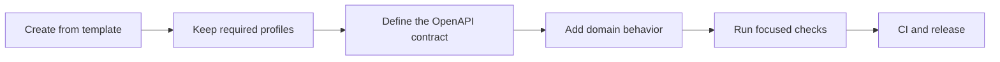

<p align="center">
  
</p>

<h1 align="center">Go REST API &amp; Microservice Template</h1>

<p align="center">
  An OpenAPI-first Go service template with safe runtime defaults, optional PostgreSQL and agent-workflow profiles, observability, and CI.
</p>

<p align="center">
  <a href="https://github.com/Dankosik/go-service-template-rest/actions/workflows/ci.yml"></a>
  <a href="go.mod"></a>
  <a href="LICENSE"></a>
</p>

<p align="center">
  <a href="https://github.com/new?template_owner=Dankosik&template_name=go-service-template-rest"><strong>Use this template</strong></a>
  ·
  <a href="#quickstart">Quickstart</a>
  ·
  <a href="#documentation">Documentation</a>
</p>

## What this repository is

This repository is a starting point for a Go HTTP API or microservice. It
already connects the pieces most services need: an OpenAPI contract,
configuration, health checks, graceful shutdown, telemetry, tests, Docker, CI,
and repository instructions for coding agents.

The initialized service is small by default. It has no database, broker, or
external provider dependency. You select the capabilities the service owns,
and the initializer removes everything else instead of leaving dormant code
behind.

## Why use it

- Start with a runnable service and spend the first commit on domain behavior.
- Keep the API contract, generated bindings, runtime wiring, and checks in one
  repository.
- Add PostgreSQL, jobs, messaging, gRPC, authentication, webhooks, or object
  storage through supported profiles when the service needs them.
- Give people and coding agents the same ownership rules and validation paths.

## Quickstart

Create a repository from the template, initialize its identity, and run it:

```bash
gh repo create my-service \
  --template Dankosik/go-service-template-rest \
  --public \
  --clone

cd my-service
make template-init \
  MODULE=github.com/your-org/my-service \
  CODEOWNER=@your-org/backend
ALLOW_FULL=1 make check
make run
```

This creates the minimal profile. `make template-init` rewrites the module,
service name, and CODEOWNERS; removes unused profiles; regenerates derived
code; and records the selection in `template.lock`.

## What stays in every service

| Area | Included |
| --- | --- |
| HTTP API | OpenAPI 3.0 as the client contract, with generated request bindings and typed responses |
| Runtime | `chi`, layered configuration, health and readiness, graceful shutdown with limits |
| Observability | OpenTelemetry traces and metrics, Prometheus export, structured logs |
| Validation | Focused Go tests, generated-code checks, race and goroutine leak coverage, CI matched to the change |
| Delivery | Dockerfile and GitHub Actions, with optional signed GHCR publication |
| Agent workflow | Shared repository rules and focused instructions, plus the selected tool adapter |

[`go.mod`](go.mod) owns runtime and test dependencies. [`tools/go.mod`](tools/go.mod)
owns the portable development-tool set shared by every derived service.

## Add only what the service needs

Pass profile options to `make template-init`. Unset options use the minimal
`none` or `core` default.

| Need | Option | Adds |
| --- | --- | --- |
| PostgreSQL | `DATABASE=postgres` | `pgx`, Goose migrations, `sqlc`, and database lifecycle |
| Idempotent HTTP effects | `DATABASE=postgres HTTP_IDEMPOTENCY=postgres` | The request effect and idempotency record in one transaction ([guide](docs/postgres-http-idempotency.md)) |
| Background jobs | `DATABASE=postgres JOBS=postgres` | Typed River jobs and a separate worker ([guide](docs/postgres-durable-background-jobs.md)) |
| Outbound webhooks | `DATABASE=postgres JOBS=postgres WEBHOOKS=durable` | Delivery jobs staged in the business transaction ([guide](docs/outbound-webhook-delivery.md)) |
| Inbound webhooks | `DATABASE=postgres JOBS=postgres INBOUND_WEBHOOKS=standard-webhooks` | Durable Standard Webhooks receipt and processing ([guide](docs/inbound-webhook-receipt.md)) |
| NATS events | `MESSAGING=nats-jetstream` | Typed publishing and a separate durable consumer worker ([guide](docs/durable-messaging.md)) |
| Transactional outbox | `DATABASE=postgres OUTBOX=postgres MESSAGING=nats-jetstream` | Transactional event recording and a separate relay ([guide](docs/postgres-transactional-outbox.md)) |
| Native gRPC | `GRPC=enabled` | Generated clients and servers, health checks, streaming, and bounded drain ([guide](docs/grpc.md)) |
| Authentication | `AUTHN=oidc-jwt` or `AUTHN=oidc-introspection` | HTTP and gRPC bearer-token verification ([guide](docs/authentication.md)) |
| Bounded outbound HTTP | `OUTBOUND_HTTP=bounded` | A fixed-authority HTTPS client with mandatory header, decoded-body, and request-concurrency ceilings |
| Machine authentication | `OUTBOUND_AUTH=oauth2-client-credentials` | OAuth 2.0 client-credentials adapters ([guide](docs/outbound-machine-authentication.md)) |
| Object storage | `OBJECT_STORAGE=s3` | An S3-compatible client locked to one configured endpoint ([guide](docs/s3-compatible-object-storage.md)) |
| Worked example | `REFERENCE_EXAMPLE=keep` | A complete feature slice under `examples/reference-service` |

Profiles add code and validation, not infrastructure. Deployment still owns
databases, streams, buckets, endpoints, and credentials. The initializer
rejects unsupported profile combinations before it changes the repository.

## How it works



1. `make template-init` turns the template into one service and removes unused
   code.
2. `api/openapi/service.yaml` owns the HTTP contract. Generated code carries
   requests and responses into handwritten handlers.
3. `internal/<feature>` owns business behavior. Transport, database, and
   provider details stay under `internal/infra`.
4. Package tests give fast feedback. `make prove` is optional package-sized
   iteration; `make verify` is the surface-aware final local route;
   `ALLOW_FULL=1 make check` validates the whole repository before delivery.
5. CI selects its checks from the changed files. Image publication is opt-in
   and happens only after the matching checks pass.

Start the first real vertical slice with the
[first production feature guide](docs/first-production-feature.md).

## Working with coding agents

`AGENTS.md` gives every supported agent the repository rules. `.agents/skills`
contains focused instructions for API contracts, architecture, data, security,
reliability, testing, delivery, and Go maintenance. Small local edits stay
direct. Bigger changes can record decisions under `specs/` so another session
can continue without guessing.

Before handwritten Go edits, agents load version-specific guidance from
[JetBrains Modern Go Guidelines](https://github.com/JetBrains/go-modern-guidelines),
pinned in `tools/go.mod`; focused and pull-request lint enforce `modernize`.

`AGENT_HARNESS=core` keeps the shared contract without a generated adapter.
Pass `codex`, `claude`, `cursor`, `qwen`, `grok`, `opencode`, or `all` to keep
the matching adapter. See [Agent Harness](docs/agent-harness.md) and the
[Spec-First Workflow](docs/spec-first-workflow.md) for the complete routing
rules.

## Repository map

```text
api/openapi/service.yaml    HTTP API source of truth
cmd/service/                service entrypoint and runtime assembly
internal/<feature>/         business behavior
internal/infra/             HTTP, database, messaging, and provider adapters
internal/config/            runtime configuration
migrations/                 PostgreSQL migrations when selected
test/                       cross-package and process integration tests
docs/                       architecture, operations, and development guides
.agents/skills/             reusable methods for coding agents
make/template.mk            portable standard Make commands
make/service.mk             optional service-owned Make extensions
scripts/init-module.sh      profile selection and repository initialization
```

Use the [placement guide](docs/project-structure-and-module-organization.md)
before adding a package. After initialization, `make integration-init`
scaffolds one outbound HTTP or gRPC integration from a committed local
contract; see the [integration initializer](docs/external-integration-initializer.md).

## Everyday commands

| Command | Use it for |
| --- | --- |
| `make run` | Start the HTTP service locally |
| `make prove PKG=./pkg FILES='...'` | Optional package-sized format, test, and lint |
| `make verify` | Run the minimal integrated surface plan |
| `ALLOW_FULL=1 make check` | Run the full-repository aggregate once before delivery |
| `make test-integration` | Run the container-backed integration tests |

Use the narrowest check that can catch a problem in the change. The full command
catalog and routing rules live in
[Build, test, and development commands](docs/build-test-and-development-commands.md)
and [Validation routing](docs/validation-routing.md).

Performance work uses `make benchmark-capture`, `benchmark-compare`, or
`benchmark-http` with an accepted workload, budget, and response owner. See
[Benchmarking](docs/benchmarking.md).

## Documentation

- Build the first feature: [First production feature](docs/first-production-feature.md)
- Understand ownership: [Repository architecture](docs/repo-architecture.md)
- Choose packages: [Project structure and module organization](docs/project-structure-and-module-organization.md)
- Work with agents: [Agent harness](docs/agent-harness.md) and [Spec-first workflow](docs/spec-first-workflow.md)
- Understand CI and releases: [CI/CD production readiness](docs/ci-cd-production-ready.md)
- Measure performance: [Benchmarking](docs/benchmarking.md)
- Deploy on Railway: [Railway deployment profile](docs/railway-deployment-profile.md)

## Community

Contributions are welcome. Read [CONTRIBUTING.md](CONTRIBUTING.md), use the
issue forms for bugs and feature proposals, and follow the
[Code of Conduct](CODE_OF_CONDUCT.md).

Report vulnerabilities privately through [SECURITY.md](SECURITY.md).

Released under the [MIT License](LICENSE).
