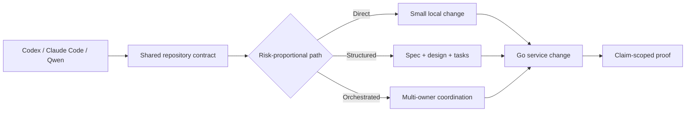

<p align="center">
  
</p>

<h1 align="center">Go REST API &amp; Microservice Template</h1>

<p align="center">
  An OpenAPI-first Go service template with safe runtime defaults, optional PostgreSQL and agent-workflow profiles, observability, and CI.
</p>

<p align="center">
  <a href="https://github.com/Dankosik/go-service-template-rest/actions/workflows/ci.yml"></a>
  <a href="https://github.com/Dankosik/go-service-template-rest/actions/workflows/nightly.yml"></a>
  <a href="https://scorecard.dev/viewer/?uri=github.com/Dankosik/go-service-template-rest"></a>
  <a href="go.mod"></a>
  <a href="LICENSE"></a>
</p>

<p align="center">
  <a href="https://github.com/new?template_owner=Dankosik&template_name=go-service-template-rest"><strong>Use this template</strong></a>
  ·
  <a href="#quickstart">Quickstart</a>
  ·
  <a href="#documentation">Documentation</a>
</p>

## Quickstart

Create a repository from the template and start the service:

```bash
gh repo create my-service \
  --template Dankosik/go-service-template-rest \
  --public \
  --clone

cd my-service
make template-init \
  MODULE=github.com/your-org/my-service \
  CODEOWNER=@your-org/backend \
  DATABASE=none \
  OUTBOUND_HTTP=none
make check
make run
```

The defaults create a service with no database dependency. The complete agent
workflow is always retained. Choose `DATABASE=postgres` when the service owns
PostgreSQL, and choose `OUTBOUND_HTTP=bounded` only when a shared
fixed-authority client removes repeated provider code.

`examples/reference-service` is a worked feature slice kept in this template for
reference; initialization removes it so a generated service does not inherit a
second OpenAPI contract and a second `main()` to maintain. Pass
`REFERENCE_EXAMPLE=keep` to retain it, and read it here or in
[first production feature](docs/first-production-feature.md) either way.

## What You Get

| Area | Included |
| --- | --- |
| Service foundation | Go 1.26, `chi v5`, `koanf v2`, graceful shutdown, health and readiness |
| API contract | OpenAPI 3.0 and `oapi-codegen v2` with generated request bindings and typed responses |
| Data | No database by default; optional PostgreSQL 17, `pgx v5`, `golang-migrate v4`, and `sqlc` profile |
| Outbound HTTP | Standard library by default; optional fixed-authority transport bounds and response-size protection |
| Observability | OpenTelemetry 1.x traces and metrics, Prometheus export, and structured logs |
| Testing | Race detection and goroutine leak checks; PostgreSQL Testcontainers coverage in the database profile |
| Delivery | Docker and GitHub Actions security gates; opt-in GHCR publishing with Cosign and CycloneDX |
| Agent workflow | Compact service-local rules by default; optional full Codex, Claude Code, and Qwen workflow |

Major versions describe the supported stack. [`go.mod`](go.mod) owns runtime
and test dependencies; [`tools/go.mod`](tools/go.mod) owns development tools.

This is a working service scaffold, not only a prompt collection. The code,
generated sources, database lifecycle, CI, and agent instructions share one
ownership model.

## Why This Template

Generic agent prompts often miss the constraints that make a Go service safe
to change: package ownership, `context`, error identity, generated sources,
migrations, partial failure, shutdown, and current proof.

Traditional Go templates provide code and commands but rarely tell an agent
how to make a non-trivial change without inventing architecture or declaring
success from an unrelated test.

This template connects both sides:

- one repository contract instead of a heavyweight prompt in every request;
- direct handling for small changes and durable artifacts only when decisions
  must survive;
- OpenAPI, PostgreSQL, telemetry, tests, security, and delivery already wired;
- completion claims tied to fresh evidence of the same scope.

Before adding the first production feature, use the maintained
[first production feature guide](docs/first-production-feature.md).

## How It Works



The workflow keeps three paths:

- **Direct** — clear, local, reversible work with one owner and bounded proof.
- **Structured** — non-trivial work whose decisions need a `spec.md`,
  `tasks.md`, and only the design or test artifacts that add value.
- **Orchestrated** — broad, multi-owner, hard-to-reverse, or multi-session work.

Public contracts, persisted data, security, money, concurrency, deployment,
and cross-service ownership receive explicit decisions and matching proof
without forcing every task through the heaviest process.

## Agent Support

| Harness | Entry point | Project-native support |
| --- | --- | --- |
| Codex | `AGENTS.md` | `.codex/agents`, `.agents/skills` |
| Claude Code | `CLAUDE.md` | `.claude/agents`, `.claude/skills` |
| Qwen Code | `QWEN.md` | Shared repository contract and skills |

Representative specialists cover API contracts, architecture, data, domain
invariants, security, reliability, concurrency, observability, performance,
testing, delivery, and Go maintainability. Skills are loaded only when the
current decision or failure needs them.

See [Agent Harness](docs/agent-harness.md) and
[Spec-First Workflow](docs/spec-first-workflow.md) for the complete routing
contract.

## Repository Layout

```text
cmd/service/                     service entrypoint and bootstrap lifecycle
cmd/migrate/                     migration entrypoint (PostgreSQL profile)
internal/<feature>/              feature-owned business behavior (when added)
internal/config/                 runtime configuration
internal/health/                 readiness and drain behavior
internal/infra/http/             HTTP transport and middleware
internal/infra/httpclient/       bounded outbound HTTP transport (optional profile)
internal/infra/postgres/         PostgreSQL adapters (PostgreSQL profile)
api/openapi/service.yaml         API source of truth
internal/openapi/                generated OpenAPI artifacts
examples/reference-service/      worked feature-slice example (upstream only)
migrations/                      SQL migrations (when first owned)
specs/                           durable task decisions (full agent profile)
.agents/skills/                  reusable skills (full agent profile)
.codex/agents/                   Codex specialists (full agent profile)
```

Use the [placement guide](docs/project-structure-and-module-organization.md)
before choosing packages or tests.

## Quality Gates

| Command | Purpose |
| --- | --- |
| `make check` | Broad local format, lint, and unit-test baseline |
| `make ci-local` | Native CI aggregate |
| `make check-full` | Native checks plus Docker-backed integration and image gates |
| `BASE_REF=origin/main make pr-check` | Pull-request checks and OpenAPI compatibility |
| `make openapi-check` | OpenAPI generation, drift, runtime, lint, and schema checks |
| `make sqlc-check` | SQL generation drift (PostgreSQL profile) |
| `make migration-validate` | Migration rehearsal (PostgreSQL profile) |
| `make test-integration` | Container-backed integration tests when present |
| `make go-security` | Go static security and vulnerability checks |

Performance work uses the narrowest matching benchmark level. DigitalOcean is
preferred only when `doctl` is already installed and authorized; local
benchmarks remain the supported fallback. See [Benchmarking](docs/benchmarking.md).

## Documentation

- [Repository Architecture](docs/repo-architecture.md)
- [Project Structure and Module Organization](docs/project-structure-and-module-organization.md)
- [Build, Test, and Development Commands](docs/build-test-and-development-commands.md)
- [Spec-First Workflow](docs/spec-first-workflow.md)
- [Agent Harness](docs/agent-harness.md)
- [Benchmarking](docs/benchmarking.md)
- [Railway Deployment Profile](docs/railway-deployment-profile.md)

## Community

Contributions are welcome. Read [CONTRIBUTING.md](CONTRIBUTING.md), use the
issue forms for bugs and feature proposals, and follow the
[Code of Conduct](CODE_OF_CONDUCT.md).

Report vulnerabilities privately through [SECURITY.md](SECURITY.md).

Released under the [MIT License](LICENSE).
