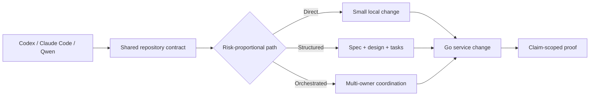

<p align="center">
  
</p>

<h1 align="center">Go REST API &amp; Microservice Template</h1>

<p align="center">
  An AI-native Golang backend boilerplate for developers and coding agents, with OpenAPI-first HTTP, PostgreSQL, sqlc, observability, and CI.
</p>

<p align="center">
  <a href="https://github.com/Dankosik/go-service-template-rest/actions/workflows/ci.yml"></a>
  <a href="go.mod"></a>
  <a href="LICENSE"></a>
</p>

<p align="center">
  <a href="https://github.com/new?template_owner=Dankosik&template_name=go-service-template-rest"><strong>Use this template</strong></a>
  ·
  <a href="#quickstart">Quickstart</a>
  ·
  <a href="#documentation">Documentation</a>
</p>

## Quickstart

Create a repository from the template and start the service:

```bash
gh repo create my-service \
  --template Dankosik/go-service-template-rest \
  --public \
  --clone

cd my-service
make template-init \
  MODULE=github.com/your-org/my-service \
  CODEOWNER=@your-org/backend
make check
make run
```

Developers and coding agents can start immediately: Codex reads `AGENTS.md`,
Claude Code reads `CLAUDE.md`, and Qwen Code reads `QWEN.md`. All three use the
same repository rules, specialist agents, and reusable skills.

## What You Get

| Area | Included |
| --- | --- |
| Service foundation | Go 1.26, `chi`, configuration, graceful shutdown, health and readiness |
| API | OpenAPI-first HTTP with validation and generated server types |
| Data | PostgreSQL 17, `pgx/v5`, migrations, and `sqlc` ownership |
| Operations | Prometheus metrics, OpenTelemetry tracing, structured logs, Docker, Railway |
| Delivery | GitHub Actions, race and integration tests, security and image scanning |
| Agent workflow | Codex, Claude Code, Qwen Code, specialist agents, risk-proportional artifacts |

This is a working service scaffold, not only a prompt collection. The code,
generated sources, database lifecycle, CI, and agent instructions share one
ownership model.

## Why This Template

Generic agent prompts often miss the constraints that make a Go service safe
to change: package ownership, `context`, error identity, generated sources,
migrations, partial failure, shutdown, and current proof.

Traditional Go templates provide code and commands but rarely tell an agent
how to make a non-trivial change without inventing architecture or declaring
success from an unrelated test.

This template connects both sides:

- one repository contract instead of a heavyweight prompt in every request;
- direct handling for small changes and durable artifacts only when decisions
  must survive;
- OpenAPI, PostgreSQL, telemetry, tests, security, and delivery already wired;
- completion claims tied to fresh evidence of the same scope.

Before adding the first production feature, use the
[production feature checklist](docs/project-structure-and-module-organization.md#first-production-feature-checklist).

## How It Works



The workflow keeps three paths:

- **Direct** — clear, local, reversible work with one owner and bounded proof.
- **Structured** — non-trivial work whose decisions need a `spec.md`,
  `tasks.md`, and only the design or test artifacts that add value.
- **Orchestrated** — broad, multi-owner, hard-to-reverse, or multi-session work.

Public contracts, persisted data, security, money, concurrency, deployment,
and cross-service ownership receive explicit decisions and matching proof
without forcing every task through the heaviest process.

## Agent Support

| Harness | Entry point | Project-native support |
| --- | --- | --- |
| Codex | `AGENTS.md` | `.codex/agents`, `.agents/skills` |
| Claude Code | `CLAUDE.md` | `.claude/agents`, `.claude/skills` |
| Qwen Code | `QWEN.md` | Shared repository contract and skills |

Representative specialists cover API contracts, architecture, data, domain
invariants, security, reliability, concurrency, observability, performance,
testing, delivery, and Go maintainability. Skills are loaded only when the
current decision or failure needs them.

See [Agent Harness](docs/agent-harness.md) and
[Spec-First Workflow](docs/spec-first-workflow.md) for the complete routing
contract.

## Repository Layout

```text
cmd/service/                 service entrypoint and bootstrap lifecycle
internal/app/                use cases and domain-facing application logic
internal/infra/http/         HTTP transport and middleware
internal/infra/postgres/     PostgreSQL adapters
api/openapi/service.yaml     API source of truth
internal/api/                generated OpenAPI artifacts
env/migrations/              SQL migrations
specs/                       durable task decisions when needed
.agents/skills/              canonical reusable skills
.codex/agents/               Codex specialist agents
```

Use the [placement guide](docs/project-structure-and-module-organization.md)
before choosing packages or tests.

## Quality Gates

| Command | Purpose |
| --- | --- |
| `make check` | Broad local format, lint, and unit-test baseline |
| `make ci-local` | Native CI aggregate |
| `make check-full` | Native checks plus Docker-backed integration and image gates |
| `BASE_REF=origin/main make pr-check` | Pull-request checks and OpenAPI compatibility |
| `make openapi-check` | OpenAPI generation, drift, runtime, lint, and schema checks |
| `make sqlc-check` | SQL generation drift |
| `make migration-validate` | Migration rehearsal |
| `make test-integration` | PostgreSQL integration tests |
| `make go-security` | Go static security and vulnerability checks |

Performance work uses the narrowest matching benchmark level. DigitalOcean is
preferred only when `doctl` is already installed and authorized; local
benchmarks remain the supported fallback. See [Benchmarking](docs/benchmarking.md).

## Documentation

- [Repository Architecture](docs/repo-architecture.md)
- [Project Structure and Module Organization](docs/project-structure-and-module-organization.md)
- [Build, Test, and Development Commands](docs/build-test-and-development-commands.md)
- [Spec-First Workflow](docs/spec-first-workflow.md)
- [Agent Harness](docs/agent-harness.md)
- [Benchmarking](docs/benchmarking.md)
- [Railway Deployment Profile](docs/railway-deployment-profile.md)

## Community

Contributions are welcome. Read [CONTRIBUTING.md](CONTRIBUTING.md), use the
issue forms for bugs and feature proposals, and follow the
[Code of Conduct](CODE_OF_CONDUCT.md).

Report vulnerabilities privately through [SECURITY.md](SECURITY.md).

Released under the [MIT License](LICENSE).
