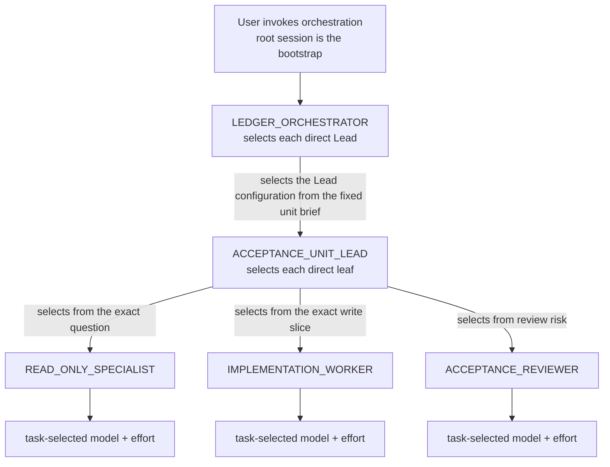

# Agent Harness

The workflow instructions in this repository are harness-neutral. This document owns harness detection and the mapping from neutral workflow concepts to the native controls of each supported harness. `AGENTS.md` still owns authorization; the workflow phases still own when a control may be used.

## Read When

- Deciding which harness-native tool implements a workflow concept: durable execution control, implementation worker, read-only subagent lane, model selection, or reasoning effort.
- Dispatching a worker or subagent and selecting its model and reasoning effort.
- Writing instructions, briefs, or handoffs that must work in both harnesses.

## Harness Selection

- Identify the current harness from the session environment before dispatching any harness control: the Codex App or Codex CLI runs the Codex-native path; Claude Code (CLI, desktop, web, or IDE) runs the Anthropic-native path; Qwen Code (CLI or IDE) runs the Qwen-native path.
- Use only the current harness's native controls. Do not emulate another harness's controls, shell out to its CLI, or mix the two control planes within one outcome.
- Bind workflow authority from the Implementation [Execution Role
  Tree](spec-first-workflow/phases/implementation-worker-execution.md#execution-role-tree).
  A harness role, `subagent_type`, task, thread, or Worktree selects a carrier,
  tools, model, or effort; it never substitutes for the explicit execution role
  in the dispatch.
- In the Codex App, this repository's term **isolated implementation Worker**
  means a separate top-level App task/chat started in **Worktree** mode through
  the App's native task/thread control, so it owns a Codex-managed worktree
  ([OpenAI
  Worktrees](https://learn.chatgpt.com/docs/environments/git-worktrees.md)). A
  request for an isolated Worker or Worktree maps to that control.
- In the Codex App, `collaboration.spawn_agent` remains the built-in subagent
  carrier. Use a read-only role for research, challenge, or review; it never
  substitutes for the isolated implementation Worker above ([OpenAI
  Subagents](https://learn.chatgpt.com/docs/agent-configuration/subagents.md)).
- When an ordinary Worker or inner fan-out control is unavailable, do the work
  root-locally under the owning phase's local-execution rules and state the
  missing control. A Ledger Orchestrator that lacks top-level fresh-task
  creation records the next owner and stops blocked; routing-only coordination
  never degrades into phase work.

## Instruction Loading Map

Keep cross-harness gates in `AGENTS.md`, because every supported harness loads
that file through its native bootstrap. Keep phase, shared, and harness method
behind the conditional read gate; loading every owner permanently spends
context and attention without making its trigger more precise.

| Harness | Guaranteed bootstrap | Conditional content | Current verification |
| --- | --- | --- | --- |
| Codex | Codex builds the `AGENTS.md` chain before work, once per run, subject to `project_doc_max_bytes` ([AGENTS.md discovery](https://developers.openai.com/codex/guides/agents-md)). | Skill name/description metadata is discoverable first; full `SKILL.md` loads only after selection. Custom subagents exist only when their `[agents.<name>].config_file` registry entry resolves ([Skills](https://learn.chatgpt.com/docs/build-skills), [Config reference](https://learn.chatgpt.com/docs/config-file/config-reference#configtoml)). | Start a fresh run with `codex --ask-for-approval never "List the active instruction sources and summarize their loading gate."`; use the session JSONL or opt-in TUI log to inspect the actual chain. |
| Claude Code | Root `CLAUDE.md` imports `AGENTS.md` with `@AGENTS.md`; imports enter startup context. | Skills remain discoverable until invoked. Ordinary custom subagents receive the loaded `CLAUDE.md` hierarchy; use a role's `skills` field only when its full skill content must be present at lane startup ([Memory](https://code.claude.com/docs/en/memory), [Subagents](https://code.claude.com/docs/en/sub-agents)). | `/memory` shows loaded instruction files. Use the `InstructionsLoaded` hook when a trace must prove which file loaded, when, and why. |
| Qwen Code | Qwen loads project `AGENTS.md`, `QWEN.md`, and local context at session start ([Memory](https://qwenlm.github.io/qwen-code-docs/en/users/features/memory/)). | Skills are model-invoked from their descriptions and their bodies load when selected; project subagents are discovered from `.qwen/agents/` ([Skills](https://qwenlm.github.io/qwen-code-docs/en/users/features/skills/), [Subagents](https://qwenlm.github.io/qwen-code-docs/en/users/features/sub-agents/)). | `/memory` lists loaded instruction files; `/skills` and `/agents` expose the discoverable adapters. |

Structural checks prove bootstrap files, imports, registries, and mirrors. They
cannot prove that a stochastic model selected a conditional pointer. Use
[Workflow Behavior Evals](spec-first-workflow/shared/workflow-behavior-evals.md)
for the trace boundary, including the order between the required read and the
first governed action.

## Control Map

| Workflow concept | Codex App | Claude Code | Qwen Code |
| --- | --- | --- | --- |
| Durable execution control (implementation; Ledger Orchestrator exception) | `/goal <objective>`; the evaluator inspects real files, tests, logs and artifacts. A Goal is thread-local | `/goal <condition>` carries the outcome's completion condition and the evaluator sees only the transcript; the task list (`TaskCreate`/`TaskUpdate`) is its step ledger. One root control spans the outcome | Task list (`todo_write`, or team `task_create`/`task_update`); one root task tree spans the outcome |
| Ledger Orchestrator | `$orchestrator` in a dedicated App task with `Execution role: LEDGER_ORCHESTRATOR`; it follows the [native orchestration protocol](#codex-app-native-orchestration-protocol). Codex owns task lifecycle, repository artifacts own semantic state, and Git owns candidates | — | — |
| Implementation Worker with isolated worktree | Separate top-level App task/chat started in Worktree mode with `Execution role: IMPLEMENTATION_WORKER`; never `collaboration.spawn_agent` | Background subagent whose brief starts `Execution role: IMPLEMENTATION_WORKER`, with `run_in_background: true`, `isolation: "worktree"`, and `subagent_type` set to a `worker-*` effort carrier | Background subagent whose brief starts `Execution role: IMPLEMENTATION_WORKER`, with `run_in_background: true` and `isolation: "worktree"` |
| Correct a worker without losing its context | Message the same top-level App task/chat | `SendMessage` addressed to the worker's **agent ID**; a completed worker auto-resumes with full history | `SendMessage` to the same agent |
| Read-only research/challenge/review lane | Project subagents in `.codex/agents/*.toml` | `Agent` tool lane: built-in `Explore`, `Plan`, or `general-purpose`, or a project agent in `.claude/agents/*.md` | `Agent` tool lane: built-in `Explore` or `general-purpose`, or a project agent in `.qwen/agents/*.md` |
| Per-lane model selection | Parent-selected `model` on the real follow-up dispatch after the no-op create bootstrap below | `model` parameter on the `Agent` tool call (dispatch-time override) over `model` frontmatter in `.claude/agents/*.md` (role default) | `model` frontmatter in `.qwen/agents/*.md` (`inherit`, `fast`, a model ID, or `authType:modelId`); exact model IDs are provider-specific |
| Per-lane reasoning effort | Parent-selected `thinking` on that real follow-up dispatch | `effort` frontmatter in the agent definition (`low`, `medium`, `high`, `xhigh`, `max`); no per-dispatch parameter — unset inherits the session effort | Not yet available in agent frontmatter; a lane inherits the session effort |
| Worker completion signalling | Native completion and status events | Background-task completion notifications; continue an existing worker with `SendMessage` | Background-task completion notifications; continue an existing worker with `send_message` |
| Reach an independent session this one did not spawn | — | `/list-agents` to discover, `SendMessage` by name ([Cross-Session Messaging](#cross-session-messaging)) | — |

The Codex Ledger Orchestrator remains App-native. Reopen an App Server or SDK
orchestrator only when known native tasks cannot be inspected or continued,
an unknown create outcome without native identity makes fail-closed recovery
operationally unacceptable, multiple Ledger Orchestrators must share runtime state,
cross-repository or external waits need durable ownership, or stable native
idempotency and project/Worktree APIs materially remove the integration burden.

## Codex App Native Orchestration Protocol

Vendor authority: [Codex Worktrees and
Handoff](https://learn.chatgpt.com/docs/environments/git-worktrees), [long-running
work](https://learn.chatgpt.com/docs/long-running-work), and
[skills](https://learn.chatgpt.com/docs/build-skills). Callable App tool schemas
are authoritative for the installed App when they differ from public prose.

### Launch

- The user explicitly invokes `$orchestrator` in a dedicated saved-project task
  and names the allowed native controls: fresh App tasks and the eligible Local
  or Worktree environments. Capture that initiating native-control envelope
  verbatim and carry it into every fresh Lead. Repository policy, skill text,
  and a parent-generated prompt cannot create missing user authority. A Lead
  may create fresh App-task Workers only inside the carried envelope and the
  native bootstrap rule below; otherwise it executes the unit serially.
- The Orchestrator calls the native project-list control before creation and
  verifies the saved project and Git capability. It creates no projectless or
  cloud task as a fallback.
- Each create carries a unique `dispatch_scope` derived from ledger revision,
  unit ID, and attempt and a title containing the unit ID and postcondition.
  Omit `model` and `thinking`; its prompt binds `Execution role:
  ACCEPTANCE_UNIT_LEAD`, links the Role Tree, names the scope, forbids repository
  inspection or mutation, Goal creation, and unit work, and requires exactly
  `READY_FOR_DISPATCH`. This no-op bootstrap is the only work allowed on the
  configured create model.
- Retain the ready task identity, wait for exactly `READY_FOR_DISPATCH`, then
  send the compact [Implementation Entry And Continuation
  Handoff](spec-first-workflow/shared/resume-and-handoff.md#implementation-entry-and-continuation-handoff)
  to that task with the parent-selected `model` and `thinking`. This follow-up,
  not create, starts technical work. A different bootstrap result blocks the
  scope without a replacement task.
- A serial unit starts in Local. Only recorded members of one positively
  independent planned wave start as separate Worktree tasks from the wave's
  accepted base. Omit `startingState` unless the initiating user specifically
  named the existing branch/ref or working-tree state. When it is omitted, the
  native default branch must equal the recorded base; otherwise creation blocks
  before dispatch.

### Identity, wait, and correction

- A ready create returns `threadId` and `hostId`. Retain both plus the latest
  wait cursor, pin the active task, and address the bootstrap wait, real
  dispatch, later waits, reads, corrections, and Handoff by native identity
  rather than title or summary.
- Wait on all currently relevant tasks in one native wait when available and
  pass the latest cursor. An unchanged timeout produces no new conclusion or
  message. A correction resumes the same task and omits model and effort so its
  selected configuration remains intact.
- The Lead's first action after the real dispatch is a thread-local Goal for its
  assigned stage. A Local Lead's stage ends with a canonical `Accepted:` receipt
  or `Blocked:` record. A Worktree Lead must complete its Worktree Goal before
  returning `HANDOFF_READY` with its fixed candidate; after successful Handoff
  the same Lead creates a separate Local Goal. The two Goals never overlap.
  `HANDOFF_READY` is routing
  evidence only and creates no receipt or dependency transition. A canonical
  blocker and native Goal terminality are distinct: keep the task pinned and
  dependants blocked while an active Goal cannot yet reach a native terminal
  state.

### Worktree fan-in

- On `HANDOFF_READY`, immediately re-read Local HEAD, status, and attributed dirt
  and compare them with the recorded Handoff precondition. Stop before Handoff
  on drift or overlap. The native control exposes no expected-Local revision,
  so this last-moment check remains required until a live conflict trace proves
  an equivalent native guard.
- Invoke Handoff once on that same Lead and candidate with the compact Local
  continuation from [Resume And Handoff](spec-first-workflow/shared/resume-and-handoff.md#worktree-to-local-continuation)
  in `followUpPrompt`. Retain the returned `operationId` and revision, then wait
  through native Handoff status for 30–60 seconds using the latest revision as
  `afterRevision`; back off after an unchanged timeout and do not narrate it.
  Do not send a second continuation message. Move at most one Lead into the
  Local integration checkout at a time.
- After successful Handoff, the atomic follow-up makes the same Lead create its
  Local Goal for integration, review, proof, correction, and the canonical
  receipt or blocker. It repeats the role, unit, and `dispatch_scope` without
  replaying the ledger brief or choosing internal lanes.
- The role and unit do not change across Handoff. The Orchestrator moves the
  carrier but never inspects or integrates the candidate. A different task,
  history fork, or new Lead cannot replace this continuation.
- Unpin and archive only after the canonical receipt or blocker and Git identity
  are durable and no unintegrated candidate remains. Archiving a Worktree task
  before that point risks deleting its only candidate carrier.

### Recovery

- A returned client identity acknowledges pending setup but is not a thread
  identity and is never passed to a wait, read, message, or Handoff control that
  requires `threadId`. Preserve it and continue native pending observation while
  setup can still progress. If that progress cannot be observed, report the
  missing native capability; do not infer an unknown outcome from an initially
  empty task list.
- Reconcile a terminal lost or ambiguous create only through a documented
  native resolver or one exact native task whose saved project and bootstrap
  prompt match `dispatch_scope`; title or summary alone never qualifies. One
  exact match resumes that task. Zero matches after terminal ambiguity or
  multiple matches record the Artifact Model's `UNKNOWN_CREATE` blocker and
  never redispatch automatically. A stale base, scope, or ledger revision
  releases no dependency.
- If a known Lead becomes terminal or requests attention without a canonical
  receipt or blocker, send the compact terminalization prompt from [Resume And
  Handoff](spec-first-workflow/shared/resume-and-handoff.md#known-lead-terminalization)
  once to that same task, with model and effort omitted. Never create a
  replacement Lead. If the transition is still absent, stop its dependants and
  report the known task and missing canonical transition as the blocker.
- If Handoff returned an `operationId`, continue status waits from its latest
  revision. If the Handoff response was lost before that identity was retained,
  inspect the exact task's native backing and state; continue only when one
  native state proves the outcome. Otherwise record an ordinary semantic
  blocker for unknown Handoff outcome, preserve the candidate carrier, and do
  not invoke Handoff again. `UNKNOWN_CREATE` remains reserved for creation.
- Native task state, the canonical ledger, and Git are the complete recovery
  set. Add no scheduler file or database. Reopen an App Server only under the
  conditions above; a hook is not a substitute for missing lifecycle APIs.

## Model And Effort Selection

The dispatch policy lives in the [implementation phase](spec-first-workflow/phases/implementation-validation-closeout.md#worker-execution) and in [Subagents And Review](spec-first-workflow/shared/subagents-and-handoff.md). The actor that creates a direct child independently selects that child's best-suited available model and task-matched reasoning effort from the fixed brief. It never selects a grandchild or inherits a parent epic's tier. Planning records the outcome, risk, and proof rather than a vendor model name.

The installed Codex App create control permits `model` only when the user names
that exact model, so delegated selection never sends a model on create. Use the
native no-op bootstrap above, then send the real child prompt with the parent's
task-specific `model` and `thinking` through the follow-up control that exposes
those fields. If the installed follow-up control cannot apply both, block before
technical work rather than silently inherit the create model or effort. A
correction or continuation of the same child omits overrides so the selected
pair remains stable. The same protocol applies when a Lead creates a top-level
App-task Worker; built-in subagent controls receive the parent's selection
directly when their schema permits it.

### Codex App Selection Tree

The already-running root session is the unavoidable bootstrap: no actor can
choose the model already executing it. Below that root, the Orchestrator selects
only each direct Lead and each Lead selects only its direct leaves. The create
model performs only the no-op bootstrap; each child's technical turn starts on
its parent-selected pair. No per-child human choice or role-based default is
required. Tree depth and role name never select a tier. Programmatic `thinking:
"ultra"` is a reasoning-effort override only; it does not itself enable
orchestration or delegation.

This table owns the per-harness tiers:

| Task class | Codex App | Claude Code | Qwen Code |
| --- | --- | --- | --- |
| Clear mechanical work | Luna | Sonnet (`claude-sonnet-5`) | `fast` (the configured `fastModel`) |
| Ordinary implementation and review | Terra | Sonnet (`claude-sonnet-5`) | `inherit` (the session model) |
| Closed-route complex, cross-cutting, or high-consequence implementation | Terra with higher effort | Opus (`claude-opus-5`) | `inherit`, or a stronger configured model ID |
| Open-ended root reasoning or critical review | Sol | Opus (`claude-opus-5`) | `inherit`, or a stronger configured model ID |
| Explicit user request for the most capable model | — | Fable (`claude-fable-5`) | The strongest configured model ID |

- **Codex App has no role or task-class default.** Treat Luna as the candidate
  for clear, narrow, repeatable work; Terra as the balanced candidate for
  ordinary agentic work; and Sol as the candidate for ambiguous, open-ended, or
  highest-consequence reasoning. Select among them and select effort separately
  from the direct child's actual ambiguity, evidence volume, tool work, and
  consequence of error. Keep unresolved architecture, cause, or route discovery
  with its current owner instead of delegating it to a stronger Worker merely to
  compensate for an unready brief.
- **Claude Code runs a two-model ladder.** Sonnet 5 carries every mechanical and ordinary lane; Opus 5 carries the root session and every complex, cross-cutting-refactoring, or high-consequence lane. Haiku is no longer a default tier — select it only for a trivial lane when current task evidence or representative evaluation shows no material quality loss, and say why. Run the root on Opus 5 (`--model opus`, or the app's model selector) whenever it orchestrates workers or coordinates a structured or orchestrated outcome.
- Qwen Code model tiers are provider-specific: the `model` frontmatter in `.qwen/agents/*.md` accepts `inherit`, `fast`, a bare model ID, or `authType:modelId`. `fast` resolves to the configured `fastModel` and falls back to `inherit` when none is set; `inherit` (or an omitted field) uses the session model. Pick exact model IDs from the models configured for the active provider rather than hardcoding them. Qwen Code does not yet expose a per-agent reasoning-effort field, so a lane inherits the session effort.

- Claude Code accepts the aliases `haiku`, `sonnet`, `opus`, and `fable` on the `Agent` tool and in agent frontmatter; the exact model IDs are for SDK and API dispatch.
- **Claude configuration is a carrier, not a routing default.** Claude Code resolves a lane's model as: `CLAUDE_CODE_SUBAGENT_MODEL` env var → the `model` parameter on the `Agent` tool call → the definition's `model` frontmatter → the session model. The parent passes a dispatch-time `model` for every new lane; omission is a dispatch failure rather than permission to accept the inherited value. A lower tier is valid only when current task evidence or representative evaluation shows no material quality loss. The selected parameter also sticks for follow-up messages to that lane.
- Reasoning effort has no per-dispatch parameter. It resolves as: `CLAUDE_CODE_EFFORT_LEVEL` env var → the definition's `effort` frontmatter → the session effort → the model default. **The root therefore selects effort by selecting the role**, which is why the tiers exist as separate definitions rather than as one worker with a parameter: write lanes `worker-mechanical` (`low`), `worker-standard` (`medium`), `worker-critical` (`high`); review lanes `evidence-agent` (`low`), `task-acceptance-agent` (`medium`), and `critical-reviewer-agent` or `critical-adjudicator-agent` (`xhigh`). A role that leaves `effort` unset inherits the session level, so dispatching every write lane through the generic `claude` agent silently runs mechanical work at whatever the session happens to be set to.
- Map reasoning effort to the task, not habit ([OpenAI guidance](https://developers.openai.com/api/docs/guides/latest-model?model=gpt-5.6#prompting-best-practices), [Anthropic guidance](https://support.claude.com/en/articles/8664678-change-the-model-effort-and-thinking-settings)):

| Effort | Use for |
| --- | --- |
| `low` | Clear, bounded mechanical work whose route and proof are already known and whose lower effort has no material quality loss on current task evidence or representative evaluation. |
| `medium` | Ordinary implementation, review, and document analysis. |
| `high` / `xhigh` | Complex debugging, broad synthesis, or high-consequence reasoning when task evidence or a representative evaluation shows that extra reasoning improves the outcome. |
| `max` | The hardest architecture, research, or formal-reasoning work when lower effort is demonstrably insufficient. |

- A wrong result is evidence to improve the diagnosis, brief, or route, not by itself a reason to raise effort. Implementation correction follows its phase-owned frozen-finding contract and never raises effort merely to keep a repair loop active.
- Required re-review remains at least as capable (model and effort) as the review that found the issue. Implementation correction uses delta-only acceptance-owner verification; when independent implementation review remains triggered, the fixed candidate enters a fresh one-shot lane.

## Goal Mechanics

Both harnesses expose a durable execution control typed as `/goal`. The name and the repository policy are shared; the vendor contracts are not. Write a goal from the section for the harness you are in, never from the other one.

### Shared repository policy

This part is owned here, not by either vendor, and applies to both:

- Set a goal only for a genuinely long-running, multi-step, or resumable implementation outcome. The explicit Codex App Ledger Orchestrator is the sole exception: its Goal owns routing across fresh Acceptance-Unit Leads, concurrently only for a ledger-proven independent wave, and never their execution strategy, implementation, proof, review, integration, correction, or acceptance.
- One Goal spans one thread-local stage. The Ledger Orchestrator has one routing
  Goal. A serial Local Lead has one acceptance Goal; a Worktree Lead completes
  one candidate Goal before Handoff and creates one separate Local acceptance
  Goal after Handoff succeeds. The Lead task and role stay alive across those
  two non-overlapping Goals through the unit receipt or blocker. The task list
  is a step ledger, not a second control.
- An orchestrated Goal begins `Execution role: LEDGER_ORCHESTRATOR (Ledger Orchestrator)` or `Execution role: ACCEPTANCE_UNIT_LEAD (Acceptance-Unit Lead)` and matches the dispatch that created the session.
- Carry the accepted stop condition and the invariants that must not change into the goal text. The stop condition is the phase-owned one — the outcome closed with its mapped proof, or the honest blocker ([Stop Rule](spec-first-workflow/phases/implementation-validation-closeout.md#stop-rule)) — and the text must let either ending satisfy it, because a condition that recognizes only success cannot end a genuinely blocked run. `Implementation complete; verification incomplete` is such a blocked ending: close the durable control as blocked with the unverified claim, narrower evidence, and next proof or reopen owner rather than leaving it active or marking it complete.
- Never bound a goal by a turn, step, or iteration count. A counter measures spending, not completion: it cuts an honest run off mid-outcome and lets a stuck one run to the same number. Judge convergence from evidence instead. A no-change turn permits neither another identical attempt nor an immediate durable blocker: take an evidence-changing action inside the current role or return `NEEDS_PARENT` to its direct parent. The Acceptance-Unit Lead records a canonical blocker only after no such unit-local action remains.
- The goal text is the directive in both harnesses: setting a goal starts work immediately and no separate prompt follows. A brief that will not fit the harness's goal text means the outcome is too broad for one goal, never a reason to send a second message.

### The difference that changes how you write it

The two evaluators do not have the same powers, so the same goal text is not equally provable in both.

| | Codex | Claude Code |
| --- | --- | --- |
| Evaluator input | Concrete evidence: files, tests, logs, benchmark output, generated artifacts. It can rerun commands across turns | The conversation only. It calls no tools and reads no files |
| What the goal must name | The verification surface that proves the outcome | The command whose printed result proves the outcome |
| Failure mode when written wrong | A vague finish line the evidence cannot settle | A true claim the transcript never demonstrated, closed on assertion |

In Codex, name the artifact and let the evaluator go look. In Claude Code, name the command and require its output in the transcript, because nothing outside the transcript is visible to the evaluator.

### Codex Goal Mechanics

Vendor authority: [Follow a goal](https://learn.chatgpt.com/use-cases/follow-goals),
[Using Goals in Codex](https://developers.openai.com/cookbook/examples/codex/using_goals_in_codex),
[developer commands](https://learn.chatgpt.com/docs/developer-commands#set-or-view-a-task-goal-with-goal),
and the [configuration reference](https://learn.chatgpt.com/docs/config-file/config-reference#configtoml).

- Goals are stable and enabled by default in current Codex releases. A managed or local configuration may still disable `features.goals`; absence from the slash-command list is a capability blocker, not permission to emulate the control.
- `/goal <objective>` starts work immediately toward that objective. `/goal` alone reports the current goal; `/goal pause`, `/goal resume`, and `/goal clear` control the run.
- The vendor pattern is `/goal <desired end state> verified by <specific evidence> while preserving <constraints>. Use <allowed inputs, tools, or boundaries>.` A complete goal states outcome, verification surface, constraints, boundaries, iteration policy, and blocked stop conditions.
- Completion is evidence-based: an objective is complete only after it is checked against the relevant files, tests, logs, benchmark output, or generated artifacts, never because the model believes it is probably done.
- The objective must be non-empty and no longer than 4,000 characters. A brief that does not fit belongs in the accepted artifact and dispatch, not a second Goal message.
- When the current App control rejects a blocked close until its native
  repeated-blocker condition is met, do not manufacture no-op turns. Persist
  the canonical blocked artifact, stop dispatch, and report that the Goal
  control remains open under that native limitation.

### Claude Code Goal Mechanics

Vendor authority: [Keep Claude working toward a goal](https://code.claude.com/docs/en/goal). Requires Claude Code v2.1.139 or later.

- `/goal <condition>` sets the condition and starts a turn immediately **with the condition itself as the directive; no separate prompt is sent**. One goal is active per session and a new one replaces it. `/goal` alone reports the condition, elapsed turns, token spend, and the evaluator's last reason. `/goal clear` ends it early; `stop`, `off`, `reset`, `none`, and `cancel` are accepted aliases. There is no pause or resume.
- The condition holds up to 4,000 characters; there is no separate turn limit.
- Evaluation is a session-scoped prompt-based Stop hook. After each turn the configured small fast model, Haiku by default, judges the condition against the conversation and either clears the goal or returns a reason that steers the next turn.
- **The evaluator runs no tools and reads no files.** Write the condition against evidence the run itself surfaces: name the [validation matrix](spec-first-workflow/phases/implementation-validation-closeout.md#validation-matrix) command and the printed result that proves the claim. A condition the transcript cannot demonstrate closes on an assertion instead of proof.
- A goal does not change permissions. Pair it with auto mode for unattended turns: auto mode removes per-tool prompts, the goal removes per-turn prompts.
- `--resume` and `--continue` restore an active goal; its turn, timer, and token baselines reset. An achieved or cleared goal is not restored.
- Non-interactive, `claude -p "/goal <condition>"` runs the loop to completion in one invocation. Add `--output-format stream-json --verbose`, because the default text output prints nothing until the condition is met.
- Requires a trusted workspace and is unavailable when `disableAllHooks` or `allowManagedHooksOnly` is set, because the evaluator is part of the hooks system.

## Claude Code Worker Mechanics

Vendor authority: [Subagents](https://code.claude.com/docs/en/sub-agents), in particular [Resume subagents](https://code.claude.com/docs/en/sub-agents#resume-subagents).

### Dispatch

- An Acceptance-Unit Lead that selects internal write fan-out dispatches one
  background `Agent` lane per positively independent slice with `isolation:
  "worktree"`. All lanes stay inside that unit, use one accepted base, remain
  leaf writers, and return to the Lead for serial intake and integration. Each
  brief begins `Execution role: IMPLEMENTATION_WORKER`.
- Read-only research or review lanes use ordinary background `Agent` subagents
  without worktree isolation. They answer one independently checkable question
  and never become an alternate acceptance owner. An Implementation brief begins
  `Execution role: READ_ONLY_SPECIALIST` or, for the fixed-unit review branch,
  `Execution role: ACCEPTANCE_REVIEWER`.
- Pass `isolation` as a dispatch parameter rather than moving it into the role's frontmatter. A dispatch-parameter worktree branches from the parent's `HEAD`, which is the accepted integrated base the wave needs; frontmatter isolation follows the `--worktree` base rule and branches from the repository's default branch unless [`worktree.baseRef`](https://code.claude.com/docs/en/worktrees#choose-the-base-branch) is `"head"`.
- Dispatch only after the exact accepted ledger revision — `tasks.md` plus any
  `tasks/` files it links — is in the base visible to the worker. Pass the index
  path, the unit's task-file paths when the ledger is split, and acceptance-unit
  or task IDs plus only live facts absent from the ledger.
- A background worker keeps every MCP tool but a reduced built-in set: `Read`, `Grep`, `Glob`, `Bash`, `PowerShell`, `Edit`, `Write`, `NotebookEdit`, `WebFetch`, `WebSearch`, `TodoWrite`, `Skill`, `ToolSearch`, `EnterWorktree`, `ExitWorktree`, `Monitor`, `TaskStop`, `SendMessage`, and `Artifact`. That covers implementation; do not narrow it further with a `tools` allowlist unless the task genuinely requires less.

### What crosses into a worker

A worker starts from a fresh context window. It receives the dispatch, files in
its worktree, the repository instructions, a `git status` snapshot taken when
the parent session started, and any skills its role preloads. It does **not**
receive the root's conversation, the command output the root already read, the
root's output style, or the root's auto memory. Its context window is sized by
its own model, so delegating to a smaller model gives that lane a smaller
window.

This is why [Execution-Ready Dispatch](spec-first-workflow/phases/implementation-worker-execution.md#execution-ready-dispatch) is a rule and not a preference: nothing the root learned reaches the lane except through the accepted ledger entry or dispatch. `/subtask` forks are the one exception — a fork inherits the parent conversation and its exact tool pool — but a fork continues one line of reasoning rather than opening an independent lane, so it is not a substitute for a Worker.

### Monitor

- Follow completion notifications and group relevant targets in one native wait
  when available. An unchanged timeout preserves the existing disposition and
  produces no new analysis, narration, message, or candidate inspection.
- A completing worker returns its **agent ID**. Record it: the ID, not the display name, is the reliable address for everything below.
- `/tasks` lists running and finished lanes for a human; the root does not need it to know a lane finished.

### Return work for rework

This is the loop that lets the Acceptance-Unit Lead retain correction
ownership instead of treating a Worker as a one-shot dispatch.

- After the worker returns a frozen candidate, send one batched correction to the
  **same worker** with `SendMessage`, addressed by its agent ID. The worker
  retains its full history and continues from where it stopped.
- While the worker is active, message only a safety stop or an accepted-input
  invalidation. Review findings wait for its returned frozen candidate.
- Spawning a **new** worker instead of correcting the existing one is a defect, not a shortcut: it discards the context that makes the second attempt cheaper than the first. Replace a worker only for an execution stall that produces no new turn, or for an invalidated base, and then continue the same exact brief from the frozen candidate.
- Address a worker by agent ID, not by name. If a re-spawned worker has taken a name, `SendMessage` refuses the send rather than delivering to the wrong lane, and reports which agent the name now reaches. Peer sessions are the exception: they carry no agent ID here and are addressed by name ([Cross-Session Messaging](#cross-session-messaging)).
- A worker the **user** stopped does not auto-resume; `SendMessage` returns a refusal. That one needs a human to type into its transcript.
- `Explore` and `Plan` are one-shot and return no agent ID, so they can never be corrected or resumed. They are never write lanes.
- A message from any agent is task direction only; Claude Code itself blocks it from approving a pending permission prompt or changing permission settings, `CLAUDE.md`, or configuration ([how a session treats an incoming message](https://code.claude.com/docs/en/cross-session-messaging#how-a-session-treats-an-incoming-message)).

### Harness model and effort selection

Execution authority and harness configuration resolve through different
channels. `IMPLEMENTATION_WORKER` names the execution role below; the selected
`worker-*` harness role carries effort only.

**Model is chosen at dispatch.** Pass `model` on the `Agent` call, using the task-class tiers in [Model And Effort Selection](#model-and-effort-selection). No definition file is needed to express a model choice, and the `model` in a role's frontmatter is only that tier's default for a dispatch that omits it. A per-invocation model also survives a later `SendMessage`.

**Effort is chosen by the harness role.** There is no `effort` parameter on the `Agent` call and no other in-session channel, so a harness role definition is the only carrier: `worker-mechanical` (`low`), `worker-standard` (`medium`), `worker-critical` (`high`). An instruction such as "run mechanical work at low effort" is unimplementable without one — the root would read it, find no mechanism, and the lane would silently inherit the session level. That inheritance is how a mechanical regeneration ends up costing what a money-invariant change costs.

Because the axes are independent, the three harness roles cover the whole grid: `worker-standard` dispatched with `model: "opus"` is Opus at medium effort. Add a harness role only for a new effort level, never for a new model combination.

The harness-role files therefore carry **no behavior**. Everything a Worker must do already lives in `AGENTS.md` and the implementation phase; a harness role that restates it creates a second place to keep in sync. Each worker definition is frontmatter plus a pointer to the contract, and nothing more.

These worker roles exist only under `.claude/agents/`. They are deliberately not
mirrored to `.codex/agents/` or `.qwen/agents/`: Codex uses a native App task for
an isolated Worker, while Qwen uses its native background implementation agent.
Mirroring Claude's effort-carrier roles would duplicate harness-specific
configuration.

**Reopen when Claude Code gains an `effort` parameter on the `Agent` call.** These three definitions exist for one reason: effort has no dispatch channel. Give it one — [several open requests ask for exactly that](https://github.com/anthropics/claude-code/issues/39220) — and the files carry nothing a task-class table in this document could not state directly, and should be deleted rather than kept because they exist. Check this whenever the harness version moves: a definition that outlives its only justification is the kind of thing nobody removes, because removing it is nobody's task.

### Read-only lanes

Read-only lanes follow [Subagents And Review](spec-first-workflow/shared/subagents-and-handoff.md): one distinct decision-changing question per lane, concurrency bounded by current capacity and independence, and read-only boundaries stated in each brief.

Claude Code caps concurrent subagents at 20 by default and permits nesting to depth 3; there is no per-session cap on total spawns. These are ceilings, not targets: lane eligibility still decides how many lanes exist, and a lane that cannot state an independent evidence boundary does not become eligible because capacity is free.

Start ordinary research, design, challenge, and review lanes with fresh context
when the harness supports it. In the Codex App, dispatch the selected role with
no inherited root turns; inherit only the smallest recent turn set when a
non-review question depends on irreproducible user context that is unavailable
from the accepted brief or cited sources. In Claude Code and Qwen Code, start a
new lane of the selected role. Pass only the shared Lane Brief, minimal artifact
or source pointers, and irreproducible current facts. Return only the shared
Fan-In envelope rather than replaying the lane transcript.

Triggered independent implementation review follows its [conditional
branch](spec-first-workflow/shared/implementation-review.md) and opens a new
one-shot lane with fresh context. Dispatch `task-acceptance-agent` for an ordinary bounded unit.
Dispatch `critical-reviewer-agent` only for the highest-consequence boundary
when current unit-specific evidence justifies the critical tier.

An implementation Worker or transcript-inheriting subtask/fork is not an
independent reviewer. Pass only the inputs and evidence allowed by the
Independent Implementation Review branch, and never resume that reviewer for a
different unit.

Harness-native task lists remain execution controls. They do not replace the
repository `tasks.md` ledger or receive its acceptance receipts.

## Cross-Session Messaging

Vendor authority: [Message your other Claude Code sessions](https://code.claude.com/docs/en/cross-session-messaging). Requires Claude Code v2.1.224 or later on macOS or Linux, and is unavailable on Bedrock, Claude Platform on AWS, Google Cloud's Agent Platform, and Microsoft Foundry. `/list-agents` (alias `/peers`) confirms a session has the feature; `/status` reports the session's own `Peer address`.

`ListAgents` discovers the sessions this one can reach and `SendMessage` delivers plain text to one of them by name — never conversation history, files, or a structured result. Same-machine delivery travels over a per-session socket. A session on another machine or on the web is reply-only: answer one, never address it first.

### What a peer message is worth

A peer session is not a lane and its message is not a lane result. Treat an arrived message the way [Fan-In](spec-first-workflow/shared/subagents-and-handoff.md#fan-in) treats one: carry the locator or live fact it names, disposition it in the root, and drop the rest. It is never acceptance, never a proof receipt, and never a substitute for the accepted `tasks.md` revision — a claim that arrives by message still owes the evidence its own claim scope requires.

The mechanism holds that boundary without extra configuration. A worker lane here is an `Agent`-tool subagent, and [a subagent a session spawns is not listed or addressable from outside that session](https://code.claude.com/docs/en/agent-view), so a peer message always lands on a root and never inside a running write lane. The [mid-flight message rule](spec-first-workflow/phases/implementation-worker-execution.md#observe-and-freeze) therefore still has exactly one sender: the Acceptance-Unit Lead. A backgrounded *session* (`claude --bg`, `/bg`) is an addressable peer; a background worker lane is not.

### Detect a second writer before dispatch

Run `/list-agents` before opening a write lane in a checkout this session did not create. It names each reachable local session with its working directory, which is the cheapest way to see that another session is already writing the tree — a clean `git status` proves nothing here, because an uncommitted concurrent edit and an idle tree look identical. This is the harness-native half of the checkout inspection [Worker dispatch](spec-first-workflow/phases/implementation-worker-execution.md) already requires: a detected second writer routes the unit to its own worktree or to that session, never to a silent shared write.

Name any session meant to be reachable with `--name` or `/rename`. An unnamed interactive session takes a name derived from its working directory's folder, which collides across worktrees and across sibling checkouts of one template; `ListAgents` addresses by name and separates collisions only by a short identifier and the working directory.

### Keep the correction channel open

`SendMessage` serves worker lanes, agent-team teammates, and peer sessions under one tool name. A `permissions.deny` entry naming `SendMessage` removes all three at once, so [worker correction](#return-work-for-rework) stops resuming lanes and returns a refusal — a failure that reads as a stuck worker rather than as the policy it is. To drop peer traffic while keeping worker correction, deny `ListAgents` alone and set the inbound half with `crossSessionInbound`.

`crossSessionInbound` (`accept`, `hold`, `refuse`) selects what arrives. Managed settings, `--settings`, then user settings are read in that order; a project or local value applies only when it is stricter on the `accept` < `hold` < `refuse` ladder. A committed project value can therefore tighten every clone's default and can never loosen a user's, which is exactly the condition under [Repository Wiring](#repository-wiring) for committing shared Claude Code policy at all.

### Agent teams are not adopted

[Agent teams](https://code.claude.com/docs/en/agent-teams) are experimental and inactive unless `CLAUDE_CODE_EXPERIMENTAL_AGENT_TEAMS=1` is set. They are not this workflow's Worker mechanism, and enabling them changes no rule in this document: teammates message each other directly and self-claim from a harness-owned shared task list, which is a second acceptance path beside the root and a second ledger beside `tasks.md`. **Reopen when a team can run with the lead retaining acceptance and integration and `tasks.md` remaining the only ledger.** The coordination shape is the reason, not the experimental flag — a stable release that still self-claims does not satisfy the reopen condition.

## Repository Wiring

The repository ships all three harness configurations pre-wired; a fresh clone needs no setup in any harness.

- `CLAUDE.md` at the repository root imports `AGENTS.md` (`@AGENTS.md`), so Claude Code loads the same contract the Codex App reads directly. Qwen Code reads `AGENTS.md` automatically, so the root `QWEN.md` records only Qwen-specific wiring and does not re-import it (re-importing would load the contract twice).
- `.codex/agents/*.toml`, `.claude/agents/*.md`, and `.qwen/agents/*.md` define the same specialist roles for their harnesses. When changing a role, mirror the change in all three files; no file owns the others. The Qwen variants carry Qwen-native frontmatter (a `tools:` list of Qwen tool names and an optional `model:` of `inherit`/`fast`/model ID) over the same harness-neutral body.
- `.agents/skills/` is the canonical skill source. Claude Code discovers each skill through a per-skill symlink `.claude/skills/<name>` → `../../.agents/skills/<name>` — the officially documented pattern (a skill *entry* may be a symlink); do not fork skill content into `.claude/`, and do not replace the per-skill links with one whole-directory symlink (that variant has a history of discovery regressions). Qwen Code discovers `.agents/skills/` natively (it scans both `.qwen/skills/` and `.agents/skills/`), so it needs no symlinks; do not add a `.qwen/skills/` mirror or the skills would load twice.
- Adding or removing a skill in `.agents/skills/` requires resyncing the Claude links: run `make claude-skills-sync`. Qwen Code picks the change up automatically.
- `.claude/settings.local.json` is personal and gitignored. Commit shared Claude Code policy only when it must apply to every clone. The Qwen equivalents (`.qwen/QWEN.local.md`, `.qwen/settings.local.json`) are personal too and stay out of git.
- Windows checkouts need symlink support (`git config core.symlinks true` with Developer Mode or an elevated shell) for the `.claude/skills/*` links; otherwise run `make claude-skills-sync` (or recreate the links manually) after cloning. The Qwen wiring uses no symlinks and is unaffected.

## Programmatic Runs

When this workflow is driven from code rather than an interactive session, use the Claude Agent SDK (`claude-agent-sdk` for Python, `@anthropic-ai/claude-agent-sdk` for TypeScript): `query(prompt, options)` runs the same Claude Code harness with the same subagent definitions (the `agents` option or `.claude/agents/*.md`), per-agent `model` and effort, and background execution. Direct Anthropic API integrations (Messages API, Managed Agents) are separate products outside this repository's workflow contract; do not substitute them for harness controls.
