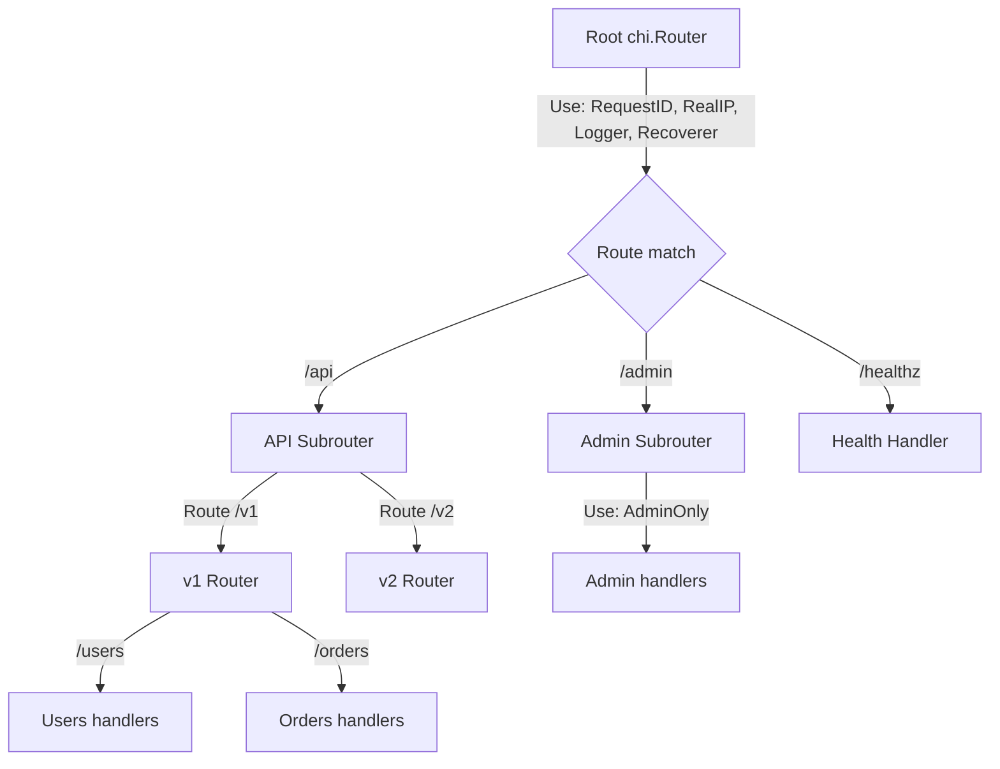
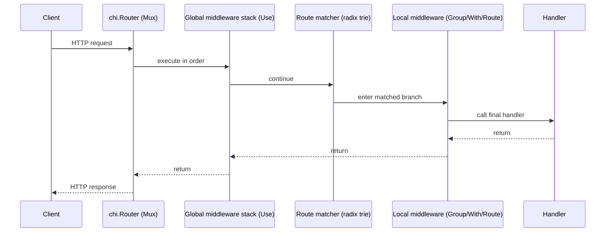

# Идея и идиоматичное использование роутера chi в Go

## Executive summary

Роутер `chi` — это лёгкий, «stdlib-first» инструмент для построения HTTP‑сервисов в Go, который решает практическую проблему роста API: когда маршрутов, middleware, версий и подсервисов становится много, хочется **компонуемости** и **поддерживаемости**, но без ухода от стандартных `net/http`‑интерфейсов. citeturn6view0turn18search5

Ключевые выводы:

`chi` остаётся **на 100% совместимым с `net/http`**: хендлеры, middleware и окружение остаются стандартными, а `chi` добавляет удобный DSL для маршрутизации, группировки, inline‑middleware и монтирования под‑роутеров. citeturn6view0turn19view2

Архитектурно `chi` построен вокруг небольшого `Mux` и интерфейса `chi.Router`, а матчер маршрутов реализован на структуре типа radix‑trie (Patricia trie). Это даёт быстрый матчинг и компактность, а также «сборку» API из модулей. citeturn6view0turn19view2

«Идиоматичность» в `chi` начинается не с магии фреймворка, а с дисциплины: явные зависимости (DI без глобальных синглтонов), минимальные middleware, аккуратное использование `context` (типизированные ключи), единый error‑контракт, ограничения размеров запросов, таймауты сервера и корректный graceful shutdown. citeturn17search0turn17search9turn16view0turn16view2

Если вы строите публичный API, важно учитывать пограничные моменты: **автоматические ответы на `OPTIONS` и заголовок `Allow` в `405`** — не сильная сторона `chi` «из коробки», а CORS‑middleware обычно требует явных `OPTIONS`‑маршрутов и корректного расположения в стеке. citeturn20search23turn12search2

## Что такое chi и какую проблему он решает

### Проблема, которую обычно чувствуют на `net/http`

Стандартный `net/http` даёт вам надёжный сервер, типы `http.Handler`, `http.HandlerFunc`, `http.Server`, `http.ServeMux`, контексты, таймауты, graceful shutdown и т.д. citeturn16view0turn16view2turn27view2

Начиная с Go 1.22, `ServeMux` заметно усилился: поддерживает паттерны с HTTP‑методом, хостом и wildcard‑сегментами, правила специфичности/конфликтов и доступ к значениям wildcard через `r.PathValue()`. citeturn27view2turn27view3turn27view0

Но даже с этими улучшениями остаётся типичная боль больших сервисов:  
нужно много повторяющихся обвязок (auth/log/trace), версии API и «пакетная» регистрация маршрутов по доменам, структурирование middleware‑цепочек «локально» (на группе маршрутов) и переиспользование под‑роутеров как модулей.

### Что добавляет chi

`chi` позиционируется как **лёгкий, идиоматичный, компонуемый** роутер для Go HTTP‑сервисов, ориентированный на поддержку больших REST API при росте проекта. Он сознательно держится рядом со stdlib: **никаких специальных типов хендлеров** — всё остаётся на `net/http`‑подписи, а расширение идёт через регистрацию маршрутов и middleware‑композицию. citeturn6view0turn18search5

Дизайн‑фокус `chi` прямо сформулирован: структура проекта, поддерживаемость, стандартные `net/http`‑хендлеры, производительность разработки и декомпозиция системы на много небольших частей. citeturn6view0

Практически это означает: вы можете продолжать писать «чистый» `net/http`, но получать удобство:
группы маршрутов, inline‑middleware (`With`), вложенные роуты (`Route`), монтирование независимых модулей (`Mount`), извлечение path‑параметров и маршрутов/паттернов через контекст. citeturn6view0turn19view2turn7view1

## Архитектурные принципы и ключевые компоненты chi

### Router и Mux

В центре `chi` — интерфейс `chi.Router`, который расширяет `http.Handler` и добавляет методы регистрации маршрутов и middleware: `Use`, `With`, `Group`, `Route`, `Mount`, методы по HTTP‑глаголам, а также настройку `NotFound`/`MethodNotAllowed`. citeturn6view0turn19view2

`Mux` — основная реализация `Router`. Её `ServeHTTP` совместим со стандартной библиотекой, а внутри используется `sync.Pool` для переиспользования routing‑context (это часть производительности и контроля аллокаций). citeturn19view2

Алгоритм матчинга маршрутов описан как radix‑trie (Patricia Radix trie). Для пользователя это означает быстрый поиск и предсказуемую структуру дерева роутинга. citeturn6view0

### Middleware

Middleware в `chi` — это **обычные net/http‑middleware** вида `func(http.Handler) http.Handler`. `chi` сознательно не вводит «специальные» сигнатуры, поэтому экосистема стандартных middleware подходит напрямую. citeturn6view0turn19view2

Важная тонкость порядка: стек `Use()` исполняется **до поиска matching‑route**, что удобно для раннего отклонения запросов (например, лимит по IP), но означает: глобальное middleware может не иметь доступа к параметрам конкретного маршрута, если они вычисляются только после матчинга. citeturn19view2turn6view0

Отдельно `chi` поставляется с пакетом `chi/middleware` (опционально): `RequestID`, `RealIP`, `Logger`, `Recoverer`, `Timeout`, `Throttle` и другие. citeturn6view0turn8search9

### Context и RouteContext

`chi` активно использует `context.Context` из stdlib: роутинг‑контекст хранится прямо в `r.Context()`. Это позволяет middleware и handlers обмениваться request‑scoped данными стандартным способом. citeturn6view0turn7view1

У `chi` есть собственная структура `chi.Context`, которая содержит стек `RoutePatterns`, текущий `RoutePath`, `RouteMethod`, а также параметры URL (keys/values). Доступ осуществляется через `chi.RouteContext(r.Context())`. citeturn7view0turn7view1

Практический бенефит: можно получать «шаблон маршрута» (route pattern) для метрик/трассировки. Но `RoutePattern()` меняется по мере прохождения роутинга, поэтому документировано правило: считывать его надёжнее **после вызова `next`** в middleware. citeturn7view2turn7view1

### Patterns

Паттерны маршрутов в `chi` поддерживают:

Именованные параметры: `/users/{userID}`. citeturn6view0turn7view3

Wildcard: `/admin/*`, значение доступно как `chi.URLParam(r, "*")`. citeturn6view0turn7view3

Regexp‑параметры (пример из документации): `/{articleSlug:[a-z-]+}`. citeturn6view0

### Routes, Subrouters, Route, Group, Mount

`Routes()` возвращает структуру дерева маршрутов (полезно для introspection и генерации документации). `Middlewares()` возвращает список middleware в роутере. citeturn6view0turn19view2

`Route(pattern, fn)` создаёт новый `Mux` со свежим middleware‑стеком и монтирует его по `pattern` — это «шорткат» к `Mount`. citeturn19view2

`Group(fn)` создаёт inline‑роутер со свежим middleware‑стеком «внутри текущего пути» — удобно для добавления middleware на группу эндпоинтов без отдельного префикса URL. citeturn19view2

`Mount(pattern, h)` присоединяет другой `http.Handler`/роутер как саб‑роутер. Документировано, что `Mount` по сути ставит wildcard на `pattern` и передаёт управление `handler`; при попытке смонтировать два хендлера на один и тот же `pattern` будет `panic`. citeturn19view2

Ниже — визуальная схема типичной композиции.



Принципиальная схема потока middleware:



citeturn19view2turn6view0

## Идиоматичное использование chi в продакшене

Ниже — практики, которые обычно дают максимально «go‑idiomatic» код на `chi`: минимум скрытой магии, максимум явной композиции.

### Организация пакетов и регистрация маршрутов

Рабочий шаблон для сервисов на `chi` повторяется в популярной структуре «`cmd/` + `internal/`»: точка входа собирает зависимости, роутер и сервер; доменная логика — в пакетах `internal`. Пример репозитория‑шаблона с подробным описанием структуры: `cmd/api` (handlers/routing/middleware/helpers) и `internal/*` (утилиты, валидация, запросы/ответы, БД и т.д.). citeturn24view1

Практическая рекомендация: держать **регистрацию маршрутов отдельной функцией** (`func Routes(deps ...) http.Handler`) и возвращать `http.Handler` (а не `*chi.Mux`), чтобы наружу торчал минимальный контракт. Это соответствует духу совместимости `chi` с `net/http`. citeturn6view0turn19view2

### Handlers как методы структуры

Идиоматичный DI в Go — избегать изменяемых глобальных переменных, прокидывать зависимости через конструкторы/структуры, которые затем используются хендлерами. Это снижает связность и облегчает тестирование. citeturn17search0turn17search35

### Middleware: слои и ответственность

Практика, близкая к документации `chi`, — базовый «глобальный» стек: `RequestID`, `RealIP`, `Logger`, `Recoverer`, а затем более специфичные middleware локально через `Group/With/Route`. citeturn6view0turn8search9

Рекомендация: глобальные middleware должны быть дешёвыми и безопасными (логирование, восстановление паник, request id), а «дорогие» или зависящие от path‑параметров — располагать внутри конкретных `Route()` или под‑роутеров. Это согласуется с тем, что глобальный стек `Use()` исполняется до матчинга маршрута. citeturn19view2turn7view3

### Context: как класть данные «по‑гошному»

`chi` побуждает использовать `context` для request‑scoped данных (например, результат аутентификации, загруженный доменный объект). Но stdlib подчёркивает: `context` не для «передачи опциональных параметров», ключи не должны быть строками, лучше вводить собственные типы ключей, чтобы избежать коллизий. citeturn17search9turn17search22

Также Go рекомендует **не хранить `Context` внутри структур**, а явно передавать в функции. Это важно при проектировании слоёв сервисов вокруг `chi`‑хендлеров. citeturn17search1

### Error handling: контракт ошибок и `MethodNotAllowed/NotFound`

`chi` позволяет задать кастомные `NotFound` и `MethodNotAllowed`. При этом дефолтный `MethodNotAllowed` в `chi` возвращает 405 с пустым телом (что иногда недостаточно для публичного API). citeturn19view2

Для публичных API часто важно:
единый JSON‑формат ошибок, `request_id` в ответе, понятные коды ошибок и логирование первопричины. Это уже «слой приложения», а не роутера — и так обычно делают в `chi`, потому что он минималистичен. citeturn6view0turn17search3turn17search34

### Валидация запросов и большие тела

Для защиты от слишком больших тел полезно ограничивать входящий body через `http.MaxBytesReader`: он специально предназначен для предотвращения избыточных body и может инициировать закрытие соединения при превышении лимита. citeturn15view0

На уровне `http.Server` стоит настраивать таймауты (`ReadHeaderTimeout`, `ReadTimeout`, `WriteTimeout`, `IdleTimeout`) и лимиты заголовков (`MaxHeaderBytes`). Документация прямо объясняет семантику и ограничения: `ReadHeaderTimeout` часто предпочтительнее `ReadTimeout`, потому что даёт хендлеру свободу решать, «что слишком медленно» для тела; а `WriteTimeout` не позволяет пер‑роутно настраивать долгие стриминги. citeturn16view2turn14search4

### Dependency injection и композиция

Вместо DI‑контейнеров типичный промышленный Go‑подход — явная сборка графа зависимостей: конструкторы, интерфейсы, struct‑поля. Это улучшает читаемость и сопровождаемость. citeturn17search35turn17search0

### Graceful shutdown

`http.Server.Shutdown(ctx)` штатно завершает сервер: закрывает listener’ы, закрывает idle‑соединения и ждёт активные до перехода в idle. Но **не закрывает hijacked‑соединения** (например, WebSocket): их нужно останавливать отдельно, и для уведомления можно использовать `Server.RegisterOnShutdown`. citeturn16view0

### Тестирование

Поскольку `chi` — стандартный `http.Handler`, тестирование обычно сводится к `httptest.NewRecorder()` + `router.ServeHTTP(rec, req)`. Эта совместимость — одно из ключевых преимуществ `chi`‑подхода. citeturn6view0turn19view2

### Производительность и наблюдаемость

`chi` держит ядро маленьким (порядка ~1000 LOC) и быстрым, а routing‑context переиспользует через `sync.Pool`. Это снижает накладные расходы и делает его удобным «слоем маршрутизации» без ощущения «тяжёлого фреймворка». citeturn6view0turn19view2

Для метрик часто удобно писать middleware, которое после `next` читает `chi.RouteContext(r.Context()).RoutePattern()` и отдаёт метки вида `GET /users/{id}` вместо фактических путей. Документация подчёркивает, что `RoutePattern()` нужно использовать после `next`, иначе может быть пустым/неполным. citeturn7view2turn7view1

### Безопасность: «база» для API

Минимальный набор «прод‑гигиены» в Go HTTP‑сервисе обычно такой:

Таймауты/лимиты на `http.Server` (`ReadHeaderTimeout`, `IdleTimeout`, `MaxHeaderBytes`). citeturn16view2

Ограничение размера body (`MaxBytesReader`) на endpoints с входным JSON/файлами. citeturn15view0

`Recoverer` (panic→500) и логирование (но осторожно с утечкой чувствительных данных). citeturn8search9

Аккуратный `RealIP`: использовать только если вы контролируете доверенные прокси/балансеры и знаете, какие заголовки выставляются. citeturn6view0turn8search9

CORS: применять осознанно, обычно top‑level и с явными `OPTIONS`‑маршрутами/поведением, иначе легко получить «почему preflight не работает». citeturn12search2turn20search23

Ниже — короткий чеклист.

**Чеклист идиоматичного chi‑кода**

- [ ] Роутер наружу возвращается как `http.Handler`, зависимости собираются в `main` (или `cmd/...`). citeturn24view1turn6view0  
- [ ] Middleware разделены на глобальные (дешёвые) и локальные (auth, доменная загрузка). citeturn19view2turn6view0  
- [ ] `context` используется только для request‑scoped данных; ключи типизированы (не `string`). citeturn17search9turn17search22  
- [ ] Единый error‑контракт (JSON error envelope), `NotFound`/`MethodNotAllowed` настроены. citeturn19view2turn20search23  
- [ ] На входных endpoint — `MaxBytesReader`, строгий JSON‑декодер (и/или валидатор), отказ при нарушениях. citeturn15view0  
- [ ] `http.Server` создан явно (таймауты, `MaxHeaderBytes`), graceful shutdown через `Shutdown(ctx)`. citeturn16view2turn16view0  
- [ ] Для метрик/трасс — использование `RoutePattern()` после `next`. citeturn7view2turn7view1  

## Примеры кода для типичных сценариев

Ниже — короткие, читаемые сниппеты. Они показывают idiomatic‑подход: стандартные типы, явные зависимости, минимальная магия.

### Простые маршруты и базовый стек middleware

```go
package main

import (
	"net/http"

	"github.com/go-chi/chi/v5"
	"github.com/go-chi/chi/v5/middleware"
)

func main() {
	r := chi.NewRouter()

	// "Базовый" стек из документации chi
	r.Use(middleware.RequestID)
	r.Use(middleware.RealIP)
	r.Use(middleware.Logger)
	r.Use(middleware.Recoverer)

	r.Get("/healthz", func(w http.ResponseWriter, r *http.Request) {
		w.WriteHeader(http.StatusOK)
		w.Write([]byte("ok"))
	})

	http.ListenAndServe(":8080", r)
}
```

citeturn6view0turn8search9

### Группировка маршрутов и цепочки middleware

```go
func routes(auth func(http.Handler) http.Handler) http.Handler {
	r := chi.NewRouter()

	r.Route("/api", func(r chi.Router) {
		r.Get("/public", publicHandler)

		r.Group(func(r chi.Router) {
			r.Use(auth) // только для защищённой группы
			r.Get("/me", meHandler)
			r.Post("/orders", createOrderHandler)
		})
	})

	return r
}
```

`Group()` создаёт inline‑mux со свежим стеком middleware, удобно для «локальной» обвязки. citeturn19view2

### Параметризованные маршруты и regexp‑параметры

```go
func userHandler(w http.ResponseWriter, r *http.Request) {
	userID := chi.URLParam(r, "userID")
	w.Write([]byte("user=" + userID))
}

func routes() http.Handler {
	r := chi.NewRouter()

	r.Get("/users/{userID}", userHandler)
	r.Get("/posts/{slug:[a-z-]+}", func(w http.ResponseWriter, r *http.Request) {
		w.Write([]byte("slug=" + chi.URLParam(r, "slug")))
	})

	return r
}
```

Паттерны с `{name}` и `{name:regexp}` — штатный стиль `chi`, а извлечение идёт через `chi.URLParam`, который читает параметры из контекста запроса. citeturn6view0turn7view3turn6view0

### Subrouter и Mount

`Mount` удобно использовать, чтобы собирать сервис из независимых модулей. Документация подчёркивает: `Mount` ставит wildcard на `pattern` и продолжает роутинг в дочернем `handler`. citeturn19view2

```go
func adminRouter() http.Handler {
	r := chi.NewRouter()
	r.Get("/", func(w http.ResponseWriter, r *http.Request) {
		w.Write([]byte("admin index"))
	})
	return r
}

func routes() http.Handler {
	r := chi.NewRouter()

	r.Mount("/admin", adminRouter())
	r.Get("/", func(w http.ResponseWriter, r *http.Request) {
		w.Write([]byte("home"))
	})

	return r
}
```

citeturn19view2turn6view0

### Middleware для метрик по RoutePattern

```go
func Instrument(next http.Handler) http.Handler {
	return http.HandlerFunc(func(w http.ResponseWriter, r *http.Request) {
		next.ServeHTTP(w, r)

		// Важно: брать RoutePattern после next (так рекомендует документация)
		pattern := chi.RouteContext(r.Context()).RoutePattern()
		_ = pattern // отправьте pattern в метрики/трейсы
	})
}
```

citeturn7view2turn7view1

### Ошибки: минимальный JSON error envelope

```go
type APIError struct {
	Code    string `json:"code"`
	Message string `json:"message"`
}

func writeJSON(w http.ResponseWriter, status int, v any) {
	w.Header().Set("Content-Type", "application/json")
	w.WriteHeader(status)
	_ = json.NewEncoder(w).Encode(v)
}

func writeError(w http.ResponseWriter, status int, code, msg string) {
	writeJSON(w, status, map[string]any{
		"error": APIError{Code: code, Message: msg},
	})
}
```

Это не «фича chi», а типичная практика поверх `net/http`: `chi` не навязывает формат ошибок, оставляя вам контроль. citeturn6view0turn17search34

### Request validation и ограничения размера body

```go
type CreateUserReq struct {
	Email string `json:"email"`
	Age   int    `json:"age"`
}

func createUser(w http.ResponseWriter, r *http.Request) {
	// 1) лимит размера тела
	r.Body = http.MaxBytesReader(w, r.Body, 1<<20) // 1 MiB

	dec := json.NewDecoder(r.Body)
	dec.DisallowUnknownFields()

	var in CreateUserReq
	if err := dec.Decode(&in); err != nil {
		writeError(w, http.StatusBadRequest, "bad_json", "invalid JSON body")
		return
	}
	// 2) минимальная валидация (пример)
	if in.Email == "" || in.Age <= 0 {
		writeError(w, http.StatusUnprocessableEntity, "validation_failed", "email/age required")
		return
	}

	writeJSON(w, http.StatusCreated, map[string]any{"ok": true})
}
```

`MaxBytesReader` задуман именно для защиты от слишком больших входных тел и может принудить закрытие соединения при превышении лимита. citeturn15view0

### Streaming: Server‑Sent Events как пример «долгого ответа»

```go
func sse(w http.ResponseWriter, r *http.Request) {
	w.Header().Set("Content-Type", "text/event-stream")
	w.Header().Set("Cache-Control", "no-cache")
	w.Header().Set("Connection", "keep-alive")

	flusher, ok := w.(http.Flusher)
	if !ok {
		http.Error(w, "streaming unsupported", http.StatusInternalServerError)
		return
	}

	for i := 0; i < 5; i++ {
		_, _ = fmt.Fprintf(w, "event: tick\ndata: %d\n\n", i)
		flusher.Flush()
		time.Sleep(1 * time.Second)
	}
}
```

SSE требует `text/event-stream` и флашинга. citeturn14search29turn14search4

### Большие payloads: стриминговая загрузка в файл

```go
func upload(w http.ResponseWriter, r *http.Request) {
	const max = 100 << 20 // 100 MiB
	r.Body = http.MaxBytesReader(w, r.Body, max)

	f, err := os.CreateTemp("", "upload-*")
	if err != nil {
		writeError(w, 500, "internal", "cannot create temp file")
		return
	}
	defer f.Close()

	if _, err := io.Copy(f, r.Body); err != nil {
		writeError(w, 400, "bad_upload", "cannot read body")
		return
	}

	writeJSON(w, 200, map[string]any{"saved_to": f.Name()})
}
```

`MaxBytesReader` — базовый инструмент защиты от «случайно/злонамеренно слишком больших» запросов. citeturn15view0

### WebSocket на chi

`chi` не «встроит» WebSocket сам по себе, но так как это `net/http`, вы просто используете WebSocket‑библиотеку в обычном `http.Handler`. Пример на `nhooyr.io/websocket` (она работает с `net/http`‑handler’ами). citeturn13search4

```go
func wsEcho(w http.ResponseWriter, r *http.Request) {
	c, err := websocket.Accept(w, r, nil)
	if err != nil {
		return
	}
	defer c.CloseNow()

	ctx := r.Context()
	for {
		var v map[string]any
		if err := wsjson.Read(ctx, c, &v); err != nil {
			return
		}
		_ = wsjson.Write(ctx, c, v)
	}
}
```

citeturn13search4

### Graceful shutdown с учётом hijacked‑соединений

```go
func runServer(handler http.Handler) error {
	srv := &http.Server{
		Addr:              ":8080",
		Handler:           handler,
		ReadHeaderTimeout: 5 * time.Second,
		IdleTimeout:       60 * time.Second,
		MaxHeaderBytes:    1 << 20,
	}

	// Shutdown hook (например, попросить WS-клиентов отключиться)
	srv.RegisterOnShutdown(func() {
		// notify websocket hub, stop background workers, etc.
	})

	go func() {
		_ = srv.ListenAndServe()
	}()

	stop := make(chan os.Signal, 1)
	signal.Notify(stop, os.Interrupt, syscall.SIGTERM)
	<-stop

	ctx, cancel := context.WithTimeout(context.Background(), 15*time.Second)
	defer cancel()

	return srv.Shutdown(ctx)
}
```

Документация подчёркивает: `Shutdown` не закрывает hijacked‑соединения (в т.ч. WebSocket), их надо останавливать отдельно; для уведомлений существует `RegisterOnShutdown`. citeturn16view0turn16view2

## Сравнение chi с net/http, gorilla/mux, echo, fiber

### Таблица сравнения

| Критерий | `net/http` `ServeMux` | `chi` | `gorilla/mux` | `echo` | `fiber` |
|---|---|---|---|---|---|
| Базовая модель | stdlib multiplexer | router поверх stdlib | router + URL matcher | полноценный web‑framework | framework на `fasthttp` |
| Совместимость с `http.Handler`/stdlib‑middleware | да (нативно) citeturn27view2 | да, «100% compatible» citeturn6view0turn19view2 | да, реализует `http.Handler` citeturn10view0 | частично: свои типы контекста/сигнатуры хендлеров citeturn10view1turn9search29 | нет «нативно»: адаптация `net/http` через совместимость и с оверхедом citeturn9search18turn11view0 |
| Маршруты с параметрами | Go 1.22+: wildcard‑сегменты + `r.PathValue()` citeturn27view2turn27view0 | `{param}`, wildcard `*`, regexp‑параметры citeturn6view0turn7view3 | `{name}` и `{name:regexp}` + `mux.Vars()` citeturn10view0turn9search8 | параметры в роутинге + binding/ответы citeturn10view1turn9search29 | параметры (`:id`, `*`) в стиле Express citeturn11view2turn11view0 |
| Матчинг по host/headers/query | да (host часть паттерна Go 1.22+) citeturn27view2 | в ядре фокус на path/method; host‑роутинг — через доп.пакеты сообщества citeturn6view0turn12search39 | сильная сторона: host/schemes/headers/query/custom matchers citeturn10view0turn9search8 | есть (framework‑уровень) citeturn9search1turn10view1 | есть (fiber‑уровень) citeturn11view2turn9search18 |
| Композиция middleware | вручную (обёртки) | `Use/With/Group/Route/Mount` citeturn19view2 | `Use()` + subrouters citeturn10view0 | middleware на app/group/route, централизованные ошибки citeturn10view1turn9search29 | `Next()` и цепочки, но своя модель и контекст с re-use значений citeturn11view0turn9search18 |
| Graceful shutdown | `Server.Shutdown` stdlib citeturn16view0 | то же (router — `Handler`) citeturn19view2 | то же citeturn10view0 | встроенные способы запуска + можно `http.Server` под капотом citeturn10view1 | свой старт/остановка, другой стек (fasthttp) citeturn11view0 |
| Типичный sweet spot | минимализм, «всё stdlib» | большие REST API без «фреймворк‑магии» | сложный матчинг и route reversing | богатый framework, много «из коробки» | максимум перф/ergonomics в стиле Express, но другой стек |
| Известные ограничения/нюансы | Go 1.22 изменил синтаксис/семантику паттернов (есть режим совместимости) citeturn27view1turn27view2 | `OPTIONS`/`Allow` — не всегда автоматом и требует внимания citeturn20search23turn12search2 | похожие нюансы с `Allow`/`OPTIONS` при кастомизации citeturn20search23turn10view0 | не stdlib‑сигнатуры → экосистема «echo‑специфична» citeturn9search29turn10view1 | `fasthttp`‑модель, re-use значений контекста; `net/http`‑совместимость имеет ограничения и оверхед citeturn11view0turn9search18 |

### Когда выбирать chi

`chi` обычно выбирают, когда:

Вам важна **stdlib‑совместимость** (вся экосистема `net/http` middleware/handlers, простое тестирование, отсутствие «фреймворк‑контейнеров»). citeturn6view0turn19view2

Нужны **группы/локальные middleware/модули** (`Group`, `With`, `Route`, `Mount`) для растущего API. citeturn6view0turn19view2

Вы хотите «тонкий слой роутинга», а не большой framework (binding/templates/ORM‑философия) — и готовы сами определить контракты ошибок/валидацию. citeturn6view0turn12search4

### Когда лучше не chi

Если вам критичны встроенные удобства «full‑stack framework» (централизованный error handler, binding/validation, ответы, шаблоны, готовые интеграции как часть ядра), то `echo` может быть более прямолинейным выбором. citeturn10view1turn9search29

Если вам нужен **богатый матчинг по атрибутам запроса** (host/schemes/headers/query/custom matchers) и **route reversing**, это сильная сторона `gorilla/mux`. citeturn10view0turn9search8

Если вы сознательно выбираете `fasthttp`‑стек и стиль API как в Express (и принимаете разницу с `net/http`, включая особенности re-use контекста и ограничения совместимости), то `fiber` может подойти. citeturn11view0turn9search18

Если вам достаточно `ServeMux` и вы хотите «0 deps», с Go 1.22 он стал гораздо мощнее (паттерны, специфика, конфликты, `PathValue`). Но удобства композиции middleware/модульности придётся строить самостоятельно. citeturn27view2turn27view0turn20search11

## Реальные проекты, репозитории и материалы

### Реальные репозитории и примеры

Репозиторий `openshift/telemeter` использует `chi` в продакшн‑логике: создаёт `chi.NewRouter()`, монтирует `http.ServeMux` через `Mount`, строит внутренние endpoints, контролирует лимиты тела запросов и т.д. citeturn25view0turn26view0

Шаблон‑проект `ry-animal/go-chi-api` подробно показывает структуру `cmd/api` + `internal/*`, подход «handlers как методы структуры приложения», отдельные файлы для routing/middleware/errors, и даёт практически готовую основу для сервисов на `chi`. citeturn24view1

Официальные `_examples/` в `go-chi/chi` — один из лучших «источников правды» по паттернам использования: `Route`, `Mount`, контекстные middleware, генерация документации маршрутов. citeturn6view0turn18search2

### Официальная документация и пакеты go-chi

Основная документация/README `chi`, где зафиксированы философия, Router интерфейс, примеры `Route/Mount`, контекстные middleware и список встроенных middleware. citeturn6view0turn19view2

Документация пакета `chi` на pkg.go.dev: детали `Mux`, `Context`, `RoutePattern`, `Mount`‑ограничения и др. citeturn7view0turn19view2turn7view2

`chi/middleware` на pkg.go.dev: описание `Recoverer`, `RequestID`, `Timeout` (включая требование слушать `ctx.Done()`), и др. citeturn8search9

`go-chi/render`: утилиты для request/response payloads и streaming‑ответов JSON/XML. citeturn12search0turn12search4

`go-chi/cors`: CORS middleware, где прямо указано, что его корректнее ставить top‑level и что `Group/With` без `OPTIONS`‑маршрутов может не сработать ожидаемо. citeturn12search2turn12search6

`go-chi/jwtauth`: middleware для проверки JWT и передачи результата вниз по `context.Context`; работает с любым роутером `net/http`. citeturn12search1turn12search9

`go-chi/httprate`: rate limiter как `net/http`‑middleware (sliding window counter). citeturn12search3turn12search7

### Ключевые статьи и разборы на русском и английском

Русский:

Статья на Хабре с обзором Go‑роутеров (ServeMux, `chi`, `gorilla/mux`) и акцентом на удобство групп middleware в `chi`, плюс перечисление нюансов вокруг `OPTIONS/Allow`. citeturn8search2

Практический разбор построения REST API с `chi` и организацией защищённых роутов через вложенный роутер/монтирование. citeturn8search8

Английский:

Разбор выбора Go‑роутера от entity["people","Alex Edwards","go web author"]: сравнение `ServeMux`, `chi`, `gorilla/mux` и др., включая нюансы `OPTIONS` и `Allow` для `chi`/`mux`. citeturn20search23

`ServeMux` Go 1.22+ vs `chi`: практический взгляд на то, что stdlib «догнала», а где `chi` всё ещё удобнее (особенно в управлении middleware на вложенных роутингах). citeturn8search19

Сравнение подходов к роутингу в Go и почему `chi` удобен в командах/больших кодовых базах. citeturn20search15

Короткий практический обзор `go-chi` от Tit Petric (routing + middleware). citeturn8search12

### Быстрый список ссылок для копирования

```text
chi (README, примеры): https://raw.githubusercontent.com/go-chi/chi/master/README.md
chi (pkg.go.dev): https://pkg.go.dev/github.com/go-chi/chi/v5
chi/middleware (pkg.go.dev): https://pkg.go.dev/github.com/go-chi/chi/v5/middleware
go-chi/render: https://pkg.go.dev/github.com/go-chi/render
go-chi/cors: https://pkg.go.dev/github.com/go-chi/cors
go-chi/jwtauth: https://pkg.go.dev/github.com/go-chi/jwtauth
go-chi/httprate: https://pkg.go.dev/github.com/go-chi/httprate

net/http ServeMux patterns (Go 1.22+): https://pkg.go.dev/net/http#ServeMux
gorilla/mux README: https://raw.githubusercontent.com/gorilla/mux/main/README.md
echo README: https://raw.githubusercontent.com/labstack/echo/master/README.md
fiber README: https://raw.githubusercontent.com/gofiber/fiber/main/.github/README.md
```

citeturn6view0turn19view2turn12search0turn12search6turn10view0turn10view1turn11view0turn27view2