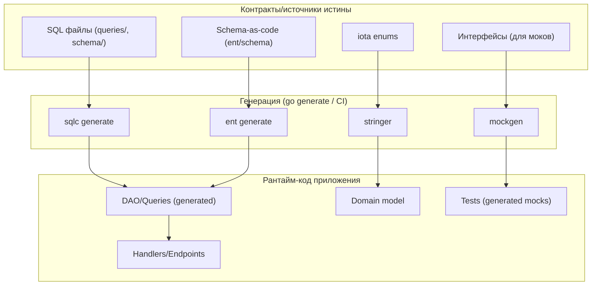
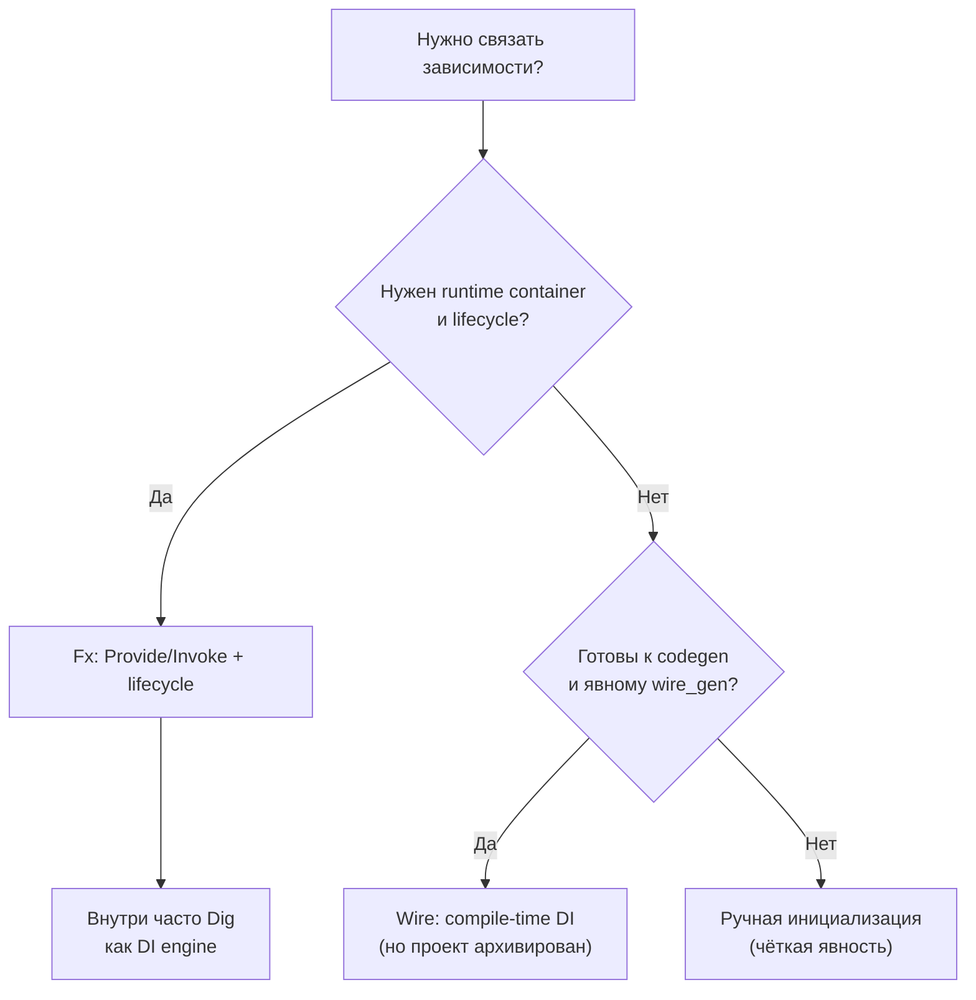

# Библиотеки и практики для избавления от боллерплейт-кода в Go

## Executive summary

Боллерплейт в Go чаще всего появляется не из‑за «многословности языка», а из‑за системных повторов на стыках слоёв: инициализация зависимостей, преобразования моделей (DB ↔ domain ↔ DTO), сериализация/валидация, ручные моки, повторяющиеся SQL‑обвязки, инфраструктурные «провода» (логирование, трейсинг, конфиг). Это подтверждается тем, что наиболее «принятые» в сообществе инструменты почти всегда относятся к двум направлениям: **генерация кода** и **стандартизация через tooling/контракты** (SQL, схемы, протоколы). citeturn1search3turn31search11turn12search29

Ключевые выводы для крупных компаний и больших кодовых баз:

- **Code generation в Go — норма**, а не экзотика: `go generate` официально задуман как «клей» для генераторов, а экосистема вокруг него (stringer, mockgen, sqlc, easyjson, ent, wire) формирует основной арсенал по снижению повторов. citeturn1search3turn2search3turn28view0turn11view0turn8view0turn16view0turn19view0  
- **DI‑фреймворки делятся на compile‑time и runtime**. Compile‑time (Wire) убирает боллерплейт инициализации без рефлексии, но в 2025 году проект был архивирован и объявлен «no longer maintained», поэтому в enterprise‑контексте важно оценивать риск форков/заморозки. citeturn19view0turn21view0turn9search11  
- **Runtime DI (Fx/Dig)** широко применяется в продакшене и прямо декларирует свои «границы применимости»: Dig хорош для сборки графа на старте процесса и как двигатель фреймворка (Fx), но плох как service locator и для резолва «на горячую». Fx заявлен как backbone почти всех Go‑сервисов в entity["company","Uber","ridesharing company"]. citeturn1search2turn24view0turn22view0  
- **Стандартная библиотека постепенно «вбирает» анти‑боллерплейт‑паттерны**: `errors.Join` уменьшает «склейку ошибок» (часто заменяя сторонние multierr‑обвязки), а `log/slog` закрывает большую часть потребности в структурированном логировании без внешних библиотек. citeturn38view2turn38view0turn37search5  
- Целевая версия Go в запросе **не указана**. В отчёте совместимость библиотек указывается по `go`‑директивам из их `go.mod` (минимальная/целевую семантика компиляции) и по релизным заметкам, где доступно. citeturn36view0turn36view3turn36view4turn21view0turn26view0turn22view0  

---

## Что в Go считают боллерплейтом и почему он возникает

В Go «боллерплейт» обычно означает **повторяющийся код, который неизбежен из‑за явности**, но не несёт бизнес‑смысла. На практике это несколько устойчивых классов:

Инициализация зависимостей и графа объектов: десятки `NewX(...)`, ручная передача зависимостей по цепочке (DB → Repo → Service → Handler), «модули» и их связывание. Именно этот класс задач прямо описывают DI‑инструменты: Wire как генератор «кода инициализации», Dig/Fx как контейнер/фреймворк для сборки графа. citeturn19view0turn24view0turn22view0turn9search11  

Маппинг между слоями (DB модели ↔ доменная модель ↔ API DTO): особенно заметно в web‑приложениях и микросервисах. Сообщество часто рекомендует **разводить модели по слоям**, но тогда появляется предсказуемый боллерплейт мапперов; это обсуждается как типичная анти‑паттерн/болевая точка при построении web‑приложений (например, когда «модели хранилища» начинают протекать в API). citeturn12search29  

Моки и тестовые заглушки: ручная реализация интерфейса ради одного теста, поддержка «фейков» при изменении интерфейсов. Поэтому генераторы моков (mockgen и аналоги) стали стандартным инструментом. Практика `go generate ./...` как единый «триггер генераторов» также часто используется в реальных репозиториях и обсуждениях. citeturn2search3turn4view2turn12search2  

Сериализация/десериализация и валидация: ручной парсинг JSON, копипаста проверок полей, однотипные сообщения об ошибках. В ответ возникают либо генераторы (easyjson), либо «drop‑in» реализации для ускорения (jsoniter), либо reflection‑валидация по тегам (`validator`). citeturn8view0turn6view3turn7view1turn5search19  

Инфраструктурная обвязка: логирование с полями, трассировка, метрики, конфиг‑загрузка (env/файлы/флаги/remote). В Go это всё чаще закрывается либо стандартной библиотекой (`log/slog`), либо de‑facto стандартами (OpenTelemetry), либо популярными конфиг‑обвязками (Viper). citeturn38view0turn34view4turn34view3  

Почему это «нормально» именно в Go:

- Язык исторически делает ставку на **явность и простые механизмы**, поэтому вместо макросов используются инструменты и генерация; `go generate` был введён именно как «официальный хук» для генераторов. citeturn1search3turn2search3  
- Макросов «как в C/C++» в Go нет; поэтому устойчивые практики сокращения повторов — это **codegen**, **композиция + интерфейсы**, и (с Go 1.18) **generics** там, где они действительно убирают шаблонный код. citeturn38view1turn37search8  

---

## Подходы к снижению боллерплейта и их компромиссы

### Генерация кода

Генерация — главный «идиоматический» путь в Go. Сам `go generate` описывается как команда для запуска генераторов (любой инструмент/скрипт), управляемых директивами в исходниках. Это сознательное решение экосистемы: генерируемый код компилируется обычным компилятором и дебажится обычными средствами. citeturn1search3turn2search3  

Плюсы:

- Производительность: часто generator создаёт специализированный код без reflection (Wire, easyjson, sqlc, ent). citeturn19view0turn8view0turn11view0turn16view0  
- Читаемость рантайма: «магия» вынесена в генератор; в рантайме остаются обычные функции/структуры. citeturn19view0turn11view0  
- Совместимость с tooling: компилятор, `go test`, профилировщики, трассировка — всё работает как с ручным кодом.

Минусы:

- Усложнение пайплайна: нужно обеспечить воспроизводимую генерацию (версии инструментов, порядок шагов, диффы).  
- Риск дрейфа: «забыли прогнать генерацию» → CI падает или, хуже, код устаревает.  
- Генераторы могут устаревать/архивироваться: критично для enterprise (пример — Wire и jsoniter были архивированы). citeturn19view0turn6view3  

С Go 1.24 появился сильный «анти‑боллерплейт» апгрейд именно для генераторов и dev‑инструментов: **`tool`‑директива в go.mod** и расширенный `go tool`. Это убирает старый хак `tools.go` с blank‑import и упрощает закрепление версий генераторов/линтеров. citeturn31search0turn31search3turn31search11  

### Generics

Go 1.18 добавил generics (type parameters) и прямо предупреждает, что это большой языковой блок, требующий аккуратности при деплое в продакшен, пока экосистема набирает реальный опыт. citeturn38view1turn37search8  

С Go 1.21 стандартная библиотека добавила обобщённые пакеты `slices`, `maps`, `cmp`, которые снимают значимый слой «утилитарного боллерплейта» (частые операции над коллекциями, сравнение упорядоченных типов). citeturn38view0turn38view3turn38view4turn38view5  

Плюсы:

- Меньше кода «обвязки» для общих операций, особенно в утилитах/библиотеках. citeturn38view0  
- Часто лучше типобезопасность (в сравнении с `interface{}`) и меньше ручных кастов.

Минусы:

- Могут ухудшать читаемость, если применять «везде». Сообщество часто советует: писать «обычный» Go‑код и лишь при явной копипасте выносить в generics‑абстракцию. citeturn37search8  
- Дебаг type inference иногда сложнее для команды, особенно при низком опыте generics.

### Композиция, интерфейсы и «простые» паттерны

Это «классика Go»: вместо глубоких иерархий — маленькие интерфейсы и композиция. В контексте боллерплейта это обычно означает:

- выделение «портов/адаптеров» (hexagonal/clean подходы) и явная передача зависимостей;
- ограничение размеров интерфейсов ради уменьшения объёма моков и реализации.  

Минус: при росте системы появляется боллерплейт инициализации (который затем компенсируют Wire/Fx). citeturn19view0turn22view0  

### Tooling и развитие стандартной библиотеки

Стандартная библиотека Go активно закрывает типовые «обвязки»:

- `errors.Join` (Go 1.20) уменьшает боллерплейт при сборе нескольких ошибок в одну. citeturn38view2turn38view6  
- `log/slog` (Go 1.21) уменьшает зависимость от внешних логгеров и «ручного JSON‑логирования», закрывая уровни и структурированные поля. citeturn38view0turn37search5  
- `go fix` в Go 1.26 получил переписанную реализацию и, среди прочего, умеет модернизировать «new‑like helpers», снижая боллерплейт для указателей на значения (ранее часто писали `newInt(10)` и т.п.). citeturn27search4  

---

## Генерация кода и core‑tooling

### `go generate` и закрепление версий генераторов

**Назначение:** запуск генераторов по директивам `//go:generate` в исходниках. citeturn1search3turn2search3  

**Как уменьшает боллерплейт:** позволяет вынести повторяемый код (моки, enum‑строки, сериализаторы, SQL‑DAO) в генераторы и вызывать их единообразно, не поддерживая ручные «скрипты». citeturn1search3turn2search3  

**Код до/после (коротко):**

До — ручная регенерация:

```go
// (нет привязки к исходнику; разработчик “помнит”, что нужно запустить генератор отдельно)
```

После — привязка к файлу/пакету:

```go
//go:generate go tool stringer -type=Status
//go:generate go tool mockgen -source=repo.go -destination=repo_mock.go -package=mocks
```

Переход к `go tool` здесь особенно важен в Go 1.24+: можно закрепить версии инструментов в `go.mod` через `tool`‑директиву (вместо старого `tools.go`). citeturn31search0turn31search11  

**Совместимость:** сам `go generate` — часть стандартного `go`‑tooling; актуальные улучшения по управлению dev‑инструментами появились в Go 1.24 (tool directives). citeturn31search0turn31search3  

**Ограничения/проблемы:** генерация не является частью `go build` по умолчанию; нужно встроить в CI/Makefile, иначе возможен дрейф артефактов.

**Популярность:** это стандартная команда `go` (метрики stars/скачиваний неприменимы).

**Альтернативы:** Makefile/Taskfile/скрипты; но они обычно хуже по воспроизводимости версий инструментов до Go 1.24. citeturn31search0turn31search11  

### `stringer` (golang.org/x/tools/cmd/stringer)

**Назначение:** генерация `String()` (и связанных деклараций) для «enum‑типов» (обычно `iota`). Инструмент прямо перечислен среди команд репозитория `golang.org/x/tools`. citeturn28view0  

**Как уменьшает боллерплейт:** устраняет ручное написание `func (T) String() string` со свитчами.

**Код до/после:**

До:

```go
type Status int

const (
	StatusNew Status = iota
	StatusDone
)

func (s Status) String() string {
	switch s {
	case StatusNew:
		return "new"
	case StatusDone:
		return "done"
	default:
		return "unknown"
	}
}
```

После:

```go
//go:generate go tool stringer -type=Status
type Status int

const (
	StatusNew Status = iota
	StatusDone
)
```

(Сгенерируется `status_string.go`.)

**Совместимость:** `golang.org/x/tools` в актуальном `go.mod` использует `go 1.25.0`, что обычно означает ориентацию на современный toolchain. citeturn30view0  

**Ограничения/проблемы:** генерация привязана к структуре пакета; нужна дисциплина размещения директив, особенно в монорепо.

**Популярность:** repo `golang/tools` — 7.9k stars и активные релизы (например, `gopls v0.21.1` в феврале 2026). citeturn28view0  

**Альтернативы:** ручная реализация; сторонние генераторы (`enumer`, `stringer`‑аналоги).

### `mockgen` (go.uber.org/mock/mockgen)

**Назначение:** генерация моков для интерфейсов.

В 2025 году активно используется и развивается репозиторий `uber-go/mock` (go.uber.org/mock) с релизами; например, stars ~3.3k, used-by ~1.7k, релиз v0.6.0 (август 2025). citeturn4view2  

**Как уменьшает боллерплейт:** вместо ручной реализации интерфейса под тест — генерация методов, ожиданий и проверок.

**Код до/после (упрощённо):**

До (ручной мок):

```go
type Repo interface {
	Get(id string) (User, error)
}

type RepoMock struct {
	GetFn func(id string) (User, error)
}

func (m *RepoMock) Get(id string) (User, error) { return m.GetFn(id) }
```

После (генерация):

```go
//go:generate go tool mockgen -source=repo.go -destination=repo_mock.go -package=mocks
type Repo interface {
	Get(id string) (User, error)
}
```

**Совместимость:** ориентируйтесь на `go.mod` инструмента/версии. В Go 1.24+ удобно закреплять версию mockgen через `tool`‑директиву и запускать как `go tool mockgen ...`. citeturn31search0turn31search11turn31search3  

**Ограничения/проблемы:** «моки как контракт» — при частом изменении интерфейсов нагрузка на ревью возрастает; важно не плодить чрезмерно большие интерфейсы.

**Альтернативы:** `mockery`, `moq`, `counterfeiter`, ручные фейки (часто через небольшие интерфейсы и composition).

---

## DI/IoC и снижение боллерплейта инициализации

### Wire (compile-time DI, генерация кода)

**Назначение:** compile‑time DI: Wire генерирует «человекочитаемый код», который связывает компоненты через dependency injection. citeturn19view0turn21view0  

**Как уменьшает боллерплейт:** убирает ручную сборку графа зависимостей (цепочки `NewX(NewY(NewZ(...)))`) и снижает риск ошибок порядка инициализации, при этом избегая runtime‑рефлексии. citeturn19view0turn9search11  

**Важно по статусу проекта:** репозиторий Wire архивирован (Aug 25, 2025) и прямо предупреждает, что проект «больше не поддерживается», предлагая форк для развития. citeturn19view0turn18view0  

**Примеры использования в крупных проектах:** `Go Cloud Development Kit` (репозиторий `google/go-cloud`) прямо говорит, что проект «works well» с Wire и использует его, чтобы генерировать код, импортирующий только нужные SDK, что помогает контролировать compile-time/binary size. citeturn9search11turn9search7  

**Код до/после:**

До (ручная сборка):

```go
func BuildServer(cfg *Config) *Server {
	db := NewDB(cfg.DSN)
	repo := NewRepo(db)
	svc := NewService(repo)
	return NewServer(svc)
}
```

После (Wire):

```go
//go:build wireinject

func InitializeServer(cfg *Config) (*Server, error) {
	wire.Build(NewDB, NewRepo, NewService, NewServer)
	return nil, nil
}
```

(генерируется `wire_gen.go` с реальным кодом инициализации)

**Совместимость:** `go.mod` Wire указывает `go 1.19`. citeturn21view0  

**Ограничения/проблемы:**
- проект заморожен → риск «застрять» на фиксах совместимости/edge cases;
- добавляет этап генерации и файлы `wire_gen.go`;
- сложность при очень динамических сценариях (условная регистрация провайдеров по конфигу).

**Популярность (на 2026‑03‑03):** ~14.4k stars, релиз v0.7.0 (Aug 22, 2025), used-by ~18.7k, около 200 commits. citeturn19view0turn18view0  

**Альтернативы:** ручная инициализация, Fx/Dig (runtime), собственные «модули»/фабрики.

### Fx (runtime DI + lifecycle framework)

**Назначение:** фреймворк для приложений на основе DI. В README Fx заявляет себя как «backbone» почти всех Go‑сервисов в Uber. citeturn1search2  

**Как уменьшает боллерплейт:** стандартизирует регистрацию компонентов и жизненный цикл (start/stop), сокращает ручную проводку зависимостей и инфраструктуры запуска (hooks, health, logging, shutdown).

**Код до/после (упрощённо):**

До (ручной main + lifecycle):

```go
func main() {
	db := NewDB()
	repo := NewRepo(db)
	svc := NewService(repo)
	srv := NewHTTPServer(svc)
	log.Fatal(srv.ListenAndServe())
}
```

После (Fx):

```go
func main() {
	fx.New(
		fx.Provide(NewDB, NewRepo, NewService, NewHTTPServer),
		fx.Invoke(RegisterRoutes),
	).Run()
}
```

**Совместимость:** `go.uber.org/fx` указывает `go 1.24`. citeturn22view0  

**Ограничения/проблемы:**
- runtime‑контейнер неизбежно добавляет «фреймворк‑слой»;
- дебаг графа зависимостей может быть сложнее, чем при явной инициализации;
- риск злоупотребления (превратить в service locator). Dig прямо предупреждает об этом паттерне. citeturn24view0  

**Популярность:** ~7.4k stars. citeturn22view0  

**Альтернативы:** Wire (compile‑time), Dig без Fx (как библиотека), ручной bootstrap, другие фреймворки/контейнеры.

### Dig (runtime DI container)

**Назначение:** DI‑контейнер на reflection. Dig сам описывает «good for» (движок для фреймворка вроде Fx, сборка графа при старте) и «bad for» (service locator, резолв после старта). citeturn23search0turn24view0  

**Как уменьшает боллерплейт:** снимает ручной «порядок конструкторов» и передачу зависимостей при сборке сложного графа.

**Код до/после:**

До — ручной порядок:

```go
a := NewA()
b := NewB(a)
c := NewC(b)
```

После — регистрация и invoke:

```go
c := dig.New()
c.Provide(NewA)
c.Provide(NewB)
c.Provide(NewC)
c.Invoke(func(c *C) { /* use */ })
```

**Совместимость:** `go.uber.org/dig` указывает `go 1.20`, есть retraction «bad release» для v1.16.0 (важно для enterprise‑политик). citeturn26view0  

**Популярность:** ~4.4k stars. citeturn26view0  

**Альтернативы:** Fx (как «полный» фреймворк), Wire, ручная проводка.

---

## Сериализация, валидация и слой данных

### jsoniter (drop‑in replacement для encoding/json, но архивирован)

**Назначение:** высокопроизводительная реализация JSON API, позиционируется как совместимая с `encoding/json`.

**Критичный статус:** репозиторий `json-iterator/go` был архивирован владельцем 15 Dec 2025 и стал read‑only. citeturn6view3turn5search1  

**Как уменьшает боллерплейт:** обычно уменьшение боллерплейта здесь косвенное: меньше «ручного ускоряющего кода» вокруг сериализации (если нужна производительность) — можно заменить энкодер без переписывания структур и тегов.

**Код до/после:**

До:

```go
var v T
if err := json.Unmarshal(data, &v); err != nil { /*...*/ }
```

После:

```go
var json = jsoniter.ConfigCompatibleWithStandardLibrary
var v T
if err := json.Unmarshal(data, &v); err != nil { /*...*/ }
```

**Совместимость:** из-за архивирования и истории багов совместимость следует проверять на вашей версии Go. Например, фикс совместимости с Go 1.18 упоминался в issue‑трекинге языка. citeturn6view3turn5search0  

**Ограничения/проблемы:** риск несовместимости с новыми версиями Go и отсутствия поддержки; сам факт архивирования — главный red flag для крупных компаний. citeturn6view3  

**Популярность:** ~13.9k stars, used-by ~405k, архивирован. citeturn6view3turn5search1  

**Альтернативы:** стандартный `encoding/json`; генераторы (easyjson); другие высокопроизводительные JSON‑библиотеки (выбор зависит от требований и поддержки).

### easyjson (генерация быстрых маршалеров)

**Назначение:** генерация сериализаторов JSON для структур.

**Как уменьшает боллерплейт:** убирает необходимость писать `MarshalJSON/UnmarshalJSON` руками ради производительности или контроля формата.

**Код до/после (суть):**

До — либо rely on `encoding/json` (reflection), либо писать методы вручную.

После:

```go
//go:generate easyjson -all

type User struct {
	ID   int    `json:"id"`
	Name string `json:"name"`
}
```

(генерируются методы и вспомогательный код)

**Совместимость:** в документации по установке упоминается требование Go 1.17+ для `go install ...@latest`. citeturn5search36  

**Ограничения/проблемы:**
- генерация увеличивает объём кода в репозитории;
- более сложный пайплайн (нужно следить за регенерацией и версиями);
- не все команды любят «генерируемые файлы» в diff’ах.

**Примеры использования/влияния:** обсуждения вокруг зависимостей показывают, что easyjson может быть транзитивной зависимостью в крупных экосистемах; например, в issue по `go-openapi/swag` отмечалось, что клиенты Kubernetes зависят от easyjson через библиотеку. citeturn5search37  

**Популярность:** ~4.9k stars, used-by ~153k, релиз v0.9.1 (Sep 15, 2025). citeturn8view0turn8view1  

**Альтернативы:** `encoding/json`, `jsoniter`, другие генераторы (ffjson и т.п., но многие устарели).

### go-playground/validator (валидация по тегам)

**Назначение:** декларативная валидация структур (обычно через `validate:"..."` теги).

**Как уменьшает боллерплейт:** вместо ручных `if x == "" { return err }` — правила в тегах + единый валидатор.

**Код до/после:**

До:

```go
if u.Email == "" { return errors.New("email required") }
if len(u.Password) < 12 { return errors.New("weak password") }
```

После:

```go
type Signup struct {
	Email    string `validate:"required,email"`
	Password string `validate:"required,min=12"`
}

err := validate.Struct(req)
```

**Совместимость:** пакет декларирует следование Go release policy и поддержку двух последних major версий Go. citeturn5search19  

**Ограничения/проблемы:**
- reflection и теги → часть ошибок проявляется в рантайме;
- важно стандартизировать сообщения и локализацию;
- при сложной доменной логике теги становятся нечитабельными.

**Популярность:** ~19.8k stars, релиз v10.30.0 (Dec 21, 2025), used-by ~227k. citeturn7view1turn5search32  

**Альтернативы:** ручная валидация; генераторы валидации; доменно‑ориентированная валидация в моделях приложения (часто в clean/hex архитектуре). citeturn12search29  

### GORM, sqlc и ent как разные стратегии «DAO без боллерплейта»

#### GORM (reflection‑ORM)

**Назначение:** ORM для Go (работа с моделями, миграции, ассоциации, построение запросов).

**Как уменьшает боллерплейт:** сокращает ручной SQL/scan‑код, даёт единый API для CRUD и ассоциаций.

**Код до/после (минимально):**

До (`database/sql`):

```go
row := db.QueryRowContext(ctx, "SELECT id, name FROM users WHERE id=$1", id)
var u User
if err := row.Scan(&u.ID, &u.Name); err != nil { /*...*/ }
```

После (GORM):

```go
var u User
if err := gormDB.First(&u, "id = ?", id).Error; err != nil { /*...*/ }
```

**Совместимость:** в этом отчёте целевая версия Go для GORM не извлечена отдельно; ориентируйтесь на `go.mod` в вашем выбранном релизе и политику поддержки проекта (в экосистеме Go это обычно отражается go‑директивой). (Ограничение: метрики по `go.mod` GORM не были извлечены из-за лимита инструментов веб‑анализа.)  

**Ограничения/проблемы:** риск «магии» ORM, сложности оптимизации сложных запросов, потенциальная потеря контроля над SQL. В практических обсуждениях миграции от GORM часто упоминают проблемы auto‑migrate и «кусающие» edge cases (пример — обсуждение «уходим от Gorm» в контексте выбора goose+sqlc). citeturn12search4turn5search18  

**Популярность:** ~39.6k stars, релиз v1.31.1 (Nov 2, 2025), used-by ~216k. citeturn5search15  

**Альтернативы:** sqlc, ent, Bun, SQLBoiler, ручной `database/sql` + query builders.

#### sqlc (генерация типобезопасного Go‑кода из SQL)

**Назначение:** генератор: вы пишете SQL, sqlc генерирует Go‑интерфейсы/структуры под ваши запросы. citeturn11view0  

**Как уменьшает боллерплейт:** убирает ручной `Scan`, ручное связывание параметров, типовые DAO‑обвязки; переносит «контракт» в SQL‑файлы, а код делает типобезопасным.

**Код до/после (упрощённо):**

До:

```go
rows, _ := db.QueryContext(ctx, "SELECT id, email FROM users WHERE active=$1", true)
defer rows.Close()
for rows.Next() { /* scan */ }
```

После (sqlc):

```go
q := dbgen.New(db) // generated
users, err := q.ListActiveUsers(ctx, true)
```

**Совместимость:** в этом отчёте `go`‑директива `sqlc-dev/sqlc` не извлечена отдельно (ограничение инструментария); обычно совместимость фиксируется в `go.mod` и релизах проекта.  

**Ограничения/проблемы:** сложные динамические запросы могут требовать ручного кода или шаблонов; обсуждения в сообществе подчёркивают «gap» для batch insert и динамики. citeturn12search20turn10search17  

**Примеры использования (компании/проекты):**
- инженерный пост компании entity["company","Speakeasy","api platform company"] описывает подход «contract-first, generated code everywhere», где SQLC используется для типобезопасных запросов. citeturn12search26  
- демо/фреймворк‑репозиторий компании entity["company","Ankorstore","ecommerce company"] (Yokai Petstore Demo) включает layout с `queries/` для sqlc и цель `make sqlc` для регенерации stubs. citeturn15search0  

**Популярность:** ~17.1k stars, ~1,800 commits, релиз v1.30.0 (Sep 1, 2025). citeturn11view0  

**Альтернативы:** SQLBoiler, Ent, query builders, ручной слой на `database/sql`/pgx.

#### ent (Schema-as-code + генерация типобезопасного ORM/DAO)

**Назначение:** entity framework: «schema as code», генерация типизированного API запросов, миграции и расширения (в т.ч. через templates). citeturn16view0turn10search5  

**Как уменьшает боллерплейт:** убирает ручной слой DAO + часть маппинга (в пределах модели данных), генерирует типобезопасный API и поддерживает расширения (GraphQL/OpenAPI и др.). citeturn16view0turn10search1  

**Код до/после (минимально):**

До (`database/sql`):

```go
// schema, queries, scan, отношения — вручную
```

После (ent, концептуально):

```go
// schema/user.go (ent schema)
type User struct{ ent.Schema }
func (User) Fields() []ent.Field {
	return []ent.Field{
		field.String("email").Unique(),
	}
}
```

Далее генерируется клиент и типобезопасные запросы.

**Происхождение и кейсы:** README прямо пишет, что проект вдохновлён внутренним ent‑фреймворком, использованным внутри entity["company","Meta","technology company"], и создан людьми из команды Facebook Connectivity; также существует страница пользователей ent. citeturn16view0turn17view0turn10search11  

**Совместимость:** в этом отчёте `go`‑директива ent не извлечена напрямую из `go.mod` ent/ent (ограничение инструментария), однако сам проект активно использует генерацию и шаблоны и публикует релизы/теги (при этом есть замечания сообщества о несоответствии GitHub releases и pkg.go.dev). citeturn16view0turn10search7  

**Ограничения/проблемы:**  
- зависимость от codegen и его инфраструктуры (темплейты, миграции);  
- часть пользователей критикует «code bloat» и проблемы миграций/«магических запросов». citeturn10search15  

**Популярность:** ~16.9k stars, ~2,343 commits, used-by ~5.4k; GitHub releases показывают v0.14.0 (Jul 29, 2024). citeturn16view0turn10search7  

**Альтернативы:** GORM, sqlc, SQLBoiler, Bun.

---

## Логирование, трассировка и конфигурация как «анти‑боллерплейт» инфраструктура

### `log/slog` (стандартная библиотека Go 1.21)

**Назначение:** структурированное логирование с уровнями в стандартной библиотеке. citeturn38view0turn37search5  

**Как уменьшает боллерплейт:** вместо внешнего логгера + адаптеров → единый стандартный API; структурные поля и уровни становятся «по умолчанию». citeturn38view0turn37search5  

**Код до/после:**

До (`log`):

```go
log.Printf("user_id=%s action=%s", id, action)
```

После (`slog`):

```go
logger.Info("action", "user_id", id, "action", action)
```

**Совместимость:** доступен начиная с Go 1.21. citeturn38view0turn37search5  

**Ограничения/проблемы:** если нужна максимальная производительность в горячем пути или специфические фичи, иногда выбирают zap/zerolog; но для большинства сервисов slog закрывает базу.

### Zap

**Назначение:** быстрый структурированный логгер; позиционируется как «blazing fast», с sugared и structured API. citeturn32search0turn32search28  

**Как уменьшает боллерплейт:** даёт API для структурированных полей без ручного форматирования строк и без «самописных JSON‑обвязок».

**Код до/после:**

До:

```go
fmt.Printf("level=info msg=%q user_id=%s\n", msg, id)
```

После:

```go
logger.Info("msg", zap.String("user_id", id))
```

**Совместимость:** `go.uber.org/zap` указывает `go 1.19`. citeturn36view0  

**Ограничения/проблемы:** необходимость выстроить единый интерфейс/обёртку для приложения; дисциплина `Sync()` на shutdown.

**Популярность:** ~24.3k stars (2026‑03‑03). citeturn35view0  

**Альтернативы:** `log/slog`, zerolog, logrus (но он в maintenance‑mode). citeturn33view2turn38view0  

### Zerolog

**Назначение:** «zero allocation» JSON logger с chain‑API; README прямо связывает подход с pioneer‑идеей zap и акцентирует отсутствие аллокаций/рефлексии в горячем пути. citeturn33view1turn32search9  

**Совместимость:** `go.mod` указывает `go 1.23`. citeturn36view1  

**Популярность:** ~12.2k stars, used-by ~59.2k. citeturn34view1  

**Ограничения/проблемы:** chain‑API может быть менее привычным; нужен аккуратный подход к контексту и полям.

### Logrus

**Назначение:** исторически популярный структурированный логгер; сам проект сообщает, что он в maintenance‑mode и не будет вводить новые фичи, рекомендуя альтернативы. citeturn33view2turn32search10  

**Совместимость:** `go.mod` указывает `go 1.23`, а релизные заметки ранее подчёркивали поднятие минимальной версии Go (как часть поддержки). citeturn36view2turn32search2  

**Популярность:** ~25.7k stars, used-by ~246k, релиз v1.9.4 (Jan 15, 2026). citeturn34view2  

**Ограничения/проблемы:** «замороженный» дизайн; часть экосистемы предпочитает переход на slog/zap/zerolog. citeturn33view2turn38view0  

### OpenTelemetry Go

**Назначение:** Go API/SDK для трейсинга/метрик/логирования в экосистеме OpenTelemetry (по данным репозитория — topics и описание). citeturn34view4  

**Как уменьшает боллерплейт:** стандартизирует создание span/контекстов/экспорта; уменьшает количество «самописной телеметрии» и адаптеров к разным бэкендам.

**Код до/после (концептуально):**

До — самописные таймеры/лог‑корреляции:

```go
start := time.Now()
err := doWork(ctx)
log.Printf("took=%s err=%v", time.Since(start), err)
```

После — span:

```go
ctx, span := tracer.Start(ctx, "doWork")
defer span.End()
err := doWork(ctx)
span.RecordError(err)
```

**Совместимость:** модуль `go.opentelemetry.io/otel` указывает `go 1.24.0`. citeturn36view4  

**Популярность и активность:** ~6.3k stars, 96 релизов, последний релиз — Mar 2, 2026. citeturn34view4  

**Ограничения/проблемы:** нужно договориться о семантиках (именах span’ов, атрибутах), иначе «телеметрия есть, пользы мало».

### Viper (конфигурация)

**Назначение:** «complete configuration solution» (файлы/env/флаги/remote stores и precedence). citeturn33view3turn36view3  

**Как уменьшает боллерплейт:** убирает самописный код загрузки конфигов из множества источников; снижает копипасту `os.Getenv + parse + defaults + flags`.

**Код до/после:**

До:

```go
port, _ := strconv.Atoi(os.Getenv("PORT"))
if port == 0 { port = 8080 }
```

После:

```go
viper.SetDefault("port", 8080)
viper.AutomaticEnv()
port := viper.GetInt("port")
```

**Примеры использования (проекты):** README перечисляет крупные проекты/инструменты, использующие Viper (например, Hugo, Docker Notary, doctl, Vitess и др.). citeturn33view3  

**Совместимость:** `go.mod` указывает `go 1.23.0`. citeturn36view3  

**Популярность:** ~30.1k stars, релиз v1.21.0 (Sep 8, 2025), used-by ~189k. citeturn34view3  

**Ограничения/проблемы:** богатство фич → риск «конфиг‑комбайна»; нужно стандартизировать структуру ключей и формат, иначе команда получает сложный «registry» без архитектурного контроля. citeturn33view3turn32search23  

**Альтернативы:** более простые env‑парсеры, `pflag` напрямую, конфиг‑структуры с явным парсингом, `koanf` и т.п.

---

## Рекомендации для больших компаний

### Когда выбирать генерацию кода, generics или DI‑фреймворк

Для крупных организаций критичны 4 фактора: **предсказуемость поддержки**, **стоимость онбординга**, **дебаг**, **воспроизводимость сборки**.

Выбирайте **генерацию кода**, когда:

- есть стабильный контракт (SQL‑файлы, schema‑as‑code, интерфейсы) и важна производительность/типобезопасность: sqlc, ent, easyjson; либо нужно убрать «проводку» без рефлексии (Wire, если вы готовы принять риск архивации/форков). citeturn11view0turn16view0turn8view0turn19view0  
- вы готовы инвестировать в «golden path» генерации: единый `go generate ./...` в CI и закрепление версий инструментов через `tool`‑директиву Go 1.24+. citeturn31search0turn31search11turn2search3  

Выбирайте **generics**, когда:

- боллерплейт — это повторяющиеся операции над коллекциями/сравнения/вспомогательные алгоритмы, и можно использовать стандартизированные пакеты `slices`, `maps`, `cmp` (Go 1.21) или аккуратные локальные generics‑утилиты. citeturn38view0turn38view3turn38view4turn38view5  
- команда понимает ограничения и следует правилу: «сначала простой Go, generics — только когда реально убирают копипасту». citeturn37search8turn38view1  

Выбирайте **DI‑фреймворки (Fx/Dig)**, когда:

- много сервисов/модулей, нужен единый lifecycle, старт/стоп, хуки, стандартная модульность;  
- команда принимает «framework layer» и умеет читать граф зависимостей;  
- вам нужен поддерживаемый инструмент (в отличие от архивированного Wire). citeturn1search2turn24view0turn19view0  

### Практические шаги внедрения

Универсальная схема внедрения «анти‑боллерплейт» инструментов в крупной организации:

1) Опишите «боллерплейт‑реестр» (2–4 недели): какие повторы реально занимают время (инициализация, DAO/SQL, JSON, маппинг DTO, моки). Это важно, чтобы не «лечить» то, что не болит.  
2) Выберите 1–2 направления как пилот:
   - Data layer: sqlc или ent (если достаточно выразительности) vs GORM (если нужен быстрый CRUD и команда согласна на ORM‑компромиссы). citeturn11view0turn16view0turn5search15turn12search4  
   - Tooling: `go generate` + `tool` директивы Go 1.24 для закрепления версий генераторов/линтеров. citeturn31search0turn31search11turn2search3  
3) Стандартизируйте CI:
   - отдельный шаг `go generate ./...` (или пакеты‑таргеты) и проверка «чистого git diff» после генерации;
   - политика обновления tool‑версий (квартально/полугодие). citeturn31search0turn31search11turn2search3  
4) Введите «архитектурные границы»:
   - запрет «service locator» и резолва зависимостей в runtime‑коде (Dig сам отмечает это как bad practice). citeturn24view0  
   - ограничение размера интерфейсов, чтобы моки не становились непереносимыми.

### Checklist оценки риска перед внедрением

Используйте как короткую форму для архитектурного ревью:

- Статус проекта: активен ли? не архивирован ли? как часто релизы? (Wire/jsoniter — пример повышенного риска). citeturn19view0turn6view3  
- Есть ли механизм закрепления версий инструментов и их запуска в CI (Go 1.24 tool directives сильно упрощают это). citeturn31search0turn31search11  
- Как будет выглядеть дебаг: можно ли легко читать/трассировать сгенерированный код?  
- Lock‑in и миграция: сможете ли вы заменить библиотеку без переписывания всего слоя (например, slog ↔ zap/zerolog проще, чем миграция ORM)? citeturn33view2turn38view0turn5search15  
- Что с производительностью: устраняет ли инструмент reflection/аллокации (easyjson, zerolog) или добавляет runtime‑слой (Dig/Fx)? citeturn8view0turn33view1turn24view0  

---

## Сравнение ключевых библиотек и схемы принятия зависимостей

### Таблица сравнения

Примечание по «скачиваниям»: в Go нет общепринятого официального счётчика downloads по модулям; в таблице используется прокси‑метрика GitHub **“Used by”** (число зависимых репозиториев/пакетов) и даты релизов/активность. citeturn19view0turn11view0turn34view3turn34view4turn6view3  

| Категория | Инструмент | Назначение | Как убирает боллерплейт | Популярность (stars / used-by / релиз) | Go-совместимость (go.mod) | Ограничения/проблемы | Альтернативы |
|---|---|---|---|---|---|---|---|
| Codegen / tooling | go generate | запуск генераторов | единый «хук» генерации | стандарт `go` | зависит от Go toolchain | нужен CI‑контроль | Make/скрипты |
| Codegen | stringer | String() для enum | убирает ручной switch | `golang/tools` 7.9k stars, активные релизы citeturn28view0 | `x/tools`: go 1.25.0 citeturn30view0 | генерация файлов | enumer и аналоги |
| Codegen / testing | mockgen (go.uber.org/mock) | моки интерфейсов | убирает ручные фейки | 3.3k stars / 1.7k used-by / v0.6.0 Aug 2025 citeturn4view2 | (рекомендуется фиксировать через `tool`) citeturn31search0turn31search11 | рост моков при больших интерфейсах | mockery/moq/counterfeiter |
| DI compile-time | Wire | генерация кода инициализации | убирает ручную сборку графа | 14.4k stars / 18.7k used-by / v0.7.0 Aug 2025 citeturn19view0 | go 1.19 citeturn21view0 | архивирован, no longer maintained citeturn19view0 | Fx/Dig/ручной bootstrap |
| DI runtime | Fx | DI framework + lifecycle | стандартизирует сборку и lifecycle | 7.4k stars citeturn22view0 | go 1.24 citeturn22view0 | framework‑слой, обучение | Wire/ручной |
| DI runtime | Dig | DI container | убирает ручную проводку на старте | 4.4k stars citeturn26view0 | go 1.20 citeturn26view0 | риск service locator citeturn24view0 | Wire/Fx |
| JSON perf | jsoniter | быстрый JSON | drop‑in замена без переписывания моделей | 13.9k stars / 405k used-by, архивирован citeturn6view3 | риск несовместимости (архив) citeturn6view3turn5search0 | проект read‑only | encoding/json, easyjson |
| JSON codegen | easyjson | генерит маршалеры | убирает ручные Marshal/Unmarshal | 4.9k stars / 153k used-by / v0.9.1 Sep 2025 citeturn8view0turn8view1 | требует Go 1.17+ для установки citeturn5search36 | codegen пайплайн | encoding/json, другие генераторы |
| Validation | validator | теги‑валидация | убирает ручные проверки | 19.8k stars / 227k used-by / v10.30.0 Dec 2025 citeturn7view1 | поддержка 2 последних major Go citeturn5search19 | runtime/reflection | ручная доменная валидация |
| Logging | log/slog | structured logging stdlib | уменьшает внешние зависимости | стандарт Go 1.21+ citeturn38view0turn37search5 | Go 1.21+ citeturn38view0 | фичи могут уступать спец.логгерам | zap/zerolog |
| Logging | zap | быстрый structured logging | убирает printf‑копипасту | 24.3k stars citeturn35view0 | go 1.19 citeturn36view0 | требует стандартизации обёрток | slog/zerolog |
| Tracing/metrics | OpenTelemetry Go | API/SDK телеметрии | уменьшает самописные адаптеры | 6.3k stars / релиз Mar 2 2026 citeturn34view4 | go 1.24.0 citeturn36view4 | нужна договорённость о семантиках | vendor‑SDK, ручная |
| Config | Viper | конфиг из многих источников | убирает самописный парсинг | 30.1k stars / 189k used-by / Sep 2025 citeturn34view3 | go 1.23.0 citeturn36view3 | риск «комбайна» | простые env‑парсеры |

### Mermaid‑схема архитектурного паттерна с code generation



Связка «контракт → генератор → обычный Go‑код» — это основной способ сокращения боллерплейта в экосистеме Go, и она напрямую поддерживается развитием `go generate` и механизмами закрепления tool‑зависимостей в Go 1.24+. citeturn1search3turn31search0turn11view0turn16view0turn28view0turn4view2  

### Mermaid‑схема выбора DI‑подхода и потока принятия зависимостей



Wire даёт compile‑time проводку без рефлексии, но проект «no longer maintained» и архивирован, что повышает риск для enterprise‑долгоживущих систем. Fx/Dig активны и имеют чётко описанные границы применимости (Dig прямо отмечает, что плохо быть service locator’ом). citeturn19view0turn18view0turn1search2turn24view0turn22view0