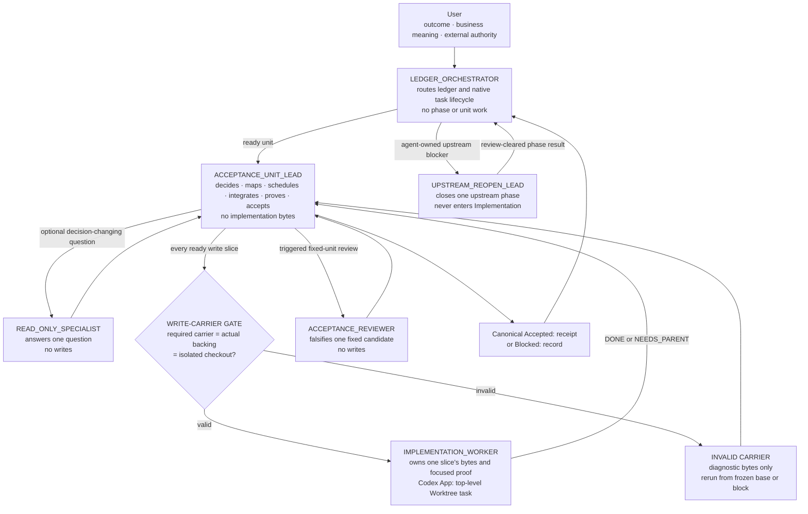

# Implementation Execution Roles

## Execution Role Tree

Ready ledger work binds exactly one role per top-level task or leaf before its
first governed action. A structured root binds `ACCEPTANCE_UNIT_LEAD` for one
ready unit. An orchestrated Codex App root binds `LEDGER_ORCHESTRATOR`, which
routes ready units and agent-owned upstream reopens until the ledger is
exhausted or its terminal boundary is reached. A native task, subagent, model,
or worktree is a carrier, not role authority.



The only path to implementation bytes is
`ACCEPTANCE_UNIT_LEAD -> WRITE-CARRIER GATE -> IMPLEMENTATION_WORKER`. The
Orchestrator, Lead, Specialist, Reopen Lead, and Reviewer have no
implementation-byte authoring path. The table and clauses below define the
evidence required on each arrow.

| Role | Entry skill | Owns | May dispatch | Upward result |
| --- | --- | --- | --- | --- |
| `LEDGER_ORCHESTRATOR` | `$orchestrator` | Ready-unit selection, native task lifecycle, upstream-reopen routing, and terminal routing | One `ACCEPTANCE_UNIT_LEAD` per ready unit; several only for a ledger-proven wave; one `UPSTREAM_REOPEN_LEAD` at a time | Ledger exhausted, an AGENTS-owned user/external boundary, an unrecoverable native blocker, or a canonical blocker with no ready work or recovery |
| `ACCEPTANCE_UNIT_LEAD` | `$acceptance-unit-lead` | Exactly one unit through Worker routing, serial intake, review, proof, correction, acceptance, and receipt | Implementation Workers; optional read-only specialists; a triggered reviewer | `HANDOFF_READY` for a fixed Worktree candidate, then one canonical `Accepted:` or `Blocked:` transition |
| `UPSTREAM_REOPEN_LEAD` | `$upstream-reopen-lead` | One named non-implementation phase through its stop rule | Phase-eligible read-only lanes and triggered reviewers | Review-cleared phase result and next owner, or its exact boundary |
| `READ_ONLY_SPECIALIST` | `$read-only-specialist` | One independently checkable question | Nothing | `DONE` with evidence, or `NEEDS_PARENT` |
| `IMPLEMENTATION_WORKER` | `$implementation-worker` | One exact write slice and focused proof | Nothing | `DONE` with a frozen slice candidate, or `NEEDS_PARENT` |
| `ACCEPTANCE_REVIEWER` | `$acceptance-reviewer` | Independent falsification of one fixed unit candidate | Nothing | `PASS`, `FAIL`, or `NEEDS_PARENT` |

A **frozen slice candidate** is one Worker's returned delta. A **fixed unit
candidate** is the Lead's integrated unit held unchanged for review and
acceptance. Only the canonical `Accepted:` transition creates an accepted unit.

Load only the entry skill for the bound role; that skill names its method and
conditional owners.

### One Acceptance Unit

```mermaid
sequenceDiagram
    participant O as LEDGER_ORCHESTRATOR
    participant L as ACCEPTANCE_UNIT_LEAD
    participant G as WRITE-CARRIER GATE
    participant W as IMPLEMENTATION_WORKER
    participant R as ACCEPTANCE_REVIEWER
    participant D as Canonical ledger

    O->>L: Ready unit + Worker-task authority
    L->>L: Decide route and freeze Execution Map
    Note over L,W: Independent ready slices run concurrently; Lead intake and integration stay serial
    loop Every ready slice up to evidenced capacity
        L->>G: Create required carrier from frozen base
        alt Carrier or base invalid
            G-->>L: Invalid backing, identity, checkout, or base
            L->>L: Release reservations; rematerialize or block
        else Carrier and base valid
            G-->>L: Native identity + isolated checkout
            L->>W: Exact outcome-first Worker brief
            W->>W: Author slice bytes + focused proof
            W-->>L: DONE or NEEDS_PARENT + frozen candidate
            alt Supported finding
                L->>W: Same-Worker correction
            else Intake valid
                L->>L: Serial integration; recompute ready set
            end
        end
    end
    L->>L: Aggregate proof + Lead self-review
    opt Independent review triggered
        L->>R: One fixed candidate
        R-->>L: PASS, FAIL, or NEEDS_PARENT
    end
    L->>D: One Accepted receipt or Blocked record
    D-->>O: Canonical transition; route again
```

### Implementation Write Boundary

An **implementation write** changes production source, tests, fixtures,
migrations, generated or contract artifacts, executable scripts or
configuration, or implementation-owned documentation for a ledger unit. Direct
work remains root-local. Every structured or orchestrated unit routes each
implementation write through a harness-valid Worker; a missing carrier is a
native capability blocker.

The Lead owns judgment, delivery, and acceptance but authors no implementation
write. It may only:

- apply an immutable Worker delta through native Handoff or an exact
  byte-preserving patch;
- run the repository formatter on Worker-authored bytes; and
- update integration metadata plus the canonical receipt or blocker.

A semantic conflict, formatter choice, or correction returns to the owning
Worker. A role does not relabel itself to cross this boundary, and a child
receives only its row's authority.

On `NEEDS_PARENT` or accepted-input invalidation, load [Implementation Obstacle
Recovery](implementation-obstacle-recovery.md) before routing the next action.
