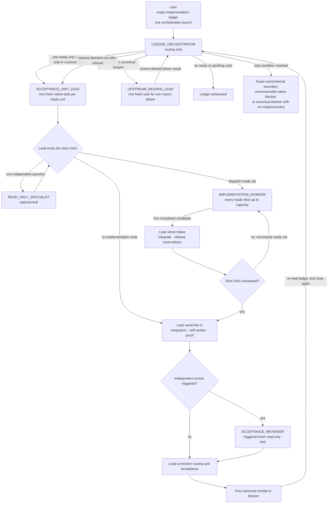

# Implementation Worker Execution

## Execution Role Tree

The user supplies a ready Implementation ledger once and explicitly launches
its orchestration. The Ledger Orchestrator then routes autonomously until that
ledger is exhausted or one terminal condition in the role table holds. It does
not perform Intake, Research, Specification, Design, Test Design,
Planning, or unit work itself. It may suspend Implementation and route a
canonical agent-owned upstream reopen through fresh phase tasks, and never asks
the user to choose a carrier, lane, model, effort, review, proof, correction,
or reopen route.

Optimize wall-clock time without weakening acceptance quality: plan the
[smallest coherent acceptance units](planning.md#acceptance-unit-contract), run
every currently ready positively independent planned-wave unit or mapped slice
concurrently within current carrier and proof capacity, keep one Lead as the
decision, quality, and acceptance owner, integrate serially, and reuse proof
while its preconditions remain valid. Atomic acceptance does not require serial
implementation: one unit may use a Worker Slice DAG while only the complete unit
can be accepted.

Every top-level task and implementation leaf binds exactly one execution role
before its first governed action. A native task or subagent is a carrier, not a
role; each such dispatch starts with `Execution role: <ROLE>` and links to this
tree. Built-in read-only lanes opened inside an upstream non-implementation
phase follow that phase and Subagents And Review rather than binding an
Implementation role. A missing or unknown required role makes the handoff
invalid rather than granting broader authority. [Agent Harness's Codex App Selection
Tree](../../agent-harness.md#codex-app-selection-tree) shows which actor selects
the model and reasoning effort for each direct child.



| Role | Receives from | Owns | May dispatch | Upward result |
| --- | --- | --- | --- | --- |
| `LEDGER_ORCHESTRATOR` — Ledger Orchestrator | Ready canonical ledger and explicit task-creation authority | Ready-unit selection, agent-owned upstream-reopen routing, native task lifecycle, and terminal routing | One `ACCEPTANCE_UNIT_LEAD` per ready unit; several only for a ledger-proven planned wave; one `UPSTREAM_REOPEN_LEAD` at a time | Ledger exhausted; an AGENTS-owned user decision or external confirmation; an unrecoverable native blocker; or a canonical blocker with neither ready work nor authorized recovery |
| `ACCEPTANCE_UNIT_LEAD` — Acceptance-Unit Lead | Ledger Orchestrator or another Implementation entry carrying explicit Worker-task authority | Exactly one unit through decisions, Slice DAG scheduling, Worker intake, serial integration, review, proof, correction routing, acceptance, and receipt | One or more implementation Workers for every implementation write; optional read-only specialists and a triggered reviewer | `HANDOFF_READY` for a fixed Worktree candidate, then one canonical `Accepted:` receipt or `Blocked:` record |
| `UPSTREAM_REOPEN_LEAD` — Upstream Reopen Lead | Ledger Orchestrator and one canonical unit blocker | Exactly one named non-implementation macro phase through its phase stop rule, triggered review, repair, and focused re-review | Phase-eligible read-only lanes and triggered reviewers under Subagents And Review | Review-cleared phase result and next owner, or the exact user/external/native boundary that prevents closure |
| `READ_ONLY_SPECIALIST` — Read-Only Specialist | Acceptance-Unit Lead | One independently checkable question | Nothing; it is a leaf | `DONE` with evidence, or `NEEDS_PARENT` |
| `IMPLEMENTATION_WORKER` — Implementation Worker | Acceptance-Unit Lead | One exact write slice and its focused proof | Nothing; it is a leaf | `DONE` with a frozen candidate, or `NEEDS_PARENT` |
| `ACCEPTANCE_REVIEWER` — Acceptance Reviewer | Acceptance-Unit Lead | Independent falsification of one fixed unit | Nothing; it is a fresh one-shot leaf | `PASS`, `FAIL`, or `NEEDS_PARENT` to the Lead |

### Implementation Write Boundary

An **implementation write** is any content change required by the unit to
production source, tests, fixtures, migrations, generated or contract artifacts,
executable scripts or configuration, or implementation-owned documentation. A
session may bind `ACCEPTANCE_UNIT_LEAD` only when its handoff carries explicit
authority to create the required implementation Workers; otherwise the handoff
is invalid. An eligible direct outcome remains root-local; a planned ledger unit
reports the missing authority without binding the role.

The Lead owns judgment and delivery but authors no implementation write. Its
complete mutation authority is:

- apply a returned immutable Worker delta through native Handoff or an exact
  byte-preserving patch operation;
- run the repository's deterministic formatter on those Worker-authored bytes;
  and
- update integration metadata plus the canonical ledger receipt or blocker.

A merge conflict, formatter result requiring a content choice, or any other
semantic edit returns to the owning Worker. The bound role does not change
during the session, and the Lead never relabels itself as a Worker. A child gets
only its row's authority, not its parent's. A correction resumes the same actor
under the same role. Acceptance-unit roles never revise behavior, unit scope,
or ledger dependencies. An Upstream Reopen Lead may revise only its named
phase-owned artifacts; it returns at that macro-phase boundary and never enters
Implementation or the next phase. Planning may change the ledger only in a
separately routed Planning reopen.

### Bottom-Up Obstacle Resolution

| Current actor | Direct parent | Obstacle result |
| --- | --- | --- |
| `READ_ONLY_SPECIALIST`, `IMPLEMENTATION_WORKER`, or `ACCEPTANCE_REVIEWER` | `ACCEPTANCE_UNIT_LEAD` | `NEEDS_PARENT` |
| `ACCEPTANCE_UNIT_LEAD` | `LEDGER_ORCHESTRATOR` | Canonical unit `Blocked:` record |
| `UPSTREAM_REOPEN_LEAD` | `LEDGER_ORCHESTRATOR` | Review-cleared phase result and next owner, or exact user/external/native boundary |
| `LEDGER_ORCHESTRATOR` | User | Only an AGENTS-owned user decision, irreversible external-effect confirmation, unrecoverable native blocker, or canonical blocker with no ready work or authorized recovery |

An obstacle is not a canonical blocker while a safe resolution remains inside
the current actor's authority. The actor first diagnoses it, uses its available
tools and evidence, and attempts the narrowest in-scope remedy. An attempt is
eligible only when evidence, inputs, the causal hypothesis, or the expected
observable changed; never repeat a route under the same preconditions. If no
eligible remedy remains, a Specialist, Worker, or Reviewer returns
`NEEDS_PARENT` exactly one level with the observed evidence, attempted actions
and results, the boundary that cannot be crossed, and one requested
parent-owned action. Never skip the direct parent or ask the user directly.

A Specialist, Worker, or Reviewer returns its obstacle only to the
Acceptance-Unit Lead. `NEEDS_PARENT` is a message, not artifact state, partial
acceptance, or dependency release. The Lead re-diagnoses instead of
copying that result into the ledger. It uses unit-level authority to close
technical decisions, revise the internal execution strategy, replace fan-out
with one serial Worker, obtain missing evidence, integrate, or route a valid
same-actor correction. Review findings always return to the Lead for this
disposition.

The Lead records the unit's one canonical blocker only after every safe
unit-local route is exhausted, or when resolution requires a change to accepted
behavior, unit scope, ledger dependencies, unavailable external authority, or
an upstream owner. The blocker names the evidence, attempted routes, exact
boundary, reopen owner and condition, and preserved candidate. It is not a
transcript of attempts.

The Ledger Orchestrator consumes only that canonical transition or a native
lifecycle obstacle. It resolves native identity, wait, resume, Handoff, and
routing issues within its authority and continues unrelated ready units. If it
receives a misrouted `NEEDS_PARENT`, it returns the message unchanged to its
owning Lead instead of consuming it. The Orchestrator never enters the unit or
an upstream phase to implement, author, review, prove, or correct it. An
outcome-level stop occurs only under its table row's terminal conditions.

### Upstream Reopen Recovery

A Worktree Lead that reaches an agent-owned upstream boundary first freezes its
current candidate and returns `HANDOFF_READY` with the proposed blocker,
evidence, reopen owner, and condition. It does not persist `Blocked:` from the
Worktree. The Orchestrator applies the ordinary native Handoff to move that same
Lead and candidate into Local; the Lead's Local Goal revalidates the boundary
and either takes a newly available unit-local remedy or persists the one
canonical blocker there. Failed or ambiguous Handoff keeps the candidate in its
original carrier and enters ordinary Handoff recovery.

A canonical blocker whose recorded reopen owner is agent-owned is an authorized
recovery route, not an outcome-level stop. Keep the blocked Lead, its native
identity, Goal, candidate, and blocker pinned. Dispatch one fresh Local
`UPSTREAM_REOPEN_LEAD` for the smallest named macro phase using [Upstream Reopen
And Implementation Return](../shared/resume-and-handoff.md#upstream-reopen-and-implementation-return),
then wait for that phase's movement-allowing result. The Reopen Lead applies the
phase's ordinary delegation and review contract through repair and focused
re-review; it starts neither another macro phase nor Implementation.

Re-read the canonical artifacts after every reopened phase. Route another fresh
Reopen Lead only when the completed change invalidated that downstream phase's
inputs; otherwise preserve its prior disposition. If Planning must repair unit
scope or dependencies, route Planning separately. A new or reopened prerequisite
repair unit is accepted before the blocked unit continues; never widen the
blocked unit silently.

Once Implementation inputs are closed and the recorded reopen condition has
changed, inspect the installed native controls. When they expose documented
Goal resume, resume the original Lead and its Goal first; an ordinary message is
not Goal-resume proof. If current native-schema inspection or a recorded
rejection proves that the Goal cannot resume, the Orchestrator may create one
fresh Local replacement `ACCEPTANCE_UNIT_LEAD` for the same unit from the
preserved candidate and current artifact revisions. The replacement uses a new
attempt in `dispatch_scope`, revalidates the candidate and checkout before work,
and becomes the sole acceptance owner. An unknown task, Goal, create, candidate,
or Handoff outcome never qualifies for replacement.

An explicitly requested Ledger Orchestrator dispatches one ready
[acceptance unit](planning.md#outputs), or each currently ready member of a
ledger-proven independent planned wave, to a separate fresh native task hosting
an Acceptance-Unit Lead. A serial unit starts in Local; each planned-wave member
starts in its own Worktree from the recorded base. The Orchestrator selects no
internal carrier or lane. Outside global orchestration, the current
Implementation root binds `ACCEPTANCE_UNIT_LEAD` only when the initiating user
or handoff explicitly authorizes its required Worker tasks. Without that
authority, eligible direct work stays root-local and a planned ledger unit
reports the missing authority rather than creating an invalid Lead.

The Acceptance-Unit Lead inspects the fixed unit, current repository, relevant
dirt, dependencies, generated/manual authority, mutable resources, and proof
preconditions, then freezes a compact execution map before the first
implementation write. The map is emitted in the Lead trace in this exact shape;
it is operational state, not a new repository artifact:

```text
Execution Map
Base: <accepted commit/tree, or synthetic Git tree ID for the frozen working tree>
Lead-only: <exact delta-application, formatter, proof, and receipt actions>
Slices:
- id: <slice ID>
  outcome: <one implementation postcondition>
  base: <initial Base, or after slice IDs; replace with exact tree ID before dispatch>
  writes: <exact paths>
  inputs:
  - <path, package surface, contract, schema, artifact, state, or proof result>: <exact Git blob/tree, revision, digest, or receipt identity>
  resources: <exclusive mutable resources, or none>
  model: <model and effort>
  proof: <focused proof>
Edges:
- from: <slice ID>
  to: <slice ID>
  consumes: <exact byte, type, schema, state, artifact, or proof result>
Conflicts:
- left: <slice ID>
  right: <slice ID>
  resource: <exact writable path, exclusive mutable resource, or proof gate>
Capacity:
  write_slots: <free count from native evidence, or probing after active Worker identities>
  proof_gates: <gate = free or reserved by slice>
  resources: <resource = free or reserved by slice>
```

Use `Edges: none` when no slice consumes another slice's output and
`Conflicts: none` when no pair excludes concurrent execution. An edge is
directed producer-to-consumer order. A conflict is symmetric reservation state,
never an order or a consumed output: either member may run first, and the other
becomes eligible after the reservation is released and its base and input
identities are refreshed. Every pair that shares a writable path, exclusive
mutable resource, or exclusive proof gate appears in `Conflicts` unless a named
consumption instead requires an edge.

For a working-tree base, create the synthetic Git tree with a temporary index so
it covers every tracked and untracked non-ignored path and byte without changing
the repository index or working tree; a path-only status is insufficient. Every
concurrently ready Worker using that base recomputes and validates the exact
tree ID before its first edit. Any mismatch invalidates every undispatched or
unedited slice using that base and requires a fresh map.

Every required content change belongs to exactly one slice. Every slice declares
the base blob identity, or absence at the base tree, of every writable path and
the immutable identity of each material package surface, contract, schema,
artifact, state, or proof result whose change could invalidate its delta or
proof. Start from the accepted owner and inverse file map. Production code and
the focused tests and fixtures that prove its postcondition **must** stay in the
same slice. A separate test-only slice is valid only when its interface already
exists in the frozen base and its deterministic oracle needs no provisional
sibling output.

A unit has a **large writable surface** when bounded discovery finds at least
eight implementation paths, three package or owner surfaces, or two independent
focused proof surfaces. Count a unique expanded authorized file as one
implementation path; a unique `go list` import path as one Go surface; a
distinct inverse-file-map responsibility as one non-Go owner surface; and one
focused target plus deterministic oracle as one proof surface. Two proof
surfaces are independent only when their targets and oracles are disjoint and
neither proof consumes the other's output. Raw globs, duplicate commands, and
estimates do not count.

That trigger requires at least two candidate slices. A candidate counts only
when it has at least one required implementation write and a non-empty
implementation postcondition checkable on its declared base after predecessors.
Formatting, integration metadata, and receipts create no slice. A
documentation-only candidate counts only when the accepted unit has a distinct
documentation postcondition checkable without sibling writes. One final serial
slice is valid only when the concrete dependency graph below collapses every
candidate group into one cyclic component, or the base-materialization preflight
proves with current harness evidence that the complete dependency chain cannot
cross Workers. File count triggers this proof but never splits the acceptance
unit by itself.

Add a dependency edge only when the downstream slice cannot start until it
observes one concrete output from the upstream slice:

- content in the same writable path;
- a type, interface, schema, or generated contract absent from the frozen base;
- canonical source bytes consumed by a generator, or generated output consumed
  by a downstream slice;
- a migration, rollout, or state transition observed by the downstream slice in
  an accepted fixed order;
- a focused proof input produced by the upstream slice.

Each edge names that consumed output. The same feature, package, acceptance
unit, dirty checkout, broad final gate, possible merge risk, or general claim of
"shared contracts" creates no edge. A shared writable path, exclusive mutable
resource, or exclusive proof gate creates a `Conflict` unless one slice actually
consumes the other's output, in which case the concrete consumption creates an
edge. Collapse each strongly connected component of the dependency graph into
one serial slice. A zero-edge pair is dependency-independent only; it is
concurrency-eligible only when it also has no conflict, its declared input
identities are stable on materializable bases, and its proof consumes no
provisional sibling output.

Before dispatch, prove that every dependency successor's frozen base can be
materialized by the current harness. If it cannot, group that complete
dependency chain into one exact serial Worker slice before work begins and
select a model and effort sufficient for its hardest work. A dispatched slice
is never widened. The same path may appear in more than one slice only under a
directed dependency edge when the successor consumes its content, or under a
symmetric conflict when neither slice consumes the other and the second base
and inputs are refreshed after the first integrates. Concurrent path overlap is
invalid. On resume or changed evidence, recompute and emit the map from the
canonical ledger, native task state, and Git candidate before another write. A
unit with one write slice still dispatches one Worker. Internal
decomposition may realize only the accepted unit outcome: it never changes
accepted behavior, splits the ledger unit, revises dependencies, or starts
another acceptance unit. New evidence that requires one of those changes blocks
the unit and reopens its owner.

The unit's ledger entries are the brief body. Every different-session dispatch
uses [Implementation Entry And Continuation
Handoff](../shared/resume-and-handoff.md#implementation-entry-and-continuation-handoff)
to carry exactly one unit ID, its accepted revision or receipt, recorded base
when a candidate crosses a checkout, relevant dirt, current external-effect
authority, verbatim native-control authority, proof, stop condition, and unique
dispatch scope. The Ledger
Orchestrator supplies no lane map.

A Worktree Lead completes its Worktree Goal before returning a fixed candidate
as `HANDOFF_READY`; when an upstream boundary caused the stop, that return also
carries the proposed canonical blocker for Local revalidation. `HANDOFF_READY`
is not an artifact state, receipt, acceptance, or dependency release. [Agent Harness's native Worktree
fan-in](../../agent-harness.md#worktree-fan-in) solely owns the Handoff mechanics
that move the same task into Local, one Lead at a time. After successful
Handoff, the same Lead creates a separate Local Goal, then integrates, reviews,
proves, routes corrections, and records the one canonical receipt or blocker.
Moving the carrier is Orchestrator lifecycle routing; candidate judgment and
integration remain Lead-owned.

When the unit has one write slice, the Lead dispatches one Worker, then reviews,
proves, routes corrections, and records the unit receipt or blocker. When
dependencies make later slices independent only after a shared foundation, the
Lead integrates the foundation Worker's frozen delta, freezes a new
unit-internal base, and makes its successors ready. Every Worker remains the
Lead's direct leaf; no internal base or slice creates acceptance or releases a
ledger dependency.
A routing-only Ledger Orchestrator that lacks fresh top-level task creation
stops blocked instead of implementing. An Acceptance-Unit Lead that lacks its
required write carrier records the exact capability blocker after exhausting
safe carrier recovery; it never substitutes a Lead-authored implementation
write.

## Implementation Slice DAG

At every scheduling point, a slice is **ready** only when:

- every declared predecessor is integrated;
- its exact frozen base is materializable and every declared input identity
  matches that base and current external state;
- it has no declared writable-path, mutable-resource, or proof-gate conflict
  with an active Worker; and
- its focused proof needs no provisional output outside its predecessors.

Capacity is evidence, not a Lead estimate. Derive free write slots from the
installed native limit or status and every active Worker carrier identity
visible in the current harness/project; derive proof and resource availability
from repository-owned serialization rules and current reservations. When the
native write limit is unavailable,
dispatch eligible ready slices one at a time: every successful create proves
another occupied slot and requires trying the next eligible slice, while a
native capacity refusal bounds further dispatch at the current active count.
Guessing a number does not. Dispatch every ready slice immediately while a
write slot and all of its proof gates and resources are free. If capacity is
full, keep only the excess ready slices queued and record the exact evidence;
idle proven capacity while an eligible ready slice exists is a routing defect.
Each dispatch atomically reserves the slice's writes, proof gates, and resources
and recomputes the ready set before another dispatch.

Different active slices may use different frozen bases only when their write
sets are disjoint, neither changes any declared input identity of the other,
and they share no conflict. Under those conditions applying their immutable
deltas in either order yields the same pre-format tree; otherwise serialize
them.

Consume the first completed Worker without waiting for an all-Worker barrier:
freeze its candidate, apply Scope Lock and mergeability checks, integrate it
serially, release its write, proof-gate, and resource reservations, and
recompute the ready set.
Other Workers continue only while that integration leaves every declared input
identity unchanged; otherwise stop the affected Worker before another edit and
emit a fresh map. This work-conserving loop ends only when the Slice DAG is
exhausted or blocked.

Use a read-only research, evidence, or review lane only for one independently
checkable question whose result can change implementation or acceptance. Keep
integration, ledger, formatting, aggregate proof, review, and receipt surfaces
with the Lead. Read-only lanes write nothing. Every internal lane remains a
leaf; a discovered dependency returns to the Lead for a new edge and ready-set
calculation rather than being dispatched by a Worker.

Each lane brief uses this exact outcome-first shape:

```text
Execution role: <READ_ONLY_SPECIALIST | IMPLEMENTATION_WORKER>
Role contract: docs/spec-first-workflow/phases/implementation-worker-execution.md#execution-role-tree
Outcome: <one checkable postcondition>
Unit: <unit ID and accepted revision>
Lane: <slice ID or question ID>
Base: <exact frozen tree or state identity>
Writes: <exact paths, or none>
Inputs: <immutable identities consumed by this lane>
Resources: <exclusive mutable resources, or none>
Lead reservations: <surfaces the lane must preserve>
Authorities: <fixed canonical and generated owners>
Proof: <focused command and expected observable>
Return: <DONE | NEEDS_PARENT> with paths, commands/results, and commit/tree/bounded-diff identity when applicable
Stop: <owner, scope, behavior, dependency, or authority boundary>
```

A write lane never edits the ledger, integrates, rebases, stashes, deploys, or
mutates the integration checkout. Every lane preserves unrelated work and stops
before crossing another owner, changing accepted behavior or dependencies, or
widening the unit.

After the DAG is exhausted, the Lead reconciles and formats the combined change,
runs aggregate proof, performs Lead self-review and triggered independent
review, routes same-Worker corrections when useful, and writes the one unit
receipt or blocker. No internal base or subset creates a receipt or releases a
ledger dependency.

## Execution-Ready Dispatch

Dispatch only when the route is closed: the reproducer or current facts,
narrowest owner, known cause or deterministic mechanism, expected behavior,
editable boundary, and exact proof live in the accepted ledger entry or its
live delta. If an intermediate finding still determines the next step, keep
discovery and the decision Lead-local; once closed, dispatch its implementation
as the next Worker slice.

If a dispatched task exposes an open route, the Worker returns the frozen
candidate and missing decision. The Lead closes that route before
dispatching implementation again. [Agent Harness](../../agent-harness.md#what-crosses-into-a-worker)
owns what context crosses into a Worker.

## Observe And Freeze

Treat a Worker worktree as mutable until the Worker returns. Observe native
completion events and stable status only; inspect or review the candidate after
the return identifies a fixed commit, tree, or bounded diff. Before return,
message the Worker only to stop unsafe work or when new evidence invalidates an
accepted input; ordinary findings wait for the frozen candidate.

Wait on all currently relevant Workers together when the harness supports it,
using the latest delivered cursor or equivalent, and consume the first completed
Worker rather than waiting for all targets. Recompute the DAG ready set after
each serial intake. An unchanged timeout carries no new evidence: preserve the
current disposition, emit no correction, and either continue independent Lead
work or wait again. Never convert partial progress or a mutable diff into a
review finding.

## Correction Loop

The Acceptance-Unit Lead owns diagnosis and correction routing through its
terminal receipt or blocker; the Ledger Orchestrator remains waiting and makes
no correction decision.

Keep every implementation Worker's native identity and context available until
the whole unit reaches its receipt or blocker. `DONE` freezes a lane candidate;
it does not authorize archiving that Worker before final unit review can return
a correction.

Before adopting a correction that changes a slice output, compute the affected
closure: seed it with that slice's direct successors and every slice whose
declared input identity changed, then include all of their transitive dependency
successors. Stop each active affected Worker before another edit; invalidate the
corrected slice's prior proof plus every affected integrated delta and proof;
rebuild the unit-internal base from the initial base, preserved unrelated
deltas, and the corrected delta; then emit a fresh map. Resume each affected
slice's original Worker on the fresh base when the harness can rematerialize it;
otherwise use only the invalidated-base replacement rule below. Preserve
unrelated active and integrated slices. A changed undeclared input is a map
defect: add the missing edge or conflict before redispatch.

A returned candidate that misses an accepted criterion goes back to **the same
Worker**, with its context intact, through the harness's own correction channel.
Spawning a fresh Worker for the same task instead is a defect: it throws away
the reasoning that made the second attempt cheaper than the first, and it
re-opens questions the first attempt already closed.

Review one frozen candidate, disposition all supported findings, and send one
batched correction brief. It names each finding, the criterion it violates, and
the proof that must change — not a restatement of the unit. Route it through the
[Diagnostic Gate](#diagnostic-gate) so a correction that cannot name a
candidate-caused regression, a violated accepted criterion or repository-owned
invariant, or missing proof is recorded as an observation rather than
re-entering the write lane.

Before sending a third correction batch for the same acceptance unit, audit the
route: cause, owner, accepted input, unit boundary, and proof strategy. Resume
the same Worker only when new evidence closes the diagnosed route defect;
otherwise reopen the narrowest upstream owner or return the honest blocker.

Replace a Worker only for an execution stall that produces no new turn, or for
an invalidated base, and then continue the same exact brief from the frozen
candidate. Worker replacement resets context; it is a recovery action, never a
correction technique.

## Scope Lock

A candidate is scope-valid only when every changed path is authorized by an
explicit editable path or by the deterministic placement rule in its bounded
discovery boundary, and every retained change maps to an accepted criterion or
required proof. Before Lead intake review, derive paths
with `git diff --name-only <slice-base> <candidate-tree>` or the
harness-native equivalent. For an uncommitted checkout, combine
`git diff --name-only <slice-base>` with
`git ls-files --others --exclude-standard` so the check includes untracked
paths. A scope-invalid lane candidate has one disposition: reject it in full
from the slice base while other provisional unit lanes remain unaffected. A
required boundary expansion reopens the scope owner before implementation.

## Progress

Continue the write lane only when a returned candidate materially advances an
open finding or new evidence changes the current causal hypothesis. When the
effective inputs, hypothesis, and expected observable already have a
disposition, retain the preceding frozen candidate and return the honest
blocker. A correction re-enters the write lane only through the Diagnostic
Gate. Judge convergence from returned candidates, not elapsed time, wait
timeouts, message count, or intermediate Worker activity.

Every Worker starts from its mapped frozen slice base and every return remains
provisional. Assemble only bounded deltas into the unit candidate. A passing
slice may be retained after another fails, but no base or subset is accepted
independently: the Lead completes or blocks the whole unit. Start another
acceptance unit only through the phase-owned [Acceptance-Unit
Closure](implementation-validation-closeout.md#acceptance-unit-closure).

## Candidate Intake And Correction

### Monotonic Intake

The Acceptance-Unit Lead owns candidate intake, correction routing,
acceptance, and integration.
Each Worker return first passes Scope Lock plus ownership, mergeability, and
proof-provenance intake. Intake-valid candidates are integrated serially into
the unit-internal base; after the Slice DAG is exhausted, the combined candidate
becomes the frozen baseline for the phase-owned bounded
[review](implementation-validation-closeout.md#review) and mapped proof. That
review creates the finite finding set supported by the evidence then available,
containing only candidate-caused regressions, concrete violations of accepted
criteria or repository invariants, and proof missing from an accepted claim.
All other observations retain observation status.

Correction verification covers the open findings, the delta from the frozen
baseline, and proof invalidated by that delta; unchanged bytes retain their
prior disposition. Adopt a correction only when it closes or disproves at least
one finding, reopens none, introduces no regression, stays in scope, and
preserves passing proof. Adoption makes the correction the current frozen
baseline and the open set a strict subset. An empty set plus passing mapped
proof, plus a passing independent review when triggered, accepts the candidate.

### Diagnostic Gate

A correction that introduces a regression, reopens a dispositioned finding, or
fails to shrink the current finding set has one disposition: reject the delta
and retain the preceding frozen baseline. Its bytes are diagnosis evidence
only, never accepted change or proof. Re-enter correction only when
[Progress](#progress) has new evidence that changes the causal hypothesis or
expected observable; otherwise return the honest blocker.

Current evidence outranks the finding set. Evidence first available after the
full review adds or reopens a finding only when it proves a candidate-caused
regression, a violation of an accepted criterion or repository invariant, or
missing proof for an accepted claim. Reopen an upstream owner only when that
evidence invalidates an accepted decision rather than the candidate.

The local repository default/main is the authoritative integration branch
unless the user names another persistent branch. Integrate only the accepted
unit delta and confirm the authoritative diff still contains that candidate
without unrelated changes. If integration changes relevant content, validate
only the affected claims. When integration is commit-backed, land the final
accepted delta and its ledger transition as one acceptance commit per unit;
intermediate Worker and correction commits remain candidate history rather than
integration history. Use a commit/tree identity only when proof crosses a
checkout or integration boundary; never hash individual files or specifications
for this purpose. Preserve unrelated dirty state during integration; publication
remains governed by [AGENTS.md Authorization And
Boundaries](../../../AGENTS.md#authorization-and-boundaries).
