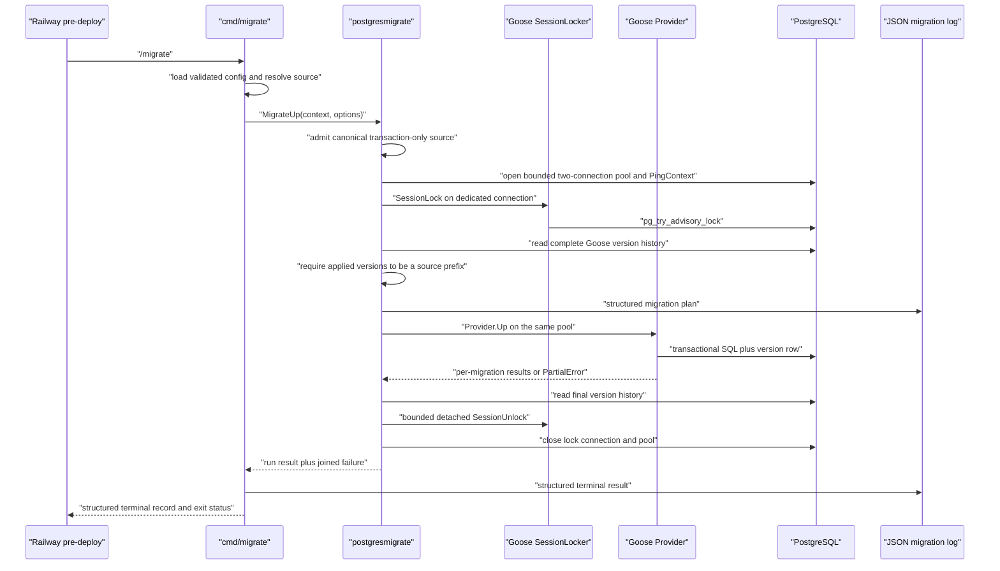

# Goose migration runtime design

status: ready

## Drivers and selected architecture

The design must preserve the separate Railway pre-deploy owner, use Goose
without retaining a second migration engine, reject ambiguous source and
database state before schema SQL runs, keep every database and cleanup stage
finite, expose useful secret-free results, and prove the exact production
source and image path.

The selected target is one repository-owned lifecycle adapter around Goose
v3.27.3:

- `cmd/migrate` remains the production-only, argument-free Up entrypoint.
- `internal/infra/postgresmigrate` admits canonical source, opens one dedicated
  `database/sql` pool, acquires Goose's PostgreSQL session advisory lock,
  checks the complete applied-version set against source while holding that
  lock, and then calls the Goose Provider API.
- Goose remains the sole parser and migration executor. The adapter neither
  interprets SQL nor stores a competing migration state.
- The public Goose database store reads the complete `goose_db_version`
  history for the prefix check; repository Git history owns file identity and
  immutability.
- A fast repository gate uses Goose's own `validate` command plus
  repository-specific naming, annotation, and base-reference history checks.
- A disposable-PostgreSQL rehearsal performs actual-source
  Up/no-op/Down/Up before the production image `/migrate` and application
  readiness proof.

Retaining `golang-migrate` loses because its pgx/v5 lock and several lifecycle
operations are not caller-context-bound. Calling Goose with only
`WithSessionLocker` loses because `Provider.Up` performs `HasPending` before
its internal lock and its detached unlock context has no deadline. A custom
parser, metadata table, or migration state machine loses because the accepted
transaction-only source policy removes the dirty-state case that would
justify that machinery.

Reopen the mechanism only if Goose exposes an atomic locked preflight and
bounded cleanup contract that makes the outer lifecycle adapter redundant, or
if an accepted non-transactional release operation needs durable recovery
state.

## Source and history flow

`migrations/` is a flat canonical source directory. Each migration is one
`NNNNNN_lower_snake_description.sql` file with exactly one ordered
`-- +goose Up` and `-- +goose Down` section. Versions are six digits,
`000001` through `999999`, unique, strictly increasing by filename, and may
have gaps.

The repository source check:

1. treats an absent `migrations/` directory as the valid pre-first-migration
   repository state;
2. when the repository directory exists, requires at least one canonical file
   and rejects nested directories, unexpected `.sql` names, legacy pairs,
   duplicate versions, missing or repeated direction annotations,
   `-- +goose NO TRANSACTION`, and Goose environment substitution;
3. invokes the pinned Goose CLI `validate` command to exercise Goose's actual
   parser without a database;
4. applies the history scope selected below and accepts only added migration
   files; modification, rename, copy, or deletion of a file already published
   in that scope fails closed.

The production adapter repeats the security- and correctness-relevant source
admission before opening PostgreSQL, except that an existing empty runtime
directory is a valid source and must reach the database-state check. It does
not repeat the repository-only absence rule or Git-history policy, for which a
production image has no trustworthy checkout authority. The admitted
filesystem is rooted with `fs.Sub` before it is passed to Goose, so the same
relative filenames reach local tests, the CLI, and the image.

History scope is explicit rather than guessed:

- without `BASE_REF` in a developer shell, the gate compares `HEAD` through
  the working tree and reports that it proved worktree scope only;
- merge-base mode, used by pull requests and explicit developer comparison,
  requires a readable `BASE_REF`, resolves its merge base with `HEAD`, and
  compares that tree through the working tree;
- exact-base mode, used by push CI, compares the exact previous event tree to
  the candidate tree without merge-base normalization. An all-zero previous
  SHA selects the Git empty tree for bootstrap validation; an unavailable
  nonzero SHA fails closed;
- an explicitly supplied unreadable merge-base ref is an error;
- workflow-dispatch is a non-publication rerun and reports worktree-only
  history scope;
- main-image and tagged-release publication are authorized only from an exact
  successful `ci` workflow run whose event is `push` and whose head SHA equals
  the candidate SHA and whose migration source/history job completed
  successfully. The main publication guard and release preflight verify that
  exact run through the GitHub Actions API with read-only Actions permission
  and fail closed when it is absent.

These boundaries are tree comparisons, not per-commit audits. A migration may
therefore evolve while it is new inside one pull request or push interval;
once present at the prior push boundary, any content or path change is
rejected independently of squash, merge-commit, rebase, fast-forward,
or force-push inside the review boundary. That boundary is intentionally not
the publication authority because a branch can be deleted and recreated.

The durable publication boundary is the migration corpus in the signed image
whose immutable digest is currently named by the dedicated
`migration-history` GHCR marker. Main and release publication jobs share one
non-cancelling concurrency group and perform the same ordered protocol:

1. resolve bootstrap versus existing-history mode before any candidate push;
   in history mode, resolve the marker to an immutable digest, verify its
   trusted repository/workflow provenance, and extract its `/migrations`;
2. build the candidate image, but do not advance any registry alias, and
   extract its `/migrations`;
3. require
   every prior relative path to exist with identical bytes in the candidate,
   and allow only canonical additions;
4. push the candidate's immutable ref, sign and attest its digest, and verify
   those records;
5. move `migration-history` to the verified candidate digest and verify the
   resolved digest;
6. only then move the channel aliases (`main`, version, or `latest`) to that
   same digest.

If marker promotion succeeds and public alias promotion fails, the unpublished
candidate becomes the conservative history authority; retrying the same
candidate is safe and a later candidate may only add files. The reverse
half-state cannot occur because public aliases move last.

The first publication has no marker image. Before pushing any candidate
manifest, the job queries the GitHub Packages REST endpoints appropriate to the
repository owner type. Absence is proved only by a successful complete owner
package listing that omits this package; any present package is treated as
prior publication authority. Bootstrap is then admitted only
when `MIGRATION_HISTORY_BOOTSTRAP_SHA` exactly equals the candidate SHA. A
`401`, `403`, `404`, truncated/incomplete listing, other unexpected response,
or any present package—including one carrying an arbitrary `v*`, immutable
build, untagged, `main`, or `latest` version—is
fail-closed. Once a marker exists, any non-empty bootstrap variable is an error
so its owner must clear the one-time authority before the next publication.
A missing marker when the package exists is a recovery blocker, not
permission to reconstruct history from a rewritable branch. Registry retention
must preserve both the marker manifest and its immutable digest; deliberately
deleting every package version is an external destructive operation requiring
restoration from a trusted digest. A release tag cannot create a second
migration identity because it uses the same serialized marker protocol.

`internal/infra/postgres/sqlc.yaml` names the migration directory rather than
the legacy Up glob. sqlc then reads Goose Up sections in the same
lexicographic order guaranteed by the fixed-width filename grammar.

## Production execution flow

The pool has a maximum of two open connections: one owns the session advisory
lock and one is available to the SQL-only Goose Provider. Every compliant
migrator must acquire the same Goose default lock ID. Holding the lock outside
the Provider makes source/database preflight and execution one serialized
critical section. Provider-level locking stays disabled to avoid attempting
the same non-reentrant session lock twice.

The adapter disables Goose's global Go-migration registry and never registers
Go migrations. Out-of-order application remains at the Provider default
`false`; versioning remains enabled; the default `goose_db_version` table and
public Goose PostgreSQL store remain authoritative.

Before execution, source versions `S` are ascending. The public Goose store
returns rows newest-first by insertion ID. The adapter validates that raw
history has exactly one oldest bootstrap row `0`, that every other row is
applied and unique, then reverses the non-bootstrap rows to construct
canonical `A`. Canonical `A` must be strictly ascending; an out-of-order
application history therefore fails rather than being normalized into an
apparently valid set. The only valid source relation is
`A == S[:len(A)]`. The check occurs under the advisory lock and therefore
cannot race another compliant migrator.

An absent version table means an empty `A` and has no bootstrap requirement.
An empty runtime source is a successful no-op only when `A` is also empty; it
still connects and checks state so a deleted source corpus cannot masquerade
as a new service. Nonempty source constructs the Provider only after the
prefix check. There is no automatic force, rename, version deletion, or repair
path.

`MigrateDown` is retained as an internal disposable-proof operation. It uses
the same source admission, database construction, advisory lock, prefix
preflight, and cleanup, then calls `Provider.DownTo(ctx, 0)`. No production
binary path exposes it.

## Time, cancellation, and cleanup

`MigrationOptions` carries the already validated PostgreSQL connect,
statement, and migration-lock budgets. `cmd/migrate` supplies a caller context
with the overall migration deadline.

The pgx `database/sql` connector is built from the parsed DSN with:

- `ConnectTimeout` set from `postgres.connect_timeout`;
- `statement_timeout` and `idle_in_transaction_session_timeout` set to
  `postgres.migration_statement_timeout`;
- PostgreSQL `lock_timeout` set to
  `postgres.migration_lock_timeout`.

The advisory locker is Goose `lock.NewPostgresSessionLocker`. Its retry probe
uses one-second intervals, while a context wrapper enforces the exact
configured lock budget, including sub-second configured values.

When the caller has an overall deadline, the execution context ends one
migration-lock budget before it. That reserve belongs only to unlock and
connection cleanup. Configuration therefore requires
`migration_lock_timeout < migration_timeout`. Cleanup uses
`context.WithoutCancel` so SIGTERM or an execution timeout cannot skip
unlock, then applies the earlier of the reserved overall deadline and one
lock-budget deadline. Without an incoming deadline, detached cleanup is still
bounded by one lock budget.

The runner never retries SQL migrations. Goose runs each file in one
transaction, so a statement, context, or metadata failure rolls back that
file. Successfully committed earlier files remain reported as partial
completion and a later invocation resumes from that valid prefix.

Unlock failure is joined with the operation failure, if any. Closing the
dedicated lock connection releases PostgreSQL session locks even when the
explicit unlock failed, but that fallback does not convert the run to
success. Database close follows lock-connection close.

## Result and observability contract

`internal/infra/postgresmigrate` returns a repository-owned `RunResult`
containing:

- current version before the operation;
- source target version;
- final database version when observable;
- ordered completed migration results with version, base filename, direction,
  duration, and empty flag;
- failed migration metadata when Goose returns `PartialError`;
- total duration.

It returns the partially populated result together with an error. A narrow
failure classifier maps errors to stable, low-cardinality stages:
`source`, `config`, `connect`, `lock`, `state`, `execute`, and `cleanup`.
The wrapped cause remains available to tests and direct callers, but the
production logger emits only the classifier, context cancellation class,
PostgreSQL SQLSTATE when available, version, base filename, and the recovery
document path. It never emits the DSN, environment, SQL statement, or
provider error text.

Goose verbose logging remains disabled because its verbose structured event
contains a raw `statement` field. `cmd/migrate` owns and supplies a JSON
`slog` logger at the configured level. The execution adapter emits:

- `migration_plan` after locked prefix preflight;
- one `migration_result` for every completed or failed result;

and `cmd/migrate` emits:

- `migration_run_finished` with before, target, after, applied count, total
  duration, outcome, and failure classifier.

The command rejects arguments before side effects. Configuration or source
failure still exits nonzero with a bounded safe terminal record. An
already-current or valid empty source emits `outcome=no_change`, not a skip.

## Delivery, rollout, and recovery

`migration-source-check` owns grammar plus Goose parsing.
`migration-history-check` owns one explicit tree-comparison scope, and
`migration-check` composes both for developer and CI use. Its log states
`worktree`, `merge-base:<sha>`, `exact-base:<sha>`, or
`exact-base:empty-tree` so proof scope cannot be mistaken. These checks own
review-time identity, not the durable published corpus.

`migration-validate` depends on source admission, while the invoking workflow
must already own the matching history result: PR/push validation from the
current CI run, and either publication channel from the exact successful
upstream push-CI job verified by its workflow guard or release preflight.
Publication additionally runs `migration-image-history-check` against the
serialized GHCR marker before any channel alias moves. It then owns the
stateful rehearsal:

1. start disposable PostgreSQL;
2. when an actual repository corpus exists, run host
   Up/all, second-Up/no-op, Down/all, and Up/all against that exact corpus;
3. build or reuse exactly one production runtime image;
4. run that image's `/migrate` against the rehearsed database and require the
   same target version;
5. start the same image, require readiness, and prove bounded SIGTERM exit.

With no repository corpus, the host reversal phase is not applicable; the
image must contain an existing empty `/migrations` directory and report the
explicit no-change outcome.

Focused real-PostgreSQL integration proof separately covers transactional
rollback, partial completion, exact prefix inconsistency, advisory-lock
contention, DDL-lock timeout, statement timeout, cancellation, concurrent
serialization, and bounded unlock. Those are engine/lifecycle claims and do
not wait for a service-specific migration corpus.

Railway still runs one `/migrate` before promotion, and application processes
never migrate. This repository change is direct target-state adoption because
the template owns no released migration corpus. Existing initialized services
are not converted; each requires a separate cutover design for files and
metadata.

Production rollback remains forward repair or restore according to the
service-specific migration class. Executable Down rehearsal proves source
quality only; it is not exposed as a production rollback button. The runbook
replaces `schema_migrations` dirty-state repair with fail-closed
`goose_db_version` prefix diagnosis. Manual version-table mutation remains
forbidden in the normal recovery path.

## Go ownership and change surface

| Responsibility | Owner and exact placement | Dependency and cleanup disposition | Proof owner |
| --- | --- | --- | --- |
| Source grammar and admission | `internal/infra/postgresmigrate/source.go` | Uses `io/fs`, regex, and file reads; no SQL interpretation. Replaces paired-file discovery in `cmd/migrate`. | `source_test.go`, project-structure and Goose CLI gates |
| Lifecycle, Goose Provider call, result/failure mapping | `internal/infra/postgresmigrate/migrate.go` | Imports Goose Provider; retains `MigrateUp` and test-only `MigrateDown` with repository result types and emits safe plan/per-file records through the supplied logger. Removes every golang-migrate driver and dirty-state path. | `migrate_test.go`, integration suite |
| Bounded pgx stdlib connection and session lock | `internal/infra/postgresmigrate/connection.go` | Uses pgx stdlib connector plus Goose `lock.SessionLocker`; package owns unlock, connection, and pool cleanup. The only interface is Goose's existing locker contract. | focused unit lifecycle tests and real contention tests |
| Complete applied-version prefix check | `internal/infra/postgresmigrate/state.go` | Uses Goose's public PostgreSQL `database.Store` and default table constant; no competing table or state. | unit prefix matrix plus real database inconsistency tests |
| Production composition and JSON terminal records | `cmd/migrate/run.go`, `cmd/migrate/main.go` | Loads config, resolves an existing source directory, builds and passes the JSON logger plus all budgets, and renders only safe terminal fields. No Down argument. | `cmd/migrate/run_test.go` |
| Repository grammar and append-only history | `scripts/ci/project-structure-check.sh`, new `scripts/ci/migration-history-check.sh`, new `scripts/ci/migration-image-history-check.sh`, `Makefile`, affected GitHub workflow invocations | Goose CLI is pinned in `tools/go.mod`; legacy pair rules are removed; local/PR/push callers report worktree, merge-base, or exact-base boundaries. Review checks reject changed prior-tree files. Both publication channels query exact push CI, serialize on one concurrency group, compare against the verified `migration-history` image corpus, and promote the marker before public aliases. | script self-tests including branch recreation, project structure, migration source/history checks in every mode, exact-run/job publication guards, image-corpus additions/rewrite/deletion/bootstrap/half-state cases |
| Stateful rehearsal | `test/postgres_migrate_runner_integration_test.go`, `Makefile` | Synthetic lifecycle fixtures plus actual repository source; one Compose database and one production image per aggregate. | `make migration-validate` |
| sqlc source authority | `internal/infra/postgres/sqlc.yaml` | Directory input lets sqlc consume Goose Up sections; generated output remains sqlc-owned. | `make sqlc-check` and PostgreSQL fixture initialization |
| Template profiles and fixture | `scripts/init-module.sh`, `scripts/ci/template-init-check.sh`, `scripts/ci/fixtures/postgres-post-feature.patch` | PostgreSQL profile retains Goose runtime/tooling; database-none drops both runtime and Goose CLI tool. | `make template-init-check`, optional PostgreSQL fixture proof |
| Operator/developer contract | README and existing migration/configuration/structure/delivery/Railway docs | Replace golang-migrate, pair, dirty/force, and false rehearsal claims. No task-local design becomes runtime authority. | link/drift search and `git diff --check` |

The import direction remains
`cmd/migrate -> internal/infra/postgresmigrate -> Goose, pgx`.
Application bootstrap and runtime pool do not import migration code. The
existing `pgtest.Migrated` helper remains a caller and adds connect-timeout
input. No new exported interface, generic database abstraction, production
Down command, or cross-package helper is introduced.

## Acceptance boundaries and reopen conditions

- Source admission must reject the complete negative matrix without opening a
  database.
- Under two concurrent real migrators, one holds the Goose advisory lock and
  the other either waits then observes no change or reaches its configured
  lock timeout; both cannot execute the same migration.
- A database-only applied version, missing earlier applied version, or empty
  source with applied history fails before schema SQL.
- Cancellation and timeout tests must prove no later migration starts, and
  cleanup completes within its reserved bound.
- Dependency and import scans must find no `golang-migrate` path and no
  migration dependency in the service binary.
- The final candidate must pass focused unit/integration/race proof,
  `migration-check`, `migration-validate`, sqlc drift, module drift, template
  initialization, changed-code lint, and the repository aggregate whose claim
  is being made.

Reopen source policy for a concrete non-transactional PostgreSQL operation,
reopen rollout for an existing deployed history, and reopen budgets when
production-shaped rehearsal shows the defaults cannot cover the largest
accepted transactional migration.
