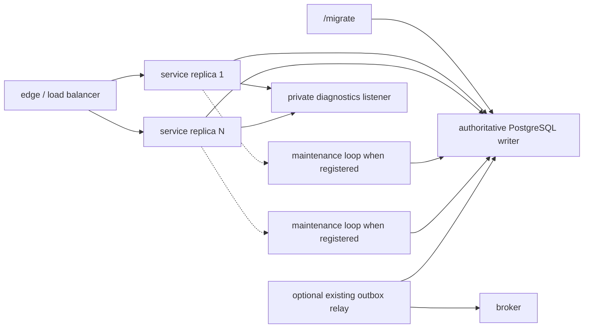

# PostgreSQL-backed HTTP idempotency technical design

status: ready
macro phase: Technical Design
behavioral authority: `specs/http-idempotency-postgres/spec.md`
evidence baseline: `40e6d212799ae8677b675339929c559246536181`
research evidence: `specs/http-idempotency-postgres/research/synthesis.md`, refreshed only as recorded below
review evidence: prior Go Ownership panel and independent Technical Design review PASS on content hash `46680d10b2b633237e77392c6db0aa3a33e9530a6c5afa85eab38c412d0e96ad` (2026-08-11); fresh independent Technical Design review PASS on corrected overview candidate `e19e486bcdc5ead2a1e9c5b7261cf34dcdd27161943cbac1f870b85f07bcfaf0` with rollout candidate `f4a69683c4468a25a5f7a25804e16742bbf02059e40c6f89aae5e6c46ac13f65` (2026-08-12); final reopened Go Ownership complementary panel PASS on fixed `design/overview.md` candidate `d044a29cd10f0d70b97d8f21ecd7200b95bdee5f087a0261a5d3f104d0262aee` with `tasks.md` candidate `6b3da77bccdebb3894e090879dbc0cbb4fca55e830b4f8a8f4d3cfb0c2b8f5b6` (2026-08-12): responsibility/execution-path and file-cohesion/naming focused reviews PASS after removing unchanged `request_errors.go` from the T1 edit surface, while the package/dependency PASS remained valid because that repair changed no package, import, composition, exported-surface, or generated-authority decision. Only review receipt edits followed. The shared fence preserved the accepted transaction boundary, so Technical Design did not reopen; no implementation or later-phase readiness is claimed.
reopen review evidence: complementary package/dependency, responsibility/execution-path, and file-cohesion/naming panels PASS on overview candidate `3601dd3cf5d3091a578e478ab052ba32d9f85c6118fc6a94ca77bc1580471823` with rollout candidate `807105028f8f999914776f85f5d7ac721a14cc3a419b8530806e7ca22d3382f2`; independent whole-artifact Technical Design review then PASS on those exact hashes (2026-08-12). The reopened T3 system candidate `92a9dd7660b4aeb1978348b8f712b23d67e1c7ee4530ca41a30a979a56eabffb` with rollout `8e316f84388c2dcac4b8dd85ca2e344e28a74aaed826e9eee4f727c5ff236cbb` received independent FAIL because final authority-admission rejection lacked a terminal observer; repaired candidate `01fc1cb615fbdee18fdd2e4da43c42c99e93e8a4f13e3bef033b62a8d9387bfb` with rollout `5a53f02d20ecbbdee57bfd84761678122bb42c0e976553500200c3653048f32d` received focused independent CONCERNS with no surviving System Design blocker (2026-08-12). The repaired Go Ownership candidate `2effd53c9fe847ea4b1a5b4905f26336a12a4c1f1f79c9f55f1c68c9f1fa065f` received complementary panel PASS: responsibility/execution-path and package/dependency PASS; file-cohesion/naming PASS after the focused repair assigned terminal observer, capacity-one publication, sole receiver, and join proof to non-contradictory files. Only this review-receipt edit followed; no implementation acceptance proof was run.
movement: Specification and the accepted caller-owned transaction boundary stay closed. System Design is preserved; Go Ownership now fixes one observation seam with mutually exclusive admission-rejection and admitted-endpoint terminal owners, plus one prompt Store-to-supervisor terminal notification, in the Store/bootstrap file map. Next owner: Test Design must repair the invalidated T3 split-finality, prompt-drain, ceiling-boundary, and two-order/restart oracles before any T3 implementation return. No Implementation or T3 acceptance movement is authorized.

## Outcome and boundary

Select a split HTTP envelope plus a caller-owned, transaction-bound PostgreSQL
primitive. Revise the leading advisory-lock hypothesis: exact row locking wins
because PostgreSQL advisory-lock keys are finite and a compressed authenticated
scope could falsely collide. One writer-authoritative relation owns both a visible
provisional reservation and the completed bounded result. The feature mutation,
completed idempotency evidence/result, and any outbox append become final in the
exact caller-owned PostgreSQL transaction. Nothing outside that transaction joins
the reusable atomic guarantee.

The selected design adds no deployable, cache, broker, scheduler, or datastore.
The existing migration binary creates the schema. When at least one operation
registers, each service replica uses the existing PostgreSQL pool for requests and
runs one bounded maintenance loop under the existing background supervisor. With
no registrations, bootstrap constructs no store, probe, or maintenance task and
performs no capability schema/writer/config check. An outbox relay remains an
unchanged optional branch only for an endpoint that appends outbox intent in the
feature transaction.

No business operation opts in in the generated health-only template. A concrete
operation supplies all endpoint-owned values and semantics before it can register.
The reusable pack does not guess a tenant, authorization rule, fingerprint, result,
retention horizon, admission budget, or external-effect recovery policy.

## Narrow dependency refresh and source selection

The research synthesis's only dependency trigger was refreshed before source
selection on 2026-08-11. `go list -m -versions` and current upstream source showed:

- [`faustbrian/go-idempotency`](https://github.com/faustbrian/go-idempotency) remains unreleased/pre-v1 and does not establish this
  repository's exact caller-owned transaction and proof surface;
- [`eben-vranken/idempo`](https://github.com/eben-vranken/idempo) has a v1 tag, but its middleware claims before the handler,
  stores after the handler, and documents fail-open behavior when post-handler
  persistence fails;
- [River](https://github.com/riverqueue/river) is a mature PostgreSQL job queue, not an HTTP semantic replay primitive;
- [DBOS Go](https://github.com/dbos-inc/dbos-transact-golang) is a durable workflow runtime, not this transaction-bound capability.

No new dependency is selected. Implementation uses the standard library plus the
already pinned authorities: pgx v5.10.0, kin-openapi v0.145.0,
oapi-codegen v2.8.0, Goose v3.27.3, and sqlc v1.31.1. The custom surface is limited
to the behavior those owners do not supply: exact header grammar, semantic
encodings, operation registration, the provisional/terminal row protocol, and its
bounded maintenance. Reopen source selection only if a stable dependency exposes
the same split envelope, exact `pgx.Tx` completion primitive, writer reconciliation,
bounded semantic replay, and retention lifecycle without changing R1-R13.

## Current and selected runtime graph

Current repository evidence:

- `internal/infra/http/router.go` mounts generated strict handlers behind the
  kin-openapi request validator and the hardened HTTP chain.
- `internal/infra/http/identity.go` publishes the verified principal during the
  validator's authentication callback.
- `internal/infra/postgres/transaction.go` gives the caller one `pgx.Tx`, performs
  no hidden retry, and preserves `postgres.ErrCommitUnknown`.
- `internal/infra/postgresinbox/inbox.go` and
  `internal/infra/postgresoutbox/store_append.go` prove transaction-bound reusable
  writes; `internal/infra/postgresoutbox/store_receipt.go` proves writer-only
  reconciliation.
- `cmd/service/internal/bootstrap/run.go` builds one pool, cached readiness, the
  supervised background lifetime, HTTP drain, background join, pool close, and
  telemetry flush in that order.
- `/migrate`, not service startup, owns canonical migrations.

Selected graph:



The authoritative deployment domain is one current writer and one writer clock.
Writer-only routing, acknowledged-commit preservation, promotion fencing, and the
environment/region namespace are adopter release inputs. Replica absence, read-only
state, or uncertain promotion never permits execution.

## Design drivers and mechanism selection

| Candidate | Disposition | Deciding consequence |
| --- | --- | --- |
| Middleware claim before handler and result write after handler | reject | A crash after the feature commit leaves an effect without replay evidence, violating R5/R8. |
| One unique row first inserted inside the feature transaction | reject | [PostgreSQL uniqueness waits](https://www.postgresql.org/docs/current/index-unique-checks.html) for the feature owner to commit or abort, so hot duplicates occupy connections for owner duration, violating R6/D3. |
| Transaction- or session-level advisory lock over a scope hash | reject | [PostgreSQL exposes one 64-bit or two 32-bit application keys](https://www.postgresql.org/docs/current/functions-admin.html#FUNCTIONS-ADVISORY-LOCKS). Compressing the full authenticated identity admits a cross-scope availability collision and cannot carry durable fingerprint/result state. |
| Lease or elapsed-time takeover | reject | Time does not prove rollback; a paused live owner could be duplicated. |
| Separate provisional and terminal relations | reject | Two lifecycle authorities and cleanup joins add no behavior over one fenced row. |
| Committed provisional row plus `FOR UPDATE NOWAIT` in the caller transaction | select | It publishes live fingerprint state without exposing feature work, fails fast for an owner-duration duplicate, releases exclusivity on rollback/session death, and terminalizes in the exact feature commit. |

PostgreSQL has no `INSERT ... ON CONFLICT ... NOWAIT`. Two replicas simultaneously
publishing the first reservation for the same never-seen identity can therefore
briefly wait on the short reservation transaction. The design bounds that window
with a reservation lock timeout strictly inside `W_in_progress`, runs no feature
work in it, and uses a process-local publication coordinator so at most one request
per replica and identity attempts the reservation while local followers wait on an
in-memory signal without a database connection. The signal carries no fingerprint
or semantic disposition. On publication completion, every follower obtains its own
authoritative writer classification within the original `W_in_progress` budget.
For `S` admitted service replicas and `D` same-key requests, owner-duration database
contenders are one and initial-publication contenders are at most `S`, not `D`;
ordinary post-publication classifications are bounded lookups, not waits for the
feature owner. A deployment with unbounded replicas or proof that the short
publication wait or bounded lookup burst exhausts unrelated pool headroom cannot
activate. If “without connection amplification” is later defined as zero
simultaneous publication wait across replicas, PostgreSQL alone cannot preserve it
together with R3 exact scope and R4 live mismatch; that wording would reopen
Specification.

## Selected authority and state model

One row is authoritative for one versioned scoped identity from reservation until
the duplicate-risk horizon ends:

```text
ABSENT
  -> RESERVED(identity token, generation, provisional fingerprint, recover_after)
  -> COMPLETED(fingerprint, result envelope, original durations, exact commit epoch)

COMPLETED + result present
  -> COMPLETED + result absent       at replay expiry or lawful erasure
  -> ABSENT                          only at finite proven duplicate-risk expiry
```

`RESERVED` is coordination state, not evidence that the feature ran. `COMPLETED`
is the only terminal evidence. “Outcome unknown” is a service classification, not
a stored phase. Current feature tables remain business truth; the row is authority
only for keyed arbitration and the original semantic result. An optional outbox row
remains durable publication intent, not evidence that an external consumer acted.

The relation stores:

- a versioned 32-byte identity comparison token, never the raw key or raw request;
- a globally nonreused writer-issued `bigint` generation, including after deletion
  and later reinsertion, to prevent ABA;
- provisional fingerprint version/digest and `recover_after` from the writer clock;
- phase `reserved|completed` under a database constraint;
- on completion, the immutable fingerprint, replay and duplicate-risk durations,
  permanence flag, bounded versioned semantic result envelope, and optional logical
  erasure marker;
- `committed_at` once the exact PostgreSQL commit timestamp has been materialized.

The database constrains phase/result combinations and the 32-byte tokens. Result
size remains checked in Go against the operation's exact encoded ceiling before the
completion statement, with a database upper constraint as defense in depth. The
schema has only the identity lookup and bounded maintenance indexes justified by
current reads; physical index shape remains measured against representative churn
before activation.

## Exact identity, fingerprint, and result representations

### Scoped identity token

The semantic owner is `internal/httpidempotency`. Version 1 is SHA-256 over this
byte stream:

1. ASCII domain `http-idempotency.identity.v1` followed by one NUL byte;
2. seven fields in this fixed order: endpoint-supplied authenticated authority,
   OpenAPI `operationId`, declared API version, resource scope, environment scope,
   region scope, and the validated case-sensitive raw key;
3. each field encoded as an unsigned 32-bit big-endian byte length followed by its
   exact bytes. An intentionally absent declared scope is a zero length; omitted or
   reordered fields are invalid.

The endpoint owns collision-free canonical bytes for its authority and resource
scope. The package owns framing and hashing. The raw key and raw scope bytes exist
only for request computation; only the version and digest persist. The digest is
still treated as sensitive.

Canonical vector:

```text
fields = ["authority-A", "CreateWidget", "v1", "widgets", "test", "region-1", "AbC_123-xyz"]
encoded length = 112
encoded hex = 687474702d6964656d706f74656e63792e6964656e746974792e7631000000000b617574686f726974792d410000000c4372656174655769646765740000000276310000000777696467657473000000047465737400000008726567696f6e2d310000000b4162435f3132332d78797a
SHA-256 = b47fe85109e0dbeff76097f03b818ba7dd3d5533d5bb90381da7cf5400825c40
```

### Semantic fingerprint

Each operation owns a named canonicalizer version and an exact typed semantic
manifest after OpenAPI decode/defaults. Its bytes use an operation-owned stable
encoding and are digested with SHA-256. The idempotency key, credentials, cookies,
correlation, dates, and other transport-only values are excluded. Each registered
canonicalizer version supplies at least one canonical golden vector and one vector
per manifest field change. A version remains registered while any retained row can
name it. No concrete operation exists in this template, so Technical Design does
not invent an endpoint vector.

### Bounded semantic result envelope

`internal/httpidempotency` owns a deterministic version 1 envelope. Its byte length
is the value compared to `B_result_bytes`; the identical bytes are stored. The
encoding is:

1. ASCII domain `http-idempotency.result.v1` plus NUL;
2. unsigned 16-bit big-endian HTTP status;
3. media type and codec version, each as unsigned 32-bit big-endian length plus
   bytes;
4. unsigned 16-bit header count; headers sorted by lowercase ASCII name; each name
   is length-prefixed, followed by an unsigned 16-bit value count and each value as
   length-prefixed bytes;
5. endpoint semantic payload as unsigned 32-bit length plus bytes.

Only the operation's declared stable header allowlist can enter the envelope.
Hop-by-hop fields, credentials, cookies, `Set-Cookie`, `Retry-After`, request IDs,
dates, trace data, and prior transport metadata are rejected. The endpoint codec
turns typed semantic result to payload and back. The HTTP adapter re-renders a
generated typed response so correlation and transport metadata are fresh.

Canonical vector:

```text
status = 201
media type = "application/json"
codec = "create-widget/v1"
headers = {"location": ["/widgets/w_1"]}
payload = {"id":"w_1"}
encoded length = 117
encoded hex = 687474702d6964656d706f74656e63792e726573756c742e76310000c9000000106170706c69636174696f6e2f6a736f6e000000106372656174652d7769646765742f76310001000000086c6f636174696f6e00010000000c2f776964676574732f775f310000000c7b226964223a22775f31227d
base64 = aHR0cC1pZGVtcG90ZW5jeS5yZXN1bHQudjEAAMkAAAAQYXBwbGljYXRpb24vanNvbgAAABBjcmVhdGUtd2lkZ2V0L3YxAAEAAAAIbG9jYXRpb24AAQAAAAwvd2lkZ2V0cy93XzEAAAAMeyJpZCI6IndfMSJ9
```

Changing either package-owned encoding creates a new version. Existing decoders
remain until no retained identity names them.

## HTTP envelope and opt-in closure

The OpenAPI document remains the client-visible authority. An opted operation adds
the required header, response alternatives, and one `x-http-idempotency` declaration
naming its contract identifiers and fixed quantities. A hand-written operation
registration supplies the current authorization function, authenticated scope
deriver, per-authority admission, canonicalizer versions, semantic result codecs,
and external-effect disposition. Bootstrap compares registrations one-for-one with
the generated OpenAPI model. A missing, duplicate, unknown, or inconsistent field
fails before serving.

The extension carries duplicate-risk policy as one required tagged object. A finite
declaration is `duplicate_risk: {kind: finite, duration: <positive Go duration>}`;
a permanent declaration is `duplicate_risk: {kind: permanent}`. Unknown kinds,
missing finite duration, a finite duration before `replay_ttl`, any duration on a
permanent declaration, and the superseded scalar `duplicate_risk_ttl` are invalid.
The strict registration decoder maps that object directly to
`Contract.DuplicateRisk` before comparing the OpenAPI declaration with the
hand-written registration, so the transport declaration and Store consume the same
shared policy value.

The envelope order is fixed:

1. The innermost router wrapper captures every parsed `Idempotency-Key` field-line
   value,
   classifies exact token grammar and byte length, and stores only request-local
   state. It never emits a response.
2. The existing generated validator invokes the existing authentication resolver.
   For an opted operation only, the registered authorization callback then resolves
   current tenant/action/resource authority from the verified principal and trusted
   endpoint sources and publishes the canonical scope.
3. The validator and request-error path return the ordinary 400 for missing or
   malformed required key. An opted handler also rejects any captured duplicate,
   combined, or grammar-invalid form before admission.
4. The registered endpoint admission owner charges the authenticated authority.
   A 429/503 here performs no lookup.
5. The adapter starts one `W_in_progress` sub-deadline, strictly inside the enclosing
   request deadline, before local publication coordination. That single budget
   covers the coordinator wait, every pool acquisition, writer lookup, reservation
   publication/reconciliation statement, and final pre-execution classification;
   no stage resets it. It ends when the Store returns execute, replay, or a Problem
   disposition and does not bound the later feature transaction. Inner-budget
   exhaustion returns 503 `idempotency_unavailable` without execution. Only expiry
   of the enclosing request budget returns 504.
6. The endpoint's PostgreSQL adapter invokes the store protocol. For an absent
   identity, the Store's process-local coordinator admits at most one reservation
   publisher per replica. Local followers wait on its in-memory completion signal
   without holding a database connection. The publisher signals immediately after
   reservation commit is authoritatively reconciled, before the caller-owned feature
   transaction; every follower then performs its own bounded writer lookup. The
   coordinator carries no fingerprint, retained row, or semantic disposition, so
   only the writer can return execute, replay, mismatch, in-progress, expired,
   unavailable, unknown, or integrity disposition.
7. The endpoint HTTP handler maps that disposition to its generated typed response.
   Problems use `internal/problem`; replay uses the operation's retained codec and
   generated renderer.

The kin-openapi v0.145.0 validator currently evaluates security before parameters
and body, which makes the 401 precedence available. The added authorization wrapper
preserves 403 before key validation. An endpoint whose current authorization cannot
be decided from the verified principal, routed raw request, and trusted authority
before key validation cannot opt in: changing that precedence changes a named R3
observable and reopens Specification. A concrete endpoint whose body or another
external input changes the client-visible authorization result is that reopen
condition.

Go's `net/http` parser removes RFC 9110 optional whitespace surrounding a field
value before constructing `http.Request`; that framing whitespace is not part of
the parsed field value. R2's whitespace rejection therefore applies to any space or
tab remaining within the parsed value, while comma-joined values and every separate
field-line value remain observable and are rejected. If R2 was intended to reject
otherwise legal raw framing OWS, the current server cannot observe that distinction;
that interpretation would reopen R2 rather than justify replacing `net/http`.

The health routes and unregistered operations do not construct an envelope and do
not gain semantics from merely receiving the header.

The concrete Problem mapping is fixed by R10 and the existing status-based type URI:

| Disposition | HTTP status and `problem.code` | Retry header |
| --- | --- | --- |
| bad key | 400 `bad_request` | none |
| authority admission exceeded | 429 `too_many_requests` | required |
| fingerprint mismatch | 422 `idempotency_key_mismatch` | none |
| live owner | 409 `idempotency_in_progress` | required |
| replay expired | 409 `idempotency_key_expired` | none |
| store/admission unavailable | 503 `idempotency_unavailable` | required |
| commit outcome unknown | 503 `idempotency_outcome_unknown` | required |
| enclosing deadline | 504 `gateway_timeout` | none added by idempotency |
| result contract too large | 500 `idempotency_result_too_large` | none |
| integrity conflict | 500 `internal_error` | none |

## PostgreSQL request protocol and exact transaction composition

### Reservation and classification

After authorization, key validation, authenticated admission, fingerprinting, and
entry into the one non-resetting `W_in_progress` budget,
`postgresidempotency.Store` uses the writer. Every pool acquire and command on this
pre-execution classification path receives that context; reservation transactions
also cap statement and lock waits at the smaller of their publication sub-budget
and the remaining context. Exhaustion never falls through to feature execution.

1. Read the row by exact identity token. A completed row is classified by current
   writer time and fingerprint. A nonexpired reservation returns live mismatch or
   in-progress.
2. For absence, a short store-owned reservation transaction inserts `RESERVED`
   with a new global generation, provisional fingerprint, and `recover_after`. It
   runs only for the process-local publication coordinator. The elected publisher
   first repeats the writer read inside the flight; if a just-completed local flight
   already published the row, it signals without another insert. Otherwise it uses
   a lock timeout strictly inside the remaining `W_in_progress` and contains no
   feature or outbox work. An ambiguous reservation commit is reconciled on the
   writer before feature execution. Local followers hold no pool connection while
   this step runs; after its signal they obtain their own writer classification
   under the original budget.
3. For a reservation eligible for recovery, the caller-owned feature transaction
   uses `SELECT ... FOR UPDATE NOWAIT`. Lock failure proves a transaction still
   owns the row and returns mismatch/in-progress. Lock success proves no feature
   transaction still owns that generation; it advances the global generation and
   may replace the provisional fingerprint because no terminal attempt committed.

`recover_after` is only the earliest takeover probe. It never overrides a held row
lock. Definite rollback may make it immediately eligible with a short conditional
release. Process death relies on PostgreSQL session/transaction termination;
`statement_timeout`, `idle_in_transaction_session_timeout`, transport keepalive,
and platform termination evidence must close `T_owner_recovery`.

The active runtime's sole source for that writer-clock probe is the required
deployment value `http_idempotency.owner_recovery_delay`. It has no template
default, stays out of `IdempotencyOperation` and OpenAPI, and is mapped once by
bootstrap into the `StoreOptions` passed to `postgresidempotency.NewStore`; the Store derives every
`recover_after` from it. The database/deployment reliability owner still closes
the full `T_owner_recovery` bound at activation from this delay plus the deployed
session-loss, writer-authority, and bounded-classification evidence. The config
value alone never proves owner death or authorizes takeover.

### Caller-owned feature transaction

The endpoint/application PostgreSQL adapter, not HTTP transport and not the
idempotency store, calls the existing `postgres.Pool.InTx` exactly once. Inside that
callback it performs, in order:

1. transaction-bound idempotency acquire: exact row `FOR UPDATE NOWAIT`, generation
   and fingerprint verification;
2. endpoint feature mutation through its transaction-bound repository;
3. optional `postgresoutbox.Store.Append` in the same `pgx.Tx`;
4. endpoint result construction and deterministic envelope encoding;
5. `B_result_bytes` validation;
6. transaction-bound idempotency completion as the final application statement.

Any error rolls back the feature mutation, completion, and outbox intent. The
reservation remains provisional and reclaimable; it is not a consumed terminal key.
The store methods take the caller's `pgx.Tx` and never begin, commit, or retry this
feature transaction. Baseline 40001/40P01 returns the specified unavailable outcome.
Only an endpoint-declared whole-operation retry can call the entire transaction
again under its named budgets.

No outbound HTTP, direct broker publish, file, other datastore write, or other
external action is permitted in the advertised atomic sequence. A PostgreSQL outbox
append covers durable intent only. Downstream idempotency, outbox delivery,
reconciliation, or compensation remains endpoint-owned.

### Commit success, rollback, and ambiguity

- Definite commit: after the endpoint-owned `Pool.InTx` returns nil, record the
  request's one terminal `executed` outcome, return the freshly rendered endpoint
  success, and trigger bounded commit-epoch materialization; the row is already
  replayable. `Complete` remains the final application statement inside the
  caller-owned transaction and records no terminal outcome.
- Definite rollback: conditionally release the matching reservation generation.
  Release failure retains suppression and is recovered by the ordinary bound.
- `postgres.ErrCommitUnknown`: before the request budget ends, query the current
  writer. Matching completed evidence means replay; a matching reserved row whose
  exact row lock is acquirable proves the feature transaction ended without
  completion and permits one successor; an unavailable row lock remains unknown;
  decisive current-writer absence proves no covered commit and enters the same
  process-local reservation-publication path under a new `W_in_progress` cap inside
  the still-remaining enclosing budget so exactly one successor can execute;
  conflicting terminal evidence is integrity failure; a non-writer, stale, or
  uncertain authority remains unknown. Absence is decisive only after current-writer
  and failover fencing are proven and because maintenance never deletes a reserved
  row or a completed row before its duplicate-risk horizon.
- Request deadline before definite resolution returns 504 and preserves the same
  identity for later writer resolution.

### Reopened T3 request-finality and prompt-drain seam

The concrete Store exposes one observation-only request-terminal operation accepting
the existing closed `httpidempotency.Decision` plus the final error. It performs no
I/O, changes no decision, accepts no caller attributes, and cannot fail the request.
Active bootstrap binds that same operation into the idempotency HTTP envelope; it is
not an endpoint-supplied metric or attribute callback.

Exactly-once ownership follows the existing mutually exclusive envelope branches:

- after authentication and valid-key checks, if authenticated authority admission
  returns its final 429 or 503 rejection, the HTTP envelope records one `failed`
  terminal outcome before writing that response and does not invoke the endpoint;
- if admission returns execute, the envelope records nothing and passes the attempt
  to the endpoint/application adapter. That adapter alone sees the final Store
  decision together with the return from the caller-owned transaction and any
  commit reconciliation, and calls the observer exactly once at its single final
  return funnel after all retries and reconciliation.

Thus no request can reach both terminal call sites: the admission-rejection branch
returns before endpoint invocation, while the admitted branch has no envelope
terminal emission. Within the admitted branch:

- `OutcomeExecute` maps to `executed` only after `Pool.InTx` returns nil; reservation,
  `Acquire`, and `Complete` are provisional and emit no terminal;
- replay, mismatch, in-progress, and unresolved commit ambiguity map respectively
  to `replayed`, `mismatch`, `in_progress`, and `commit_unknown` only when they are
  the request's final decision;
- definite rollback, exhausted retry, pre-execution failure, expired,
  unavailable, result-too-large, integrity failure, or any non-nil final error maps
  to `failed`; an unknown decision with no error maps to `other`;
- a commit-unknown attempt reconciled to completed records `replayed`; one that
  admits a successor records nothing until that successor's transaction resolves;
  response/render loss after definite commit remains `executed`.

Store request methods retain stage and transition signals but never record a
terminal request outcome themselves. This rejects both the current early
`executed` emission at reservation and a request token or `sync.Once` carrier: two
disjoint branch owners plus executable zero-or-one/one-call oracles are the smaller
sufficient invariant. Moving `Pool.InTx` into Store is also rejected because it
would transfer feature transaction, retry, and external-effect authority.

Request-discovered terminal integrity state uses the existing atomic safety
snapshot as authority and adds one wakeup-only edge. `NewStore` creates one
capacity-one terminal-error channel; the first successful `markTerminal` compare-
and-swap stores the exact `ErrEpochLost` or `ErrIntegrityConflict` in the snapshot,
then publishes that same error once without waiting for a consumer. Every public
request classification that converts either sentinel into a Decision must pass
through this terminalization path; no direct sentinel return may bypass it. Later
terminal reports preserve the first error and publish nothing.

The active bootstrap runtime is the channel's sole receiver. Its existing one
supervised maintenance task selects terminal notification beside cancellation and
the cadence ticker and returns the wrapped terminal error immediately. The existing
supervisor failure channel observes the already-terminal readiness snapshot and
starts the normal clamped HTTP drain; background cancellation/join, PostgreSQL
close, and telemetry flush keep their existing order. The channel is never closed,
no goroutine or poller is added, and zero registrations construct neither Store,
channel, probe, nor task. An already-running bounded maintenance database call is
not preempted; notification is consumed when that call returns. Reopen System
Design only if terminal discovery must cancel an in-flight maintenance call or
more than one runtime consumer is required.

This section is the reopened system authority. The exact Go responsibility and
inverse file maps below place the two seams: the HTTP envelope owns only final
admission-rejection observation, while the admitted endpoint owns its terminal
observation; the Store owns the capacity-one terminal signal, and the existing
supervised maintenance task is its only consumer. Go Ownership review must prove
those two exclusive call owners and the signal's single producer/consumer ownership
before the Technical Design macro phase can return to ready.

## Literal authoritative-commit horizons

R9 starts both horizons at physical R5 commit. PostgreSQL documents that
[`transaction_timestamp()` is the transaction start and `clock_timestamp()` is
statement-call time](https://www.postgresql.org/docs/current/functions-datetime.html);
either can end a horizon before the later physical commit. Literal preservation
therefore requires PostgreSQL `track_commit_timestamp=on` for every deployment with
an opted operation.

The completion update leaves `committed_at` null. Until materialization, the row's
`xmin` is the feature transaction ID and writer reads derive the epoch with
`pg_xact_commit_timestamp(xmin)`. The successful request, reconciliation path, and
maintenance loop each attempt an idempotent update that stores that timestamp.
No other update of an unmaterialized completed row is allowed. Maintenance gives
unmaterialized rows priority over expiry and deletion.

PostgreSQL's committed-transaction information is available only when the optional
setting is enabled and [can be removed during routine
vacuum](https://www.postgresql.org/docs/current/functions-info.html). Activation
must therefore prove a maximum materialization lag inside the retained
commit-timestamp window, preservation across supported failover, and backup/restore
handling. A null or unavailable timestamp fails closed, suppresses execution/expiry,
and returns 503 `idempotency_unavailable` with the operation's retry advice; the
completed effect is known, so it is not misclassified as commit-unknown. The first
`ErrEpochLost` terminates the maintenance task, makes cached readiness false, and
drains the process. The deployment/database owner must recover the exact transaction
commit timestamp from the predeclared surviving synchronous member or backup/WAL
authority and re-run materialization before admission. That repair action and its
RTO are mandatory activation inputs. If the exact epoch cannot be recovered, the
service remains unready and R9 reopens before any fallback epoch or permanent guard
can be selected; automated replay, expiry, deletion, or execution is forbidden.
This is a classified integrity stop with one recovery owner, not unclassified
limbo, and it never substitutes statement time.

At current writer time:

- before `committed_at + T_replay`, matching semantics replay;
- at/after replay expiry, result bytes are removed monotonically and the row returns
  expired;
- at/after a finite duplicate-risk horizon, a lock-skipping delete makes the old
  identity new work; a permanent horizon never deletes the guard.

Cleanup and replay use row locking so their race is equivalent to one serial order.
Erasure removes replay access/result in its own transaction while retaining only a
privacy-approved non-disclosing guard. A restore stays unready until expiry and
external erasure authority are re-established at current writer time.

## Failure schedules

| Schedule | Selected outcome and invariant |
| --- | --- |
| Many first requests for one never-seen key in one replica | One enters reservation publication; local followers wait on one in-memory signal without a database connection. After publication, each obtains a bounded writer read and the writer alone classifies 409/422/replay. None is relabeled as authority admission 429. |
| Same never-seen key reaches several replicas | At most one short reservation contender per replica; one inserts, the other replica leaders wait only for publication within the shared per-request budget, and local followers hold no connection until signalled. None waits for feature completion. |
| Duplicate while feature transaction holds row | Plain writer read sees committed reservation; it returns 409/422. Recovery `NOWAIT` cannot steal the row. |
| Owner dies before reservation commit | The reservation rolls back; one later insert wins. |
| Owner dies after reservation but before feature lock | After `recover_after`, one successor locks and advances generation; the stale creator fails generation verification. |
| Owner dies during feature transaction | PostgreSQL rolls back feature/result/outbox and releases the row lock; one successor advances generation. |
| `recover_after` passes while owner is live | `NOWAIT` fails; elapsed time never authorizes a second owner. |
| Result encoding exceeds `B_result_bytes` | Callback returns the contract fault; exact feature transaction rolls back; provisional row is reclaimable and no terminal result exists. |
| Commit response is lost | Writer completed/reserved+lockable/reserved+locked/decisive-absence/conflict/unavailable branches resolve to replay/successor/unknown/exactly-one newly reserved successor/integrity/unknown respectively. |
| Publication coordination, pool acquisition, or pre-execution classification stalls | The attempt's one non-resetting `W_in_progress` sub-budget cancels every remaining classification stage; inner-budget expiry returns 503 without execution, while enclosing request expiry returns 504. The later feature transaction retains the enclosing request budget. |
| Completed row loses commit-timestamp history before materialization | Requests return 503 unavailable without replay/expiry/execution; maintenance terminates, readiness fails, and the deployment/database owner restores the exact epoch from its activation-named authority. Absence of that authority reopens R9 and blocks admission. |
| Writer fails over | Admission remains closed until one writer and acknowledged evidence visibility, including commit timestamps, are proven. |
| Replay races result cleanup | Row locking yields either replay before removal or expired after removal; never partial result. |
| Final guard deletion races retry | Row locking yields expired before delete or one new reservation after delete; never two owners. |
| Cleanup fails | Evidence is retained; new first executions close before safety headroom is exhausted; safe reads continue. |
| Old revision receives opted traffic after activation | Contract violation; ingress must gate it or deployment must use only contract-preserving revisions. |

## Capacity and performance disposition

This is `constraint_only`; the spec intentionally supplies no numeric workload or
budget. Let `S` be maximum active service replicas, `P` database pool size per
replica, `A` per-authority concurrency, `D` same-key concurrency, `B` result ceiling,
and `N` retained identities.

- local header/key classification is O(key bytes) within `K_key_bytes`;
- identity/fingerprint/result encoding is O(input bytes) within declared bounds;
- one hot identity reaches at most `S` initial publication connections and one
  feature owner, not `D` owner-duration connections; local publication followers
  wait in memory and use a connection only for their later bounded lookup;
- ordinary duplicates use one writer lookup bounded together with pool acquisition
  by the original `W_in_progress`; expired recovery adds one `NOWAIT` statement;
- one first execution adds one short reservation transaction and one completion
  statement to the caller's existing feature transaction; post-commit epoch capture
  is one bounded idempotent update;
- storage is O(`N * (fixed evidence + min(result,B))`); result bytes are removed at
  replay expiry, guard bytes persist to the duplicate-risk horizon;
- each replica runs at most one maintenance batch; `SKIP LOCKED` caps one cycle at
  the configured batch, while aggregate concurrency is bounded by `S`.

Structural falsifiers are: publication contenders scale with `D`; a local follower
holds a connection while waiting for publication; a loser waits for feature-owner
duration; any classification stage resets or exceeds `W_in_progress`; an unrelated
admitted authority cannot acquire within its budget during the first-publication
race or bounded lookup burst; one request performs an unbounded scan or copy; one
cleanup cycle exceeds its batch; storage admission permits required evidence to
cross the safety floor. Any falsifier reopens this mechanism or the external budget
owner before activation.

## Security, privacy, telemetry, and readiness

- Authentication remains the existing OIDC/JWT verifier. The capability consumes
  its verified principal and never re-reads bearer credentials or caller tenant
  headers.
- Authorization and tenant/resource mapping are endpoint-owned, current on every
  attempt, and fail closed before retained-state disclosure.
- Per-authority request, concurrency, and storage admission runs before database
  lookup; global HTTP and pool limits remain backstops.
- Raw keys, scope bytes, request bytes, fingerprint input, result content, and SQL
  never enter Problems, logs, spans, metric attributes, event names, or headers.
- Stable Problem codes are added to `internal/problem` and use existing status type
  URIs. Only required retryable outcomes carry `Retry-After`.
- Transition and terminal metrics use exactly the spec's closed vocabularies plus
  `other`. Stage duration uses a closed `first_execution|lookup|reconciliation|other`
  vocabulary. No route, operation, status, tenant, key, fingerprint, or error-text
  label is added. The HTTP envelope records only a final authenticated-admission
  rejection; on the mutually exclusive admitted branch, the outer endpoint/application
  adapter records one terminal outcome only after final request resolution. Store
  phase methods cannot publish `executed`. Aggregate row/byte/expiry/observation/headroom gauges publish timestamps
  rather than frozen ages.
- Exceptional sanitized logs cover cleanup failure/recovery, commit unknown, and
  integrity failure. Existing request/trace correlation is the only forensic pivot.
- The private diagnostics listener remains the only telemetry surface.
- With no registered operation, bootstrap constructs no idempotency Store, probe,
  telemetry instruments, or maintenance task and performs no capability schema,
  writer, config, or commit-timestamp check. Health-only/profile-present startup is
  therefore inert and needs no guessed values. With at least one registration,
  startup constructs that runtime and verifies the selected schema, current writer,
  every declaration, required config, and commit-timestamp capability before
  opening admission.
- Maintenance owns an atomic snapshot consumed by a `health.Probe`; the readiness
  handler performs no I/O. Recoverable cleanup error retains data and retries.
  Terminal task failure, stale safety observation, evidence breach, missing schema,
  or lost writer authority becomes cached-unready. Request-discovered terminal
  integrity state also wakes the existing supervised task without waiting for the
  maintenance cadence. Liveness stays process-only.
- Existing shutdown order remains: readiness false and HTTP drain, maintenance
  cancel/join, PostgreSQL close, telemetry flush.

When at least one operation registers, the profile requires these deployment config
keys with no defaults: `http_idempotency.owner_recovery_delay`,
`http_idempotency.maintenance_interval`,
`http_idempotency.cleanup_batch_size`,
`http_idempotency.max_maintenance_lag`,
`http_idempotency.max_relation_bytes`, and
`http_idempotency.admission_headroom_bytes`. Validation requires positive values,
headroom below the logical relation ceiling, and `max_maintenance_lag` below the
adopter-proved commit-timestamp retention window. Validation runs only for an exact
nonempty registration slice, before Store construction; an empty slice neither
reads nor validates these zero-valued inactive fields. One loop/cycle per process
fixes local cleanup concurrency at one; the declared maximum replica count fixes
the aggregate ceiling. The store observes relation bytes on the maintenance path,
not per request, and closes new first executions before the configured headroom is
consumed. `postgresidempotency.StoreOptions` carries the five Store-owned inputs:
`OwnerRecoveryDelay`, `CleanupBatchSize`, `MaxMaintenanceLag`,
`MaxRelationBytes`, and `AdmissionHeadroomBytes`; bootstrap maps the validated
config into that concrete value once. `MaintenanceInterval` remains bootstrap
scheduling policy and is not duplicated in the Store.

Active startup performs the first writer/schema/capacity observation before
admission opens. Thereafter `store_maintenance.go` owns one atomic safety snapshot
and its private `Store.allowsFirstExecution` interpretation. An unobserved, stale,
terminal, non-writer, epoch-lost, or headroom-exhausted snapshot returns false.
`store_reserve.go` first classifies the writer row, so retained reservations and
completed rows can still return in-progress, mismatch, replay, or expired; only
writer-confirmed absence calls `allowsFirstExecution` immediately before
publication. False returns the closed unavailable disposition and inserts nothing.
No request performs another capacity query, and no exported capacity seam or
second policy source is added.

Current-tree drift does not remove this owner: `store_reserve.go` presently moves
from writer-confirmed absence directly to publication and contains no
`allowsFirstExecution` reference. The durable-jobs receipt's missing-method compile
wording is therefore stale on the current source, but its upstream boundary remains
real: accepted T3 capacity closure requires the private method and call above before
the whole-package carrier is coherent.

## R1-R13 closure

| Rule | Design closure |
| --- | --- |
| R1 | OpenAPI/registration one-to-one bootstrap validation; no template operation registers. |
| R2 | Request-local raw field-line capture plus exact package-owned token parser and operation byte bound. |
| R3 | Existing authentication, pre-key endpoint authorization, versioned scoped digest, authenticated admission, writer lookup. |
| R4 | Endpoint versioned typed canonicalizer, retained version registry, provisional live fingerprint, terminal immutable fingerprint. |
| R5 | Acquire/mutation/optional outbox/result/completion in exactly one caller-owned `pgx.Tx`; external effects excluded. |
| R6 | In-memory publication wait without a connection, one end-to-end `W_in_progress`, visible reservation, exact `NOWAIT` row lock, generation fence, PostgreSQL session-death release, no time-only takeover. |
| R7 | Versioned bounded semantic envelope and endpoint codec; generated fresh rendering. |
| R8 | Size-before-completion rollback and writer-only completed/reserved/decisive-absence/conflict/unavailable reconciliation. |
| R9 | Exact commit timestamp, replay-before-guard lifecycle, monotonic bounded lock-skipping maintenance. |
| R10 | Existing Problem envelope plus closed new codes/header contracts and sanitized mapping. |
| R11 | Every correctness classification/read/write and cleanup decision uses a proven writer; the local coordinator carries only a completion signal and promotion gates admission. |
| R12 | Sensitive digest/result policy, lawful guard/erasure/restore gate, closed telemetry, cached readiness. |
| R13 | Optional coherent profile, inert zero-registration runtime, additive migration-before-service, profile-off purity, mixed-version activation and rollback gate. |

## Reusable capability and endpoint/deployment ownership

| Reusable owner | Endpoint/deployment owner |
| --- | --- |
| Exact header capture/parser and HTTP outcome mapping | operation opt-in, required OpenAPI responses, `K_key_bytes` |
| Identity framing/hash and process-local publication coordinator | canonical authenticated authority/resource/environment/region bytes |
| Provisional/terminal writer protocol and caller-`pgx.Tx` primitives | feature transaction adapter and mutation order |
| Fingerprint version comparison | semantic manifest, canonicalizers, version retention |
| Result envelope framing/bound check | replay statuses, semantic codec versions, stable headers, `B_result_bytes` |
| Writer reconciliation and exact commit epoch | transaction retry policy and supported client retry behavior |
| Replay/guard cleanup mechanics and aggregate observations | horizons, capacity, privacy, erasure, backup/restore values |
| Existing supervisor/readiness/diagnostics composition | replica ceiling, alerts/SLOs, writer/failover/durability proof |
| Optional outbox append compatibility | all downstream idempotency/reconciliation/compensation and final semantics |

## Go responsibility map

### Reopened T1/T2 shared boundary

The accepted PostgreSQL mechanism and caller-owned transaction boundary remain
unchanged. T1 extends the existing shared-value owner rather than admitting an
adapter-local protocol type:

- `internal/httpidempotency/contract.go` owns
  `DuplicateRiskPolicy{Duration time.Duration, Permanent bool}` and the single
  `Contract.DuplicateRisk` field. Validation accepts exactly one form: permanent
  requires zero `Duration`; finite requires a positive `Duration` not before
  `ReplayTTL`. The PostgreSQL adapter derives both canonical columns
  `duplicate_risk_nanos` and `duplicate_risk_permanent` only from this value. No
  Store option, config value, second boolean, or zero-duration convention is a
  policy source.
- `internal/httpidempotency/reservation.go` owns
  `Reservation{Attempt Attempt, Generation int64, Recovery ReservationRecovery}`
  and the closed `ReservationRecoveryNone`, `ReservationRecoveryDue`, and
  `ReservationRecoveryReconciled` values. `Reserve`, `Reconcile`, and `Acquire`
  return that shared carrier; `Acquire`, `Complete`, and `Release` consume it.
  Before execution, the concrete Store validates its nonzero writer-issued
  generation, attempt, and recovery value against the current writer row, exact
  generation, and `FOR UPDATE NOWAIT` lock; definite-rollback release deletes only
  the exact generation on the writer. The recovery value never overrides a held
  row lock, and every successor receives a globally new generation.

The carrier contains no transaction, connection, row, generated SQLC type, or
external-effect state. `Acquire` and `Complete` continue to receive the endpoint's
exact caller-owned `pgx.Tx` separately; reservation publication, writer
reconciliation, and definite-rollback release remain Store operations outside that
transaction. Canonical migration and query sources still precede SQLC generation.
Writer-only classification and exact-epoch authority remain in
`postgresidempotency`; downstream idempotency, outbox delivery, reconciliation, or
compensation remain endpoint-owned.

Rejected alternatives are keeping `Reservation` adapter-local, because it makes a
concrete adapter type part of the shared endpoint protocol; re-deriving or hiding
the generation, because stale release/completion would lose their ABA fence; and
separate duration/permanence inputs or zero-as-permanent, because they either create
competing policy sources or make an omitted R1 declaration indistinguishable from
intentional permanence.

Existing proof remains the owner: TD-IDEM-001 covers complete finite/permanent
contract validation before Store construction; TD-IDEM-006 and TD-IDEM-009 cover
shared-carrier round trips, stale-generation rejection, due recovery, and
reconciled recovery; TD-IDEM-007 proves `Acquire` and `Complete` stay on the
caller's exact transaction; TD-IDEM-011 covers finite deletion versus permanent
guard retention; TD-IDEM-012 keeps every absence and recovery decision writer-only;
and `make sqlc-check` proves canonical query input precedes generated output. Reopen
Technical Design if the shared carrier cannot preserve exact writer/lock/generation
validation while `Acquire` and `Complete` remain on the caller-owned `pgx.Tx`.

### Active-registration production-image proof carrier

The shipped health-only template cannot exercise active capability admission because
its registration slice is empty. Implementation therefore extends the existing
temporary initialized-image owner rather than adding a deployable or a production
test switch. `scripts/ci/runtime-image-build.sh` accepts one explicit fixture choice:
the existing health-only profile or
`scripts/ci/fixtures/postgres-http-idempotency-active.patch`. The active patch is
applied only to the disposable initialized checkout, selects
`DATABASE=postgres`, `HTTP_IDEMPOTENCY=postgres`, and `AUTHN=oidc-jwt`, and adds one
complete synthetic protected operation plus registration. It is never copied into
the template or a generated service.

The active image deterministically owns the missing-schema, read-only/non-writer,
and `track_commit_timestamp=off` process-start falsifiers. Those checks run during
dependency construction before OIDC trust bootstrap, so they need no fake principal,
private issuer exception, or production fault seam. The runner supplies a
syntactically valid loopback HTTPS issuer as an ordering sentinel and asserts the
exact idempotency failure wins before the production OIDC client's deterministic
loopback rejection. The non-writer case explicitly enables commit timestamps so
one authority failure cannot mask the other. One build of the active source
identity is reused for every such case. The ordinary health-only image separately
owns migration up/down/up, profile-off/previous-revision compatibility,
migrate-then-ready, and clean shutdown; its readiness is not evidence of active
idempotency.

Positive active composition is proved locally in
`cmd/service/internal/bootstrap/startup_idempotency_integration_test.go` by the
real-PostgreSQL bootstrap path with existing test-only runtime wiring, then at
activation by the adopter's real public HTTPS issuer and authenticated canary. A production-image
positive local issuer would require weakening the existing OIDC public-address gate
or inventing a second trust path, so it is deliberately not a reusable-template
claim. Reopen this carrier if an active PostgreSQL rejection occurs after OIDC
initialization, the disposable patch cannot produce a complete registration, or an
adopter cannot execute the target authenticated canary.

The implementation-source rung is repository/platform reuse first: existing
OpenAPI generation, Problem catalog, pgx transaction owner, SQLC/Goose authority,
background supervisor, cached readiness, telemetry SDK, and template profile engine
remain. Standard `crypto/sha256`, `encoding/binary`, `net/http`, `slices`, `sync`,
and `time` cover the small missing algorithms. No new interface is added unless a
current endpoint consumer must keep a feature package free of `internal/infra`;
that interface belongs to that endpoint package.

The minimum cross-package surface is fixed. `httpidempotency` exports value types
`Contract`, `DuplicateRiskPolicy`, `Scope`, `Fingerprint`, `Attempt`, `Result`,
`Reservation`, `ReservationRecovery`, and `Decision`, plus the deterministic
identity/result encode/decode functions. `httpx.IdempotencyOperation`
pairs one `Contract` with endpoint-owned
authorization/admission callbacks; `RouterConfig.IdempotencyOperations` is the
bootstrap registration seam. `postgresidempotency.NewStore` constructs the concrete
adapter from the pool and one `StoreOptions` value. Its private exact-identity
publication group lets one caller execute the
writer publication callback while followers await only its completion signal under
their unchanged context; it retains no fingerprint, row, error, or decision after
signalling. The existing exported `FingerprintResolver` remains the endpoint-supplied
retained-version reconstruction function consumed by Store request methods. The
Store adds `Maintain(context.Context) error` for one bounded cycle,
`Name() string`/`Check(context.Context) error` to satisfy `health.Probe` without an
infra-to-health import, `ObserveTerminal(context.Context, httpidempotency.Decision, error)`
for final request observation, and `TerminalErrors() <-chan error` for the one
bootstrap receiver. `Check` performs no I/O and reads the Store's private atomic
safety snapshot; telemetry reads that same private snapshot inside the adapter.
`Maintain` returns sanitized `ErrUnavailable`-class failures for bootstrap to log
and retry only at the configured cadence, while `ErrEpochLost`, `ErrIntegrityConflict`, or
an unclassified task error terminates supervision. Its outside-transaction
reserve/reconcile/maintenance operations and `Acquire`/`Complete` operations
accepting caller `pgx.Tx` consume and return only the shared value types; no rows,
generated SQLC types, or aggregate snapshot cross the package boundary. A concrete feature's
consumer-owned transaction interface lives at the HTTP application edge and accepts
`context.Context`, `httpidempotency.Attempt`, and feature input/result values; its
concrete type in `postgresidempotency` alone imports pgx and the Store. The feature
package itself sees only feature values and canonicalization. Exact local names may
follow the feature verb, but this dependency shape may not change without reopening
ownership. `config.ValidateHTTPIdempotencyActive` is the sole cross-package config
policy seam; bootstrap calls it with the exact registration-presence decision and
maps the validated Store-owned fields once into `postgresidempotency.StoreOptions`
before any capability task, probe, or HTTP wiring.

| Responsibility and paths | Selected owner and exact action | Boundary, dependencies, proof owner, reopen condition |
| --- | --- | --- |
| Transport-neutral scope/fingerprint/result/outcome contract and Store-boundary values | keep the current `internal/httpidempotency/{doc.go,contract.go,identity.go,result.go,outcome.go,reservation.go}` and their existing tests unchanged in T3 | Imports standard library only. Imported by HTTP, PostgreSQL adapter, and adopting feature adapters. The shared reservation fence already replaced the rejected adapter-local candidate; T3 adds no second carrier or policy type. |
| Per-process first-reservation connection bound | change the current `internal/infra/postgresidempotency/store_reserve.go` only to add the private capacity-admission call at writer-confirmed absence; keep its current publication group and all other paths | The group remains only for the writer reservation lifecycle. `store_reserve_test.go` retains leader/follower/cancel/race cleanup and adds admission-path proof. Reopen if representative evidence needs cross-process routing rather than a replica bound. |
| Raw header capture, request envelope, and admitted/rejected terminal split | keep `internal/infra/http/{middleware_idempotency.go,idempotency_registration.go,idempotency_response.go,doc.go}` unchanged; change `internal/infra/http/{idempotency.go,idempotency_test.go,router.go,router_contract_test.go}` | `RouterConfig.IdempotencyTerminalObserver func(context.Context, httpidempotency.Decision, error)` is one process-composition seam, not an operation or endpoint callback. `newIdempotencyEnvelope` stores it privately. After valid authentication, key, and authority admission, `idempotencyEnvelope.enforce` calls it only for a final rejected decision before its response and returns; `OutcomeExecute` invokes no envelope observer and continues to the endpoint. The endpoint/application adapter owns exactly one final call after its caller-owned transaction and reconciliation. `httpx` still imports no PostgreSQL package. |
| OpenAPI/registration closure | keep the current `internal/infra/http/idempotency_registration.go` and `idempotency_registration_test.go` unchanged in T3 | Startup-only one-to-one validation of OpenAPI extensions and registered operations; `T_owner_recovery` is deployment-wide Store config, not an operation declaration. |
| Idempotency response mapping | keep the current `internal/infra/http/idempotency_response.go`, its existing proof, and `request_errors.go` unchanged in T3 | Maps closed decisions and post-auth authorization rejection through the existing Problem/Retry-After owners. Capacity unavailability reuses the closed unavailable decision; T3 adds no response code. |
| Stable HTTP problem definitions | keep the current `internal/problem/problem.go`, `idempotency_problem_test.go`, and generic `problem_test.go` unchanged in T3 | HTTP-only catalog; T3 adds no Problem member and no database import. |
| Durable protocol, reconciliation, exact epoch, maintenance, terminal telemetry, prompt terminal signal, and first-execution capacity admission | keep current `internal/infra/postgresidempotency/{doc.go,docs_test.go,errors.go,store_acquire.go,store_acquire_test.go,store_complete.go,store_complete_test.go,store_epoch.go,store_epoch_test.go,store_reconcile.go,store_reconcile_test.go,store_release.go,store_release_test.go}`; change current `{store.go,store_test.go,store_reserve.go,store_reserve_test.go}`; add `{store_maintenance.go,store_maintenance_test.go,telemetry.go,telemetry_test.go,vocabulary.go,vocabulary_test.go}` | Imports `httpidempotency`, `postgres`, generated SQLC, pgx, and telemetry APIs. `Store` remains concrete. `NewStore` creates its private capacity-one terminal-error channel beside the atomic safety snapshot; `Store.TerminalErrors() <-chan error` exposes only receive access to bootstrap. `Store.ObserveTerminal(context.Context, httpidempotency.Decision, error)` is the one observation-only final-request operation: it records the closed terminal vocabulary and, for `ErrEpochLost` or `ErrIntegrityConflict`, delegates to `store_maintenance.go`'s first-error-wins terminalization. `store_maintenance.go` owns the snapshot, private `markTerminal`, non-blocking first-error publication, and `allowsFirstExecution`; `store_reserve.go` calls the latter only after writer-confirmed absence and before publication. No request token, `sync.Once`, lease/heartbeat worker, poller, or new lifecycle owner is admitted. |
| Canonical schema and SQL queries | keep current `migrations/000003_postgres_http_idempotency.sql`, `internal/infra/postgres/queries/postgres_http_idempotency.sql`, and generated `internal/infra/postgres/sqlcgen/*` unchanged in T3 | The accepted relation already carries `recover_after`; T3 supplies its active runtime input and capacity admission without schema/query/generated changes. Reopen data design if one relation cannot preserve lawful erasure or exact epoch capture. |
| Required runtime quantities with no template guesses | add `internal/config/http_idempotency_config.go`; change `internal/config/types.go` | Profile-owned `HTTPIdempotencyConfig.OwnerRecoveryDelay` (`koanf:"owner_recovery_delay"`) is the sole active source for the Store recovery delay alongside the maintenance/capacity fields; none has a default. Exported pure `ValidateHTTPIdempotencyActive(HTTPIdempotencyConfig, PostgresConfig)` owns only bootstrap scheduling and cross-section invariants, including positive `MaintenanceInterval` and an enabled PostgreSQL dependency. The unexported `StoreOptions.validate` is the sole semantic owner of positivity and relations among the five Store-owned fields; `NewStore` calls it before pool validation, so package tests need no database. Bootstrap invokes both owners only for a nonempty exact registration slice; config never imports HTTP/infra. `http_idempotency_config_test.go` owns active bootstrap/cross-section validation, `store_test.go` owns the Store-options matrix, and `snapshot_contract_test.go` owns leaf discovery plus explicit no-default classification. |
| Store, maintenance, readiness, terminal-signal consumption, and HTTP composition | add `cmd/service/internal/bootstrap/{startup_idempotency.go,startup_idempotency_test.go,startup_idempotency_integration_test.go}`; change current `{run.go,run_lifecycle_test.go,startup_http.go}` | Bootstrap returns immediately for an empty exact operation-registration slice. For a nonempty slice it validates bootstrap/cross-section config, maps the five Store-owned values through one unexported pure `idempotencyStoreOptions` function, constructs the Store (which validates those options), calls `Maintain` once for initial schema/writer/capacity admission, binds `Store.ObserveTerminal` through `httpRuntimeBindings` into the sole router observer, registers the Store as a `health.Probe`, and runs cadence/retry around later `Maintain` calls before serving. `httpIdempotencyRuntime.Run` is the sole `TerminalErrors` receiver: it selects that receive beside cancellation and the cadence ticker, returns the received terminal error immediately, and otherwise keeps the present cadence/retry policy. Shutdown and the existing supervisor remain unchanged. |
| Published operation contract and generated bindings | keep current `api/openapi/service.yaml` and generated `internal/openapi/openapi.gen.go` unchanged in T3; a future concrete adopter changes them under its own endpoint unit | `T_owner_recovery` remains deployment-wide runtime config and never enters the operation extension. The health-only base gains no fake business operation. |
| Endpoint adoption | deterministic rule: service-owned handler and its consumer transaction interface go in `internal/httpapi/<feature>_handlers.go`; business model and canonicalization remain in `internal/<feature>/`; ordinary repository remains `internal/infra/postgres/<feature>_repository.go`; exact idempotent transaction composition goes in `internal/infra/postgresidempotency/<feature>_transaction.go` | `httpapi` maps generated request to `httpidempotency.Attempt` and generated response. The feature imports no HTTP/idempotency/infra package. The concrete transaction type structurally implements the handler-owned interface without importing `httpapi`, and alone composes `Pool.InTx`, the Store, feature repository, and optional outbox. No concrete endpoint means no adopter file now. |
| Real PostgreSQL and combined-path proof location | change current `test/postgres_http_idempotency_fixtures_integration_test.go` and `test/postgres_http_idempotency_integration_test.go`; add `cmd/service/internal/bootstrap/startup_idempotency_integration_test.go` | The root `test/` package retains PostgreSQL 17 protocol schedules. The tagged bootstrap sibling test is the narrow placement exception: Go `internal` visibility prevents `test/` from importing the binary-private bootstrap owner, and a production export solely for a test is rejected. T3 must update `docs/project-structure-and-module-organization.md` and its structure check before adding that file. The sibling test owns exact config-to-writer `recover_after`, initial observation, and probe/task composition; Test Design already selects the scenarios and commands. |
| Profile generation and absence/presence contract | change `scripts/init-module.sh`, `scripts/ci/template-init-check.sh`, `scripts/ci/runtime-image-build.sh`, `Makefile`, the existing CI change-scope route, relevant profile markers/project-structure checks, and add `scripts/ci/fixtures/postgres-http-idempotency-active.patch` | `HTTP_IDEMPOTENCY=none|postgres`, exact dependency validation, lock recording, off purity, repeatability, one SQLC regeneration point, one disposable active-registration image source, exact-tag reuse, and fail-closed routing for fixture/profile-only changes. The patch never changes the shipped health-only template. No manual `template.lock`, fixture, or generated artifact is written in this phase. |
| Driver/generated import enforcement for the adapter | keep current `.golangci.yml` and `internal/infra/postgresidempotency/docs_test.go` unchanged in T3 | The accepted T2 exemption already covers the current `store*.go` driver files; the new maintenance file follows that existing owner and needs no new import boundary. |
| Repository placement and operator contract | change `docs/project-structure-and-module-organization.md` plus its existing structure check in T3 only for the bootstrap-internal tagged integration-test exception; keep `docs/repo-architecture.md` unchanged; `docs/postgres-http-idempotency.md` remains the later operator-contract owner | The placement edit records one current exception, not a general license for package-local integration tests. Design/spec remain task authority until implementation closeout. |

No current Go file is moved or removed. `internal/background`, `internal/health`,
`internal/infra/postgres/transaction.go`, the existing inbox/outbox packages, and the
shutdown owner stay unchanged. A later implementation may adapt an exact filename
only if current declarations reveal two independently changing responsibilities;
that evidence reopens this map before code spreads across both.

### Reopened T3 current-to-final action ledger

Actions below are relative to the current accepted T1/T2 tree, not the pack's
original baseline:

- **add:** `internal/config/{http_idempotency_config.go,http_idempotency_config_test.go}`;
  `internal/infra/postgresidempotency/{store_maintenance.go,store_maintenance_test.go,telemetry.go,telemetry_test.go,vocabulary.go,vocabulary_test.go}`;
  `cmd/service/internal/bootstrap/{startup_idempotency.go,startup_idempotency_test.go,startup_idempotency_integration_test.go}`;
- **change:** `internal/config/{types.go,snapshot_contract_test.go}`;
  `internal/infra/http/{idempotency.go,idempotency_test.go,router.go,router_contract_test.go}`;
  `internal/infra/postgresidempotency/{store.go,store_test.go,store_reserve.go,store_reserve_test.go}`;
  `cmd/service/internal/bootstrap/{run.go,run_lifecycle_test.go,startup_http.go}`;
  `test/{postgres_http_idempotency_fixtures_integration_test.go,postgres_http_idempotency_integration_test.go}`;
  `docs/project-structure-and-module-organization.md` and
  `scripts/ci/project-structure-check.sh` solely for the tagged
  bootstrap-internal integration-test exception;
- **keep:** every other current T1/T2 idempotency file and declaration, including
  the migration, query, generated SQLC/OpenAPI, HTTP/shared-contract surface,
  `.golangci.yml`, `docs_test.go`, `shutdown.go`, and `shutdown_test.go`;
- **move/delete/privatize:** none.

Within `postgresidempotency`, keep the current exported `FingerprintResolver` and
the current `Store` methods `Reserve`, `Acquire`, `Complete`, `Release`,
`Reconcile`, and `MaterializeEpoch` in their present files and at their present
visibility. Change `NewStore` from `(pool, recoveryDelay)` to `(pool, StoreOptions)`
and add the concrete `StoreOptions`; `Maintain`, `Name`, `Check`, and private
terminalization remain in `store_maintenance.go`; `ObserveTerminal` remains in
`telemetry.go`; `TerminalErrors` is the receive-only bootstrap seam. Existing private
helpers remain private. No new interface, adapter-local reservation, exported
capacity predicate, request token, `sync.Once`, poller, transaction transfer, or
second lifecycle owner is introduced.

## Inverse Go file map

| File | One present reason, declarations, and call-path role | Must not own |
| --- | --- | --- |
| `internal/httpidempotency/doc.go` | Package contract across HTTP and PostgreSQL audiences; records the atomicity ceiling and extension rule. | Runtime wiring or SQL. |
| `internal/httpidempotency/contract.go` | Operation declaration, canonical scope/fingerprint/result codec identities, fixed quantities, the single tagged finite/permanent duplicate-risk policy, and registration validation types. | OpenAPI parsing, endpoint business policy values, or a second Store/config retention source. |
| `internal/httpidempotency/identity.go` | Versioned scoped token framing/hash and canonical vector. | Authorization or storage. |
| `internal/httpidempotency/result.go` | Versioned semantic result envelope, allowlist enforcement, size measurement, decoder, canonical vector. | Generated response types or database I/O. |
| `internal/httpidempotency/outcome.go` | Closed reusable Store/admission dispositions and replay result carrier consumed by HTTP response mapping. | HTTP status rendering, PostgreSQL rows, transaction ownership, or reservation recovery. |
| `internal/httpidempotency/reservation.go` | Shared ABA-safe reservation generation/recovery carrier returned and consumed across the Store boundary. Recovery changes independently of HTTP outcome mapping, so it does not share `outcome.go`. | PostgreSQL rows, transaction ownership, HTTP disposition mapping, or Store I/O. |
| `internal/infra/http/middleware_idempotency.go` | Request-local raw field-line capture before generated validation. | Response emission or lookup. |
| `internal/infra/http/idempotency.go` | One per-request path: post-auth endpoint authorization, canonical scope context, captured-key enforcement, authenticated admission handoff, and the admission-rejection half of terminal observation. Its private observer is invoked only after a final non-execute admission decision and before the envelope returns; execute reaches the endpoint without an envelope terminal call. | Startup registration parity, response rendering, SQL, endpoint canonicalization, endpoint finality, or a per-operation telemetry callback. |
| `internal/infra/http/idempotency_registration.go` | Startup-only OpenAPI extension/operation-registration parity and completeness, including the strict finite/permanent duplicate-risk object and mapping/comparison against `Contract.DuplicateRisk`. | Per-request state, response rendering, or a second retention-policy value. |
| `internal/infra/http/idempotency_response.go` | Closed Decision/authorization-error to Problem metadata and retry-header mapping. | Registration, database state, or generated endpoint success rendering. |
| `internal/infra/http/router.go` | Adds the envelope wrapper, configured registrations, and one `RouterConfig.IdempotencyTerminalObserver` process-composition value at the existing generated-router seam. | Idempotency state policy, endpoint finality, or Store construction. |
| `internal/infra/http/doc.go` | Updates the package extension map and ordering constraint because a new cross-route policy exists. | Duplicate mechanics. |
| `internal/problem/problem.go` | Adds the closed idempotency codes to the one HTTP catalog; existing `idempotency_problem_test.go` remains their focused proof owner. | Database errors or arbitrary details. |
| `internal/config/http_idempotency_config.go` | Profile-owned deployment quantities and conditional validation with no defaults, including `OwnerRecoveryDelay` as the sole active Store recovery-delay source. | Per-operation business values already fixed in OpenAPI/registration, environment loading, or owner-death classification. |
| `internal/config/types.go` | Adds the removable config section to the immutable snapshot. | Defaults or feature behavior. |
| `internal/infra/postgresidempotency/doc.go` | Explains reservation, caller transaction, reconciliation, and maintenance audiences plus driver-file boundary. | Endpoint semantics. |
| `internal/infra/postgresidempotency/errors.go` | Closed config, unavailable, conflict, integrity, and epoch-loss sentinels. | Client detail strings. |
| `internal/infra/postgresidempotency/store.go` | Concrete `StoreOptions` declaration, its unexported sole semantic validator for the five Store-owned fields, existing exported `FingerprintResolver`, and Store construction/state shared by all stages; initializes the publication group, fail-closed safety snapshot, and one private capacity-one terminal-error channel. `TerminalErrors() <-chan error` exposes that channel only to bootstrap. | Config loading, scheduling cadence, owner-death inference, terminal classification, a generic unit-of-work abstraction, or an adapter-local reservation/policy type. |
| `internal/infra/postgresidempotency/store_reserve.go` | Writer read, private exact-identity in-memory publication coordination, absent-row admission through `allowsFirstExecution`, publication, publication-commit reconciliation, and construction of the shared reservation fence. Existing retained rows are classified before the private capacity predicate. | Capacity-policy ownership, feature transaction commit, or HTTP rendering. |
| `internal/infra/postgresidempotency/store_acquire.go` | Exact `FOR UPDATE NOWAIT`, shared generation/fingerprint/recovery fence validation, and successor acquisition on caller `pgx.Tx`. | Time-only takeover or transaction construction. |
| `internal/infra/postgresidempotency/store_complete.go` | Bounded terminal update as the final statement on caller `pgx.Tx`, deriving finite/permanent SQL fields only from the shared contract policy. | Post-transaction release, result rendering, external effects, or retention policy. |
| `internal/infra/postgresidempotency/store_release.go` | Conditional provisional release of only the shared fence's exact generation after a definitely rolled-back caller transaction. | Completion or time-only takeover. |
| `internal/infra/postgresidempotency/store_reconcile.go` | Writer commit-unknown state/lock branches and construction of the shared reconciled-recovery fence. | Epoch materialization, replica reads, hidden retry, or transaction ownership. |
| `internal/infra/postgresidempotency/store_epoch.go` | Exact commit-epoch read and idempotent materialization shared by success, reconciliation, and maintenance. | Commit outcome classification or fallback timestamps. |
| `internal/infra/postgresidempotency/store_maintenance.go` | Exported `Store.Maintain(context.Context) error` performs one bounded materialize/expire/delete/observe cycle using writer locks and skip-locked batches; exported `Name() string`/`Check(context.Context) error` satisfy `health.Probe`, with `Check` reading only the atomic writer/schema/capacity snapshot. The file owns that snapshot, `allowsFirstExecution`, and private first-error-wins `markTerminal`: its successful compare-and-swap makes one non-blocking send on the Store-owned capacity-one channel. | Scheduling, goroutine ownership, per-request database observation, retained-row classification, exported snapshot types, closing the channel, or unbounded loops. |
| `internal/infra/postgresidempotency/telemetry.go` | Adapter-owned counters, durations, aggregate snapshot/instruments, and `Store.ObserveTerminal(context.Context, httpidempotency.Decision, error)`. The operation has no I/O or request failure path; it maps only the final closed decision/error to telemetry and invokes `markTerminal` only for the two terminal integrity sentinels. | Caller-controlled attributes, endpoint transaction/retry/reconciliation policy, terminal-channel consumption, or a second telemetry source. |
| `internal/infra/postgresidempotency/vocabulary.go` | All closed event/outcome/stage/error literals and fallback. | Free-form log text. |
| `internal/infra/postgresidempotency/docs_test.go` | Executable package-document and driver-exemption filename contract, matching the current outbox pattern. | Runtime behavior or integration schedules. |
| `cmd/service/internal/bootstrap/startup_idempotency.go` | Exact nonempty-registration branch, bootstrap/cross-section config validation, unexported pure `idempotencyStoreOptions` mapping, Store construction, initial `Maintain`, `Store.ObserveTerminal` binding for the router, `health.Probe` registration through the Store's `Name`/`Check`, and the existing task binding; empty registration returns without reading or validating capability config or constructing runtime. `httpIdempotencyRuntime.Run` alone receives `Store.TerminalErrors` and returns its first terminal error immediately beside cancellation and cadence. | Store query logic, endpoint policy, inactive defaults, a second recovery value, a second capacity rule, terminal classification, or another maintenance goroutine/poller/lifecycle owner. |
| `cmd/service/internal/bootstrap/run.go` | Inserts the new runtime/probe/task into the existing visible startup and teardown sequence. | Capability internals. |
| `cmd/service/internal/bootstrap/startup_http.go` | Carries operation registrations/authorization into `httpx.RouterConfig`. | Registration policy values. |
| `internal/openapi/openapi.gen.go` | Generated binding only, regenerated from the canonical OpenAPI source. | Hand edits. |
| `internal/infra/postgres/sqlcgen/*` | Generated query/model output only, regenerated from migration/query authority. | Hand edits or semantic policy. |

The exact focused proof-file map is:

- `internal/httpidempotency/{contract_test.go,identity_test.go,result_test.go}`;
  `contract_test.go` owns finite/permanent policy validation;
  `reservation.go`'s carrier is exercised by PostgreSQL Store and integration
  tests, while `outcome.go` is exercised by HTTP/PostgreSQL mapping tests and
  `doc.go` has no sibling test;
- change current `internal/infra/http/{idempotency_test.go,router_contract_test.go}`:
  `idempotency_test.go` proves one observer call for each final admission rejection
  and no envelope call for `OutcomeExecute`, while `router_contract_test.go` proves
  the one router-configured observer reaches that envelope; keep
  `{idempotency_registration_test.go,openapi_contract_test.go}` unchanged because
  registration/OpenAPI parity does not change;
- `internal/infra/postgresidempotency/{store_test.go,store_reserve_test.go,store_acquire_test.go,store_complete_test.go,store_release_test.go,store_reconcile_test.go,store_epoch_test.go,store_maintenance_test.go,telemetry_test.go,vocabulary_test.go,docs_test.go}`;
  `store_test.go` owns the pure five-field `StoreOptions.validate` rejection matrix,
  `store_maintenance_test.go` owns first-error-wins snapshot/channel publication,
  `telemetry_test.go` owns final-decision/error mapping without request failure, and
  `errors.go` is covered by stage/mapping tests and `doc.go` by `docs_test.go`;
- `internal/config/http_idempotency_config_test.go` plus the existing
  `snapshot_contract_test.go`, `internal/problem/idempotency_problem_test.go`,
  `cmd/service/internal/bootstrap/startup_idempotency_test.go`,
  `cmd/service/internal/bootstrap/startup_idempotency_integration_test.go`,
  `cmd/service/internal/bootstrap/run_lifecycle_test.go`, and
  `cmd/service/internal/bootstrap/shutdown_test.go`; the startup unit test owns the
  zero/nonzero activation branch, explicit active missing/nonpositive
  `OwnerRecoveryDelay` rejection, and pure exact Store-options mapping; the tagged
  bootstrap integration test is the narrow `internal`-visibility placement
  exception and observes positive Store construction and the configured delay in
  writer `recover_after` plus initial admission and `Maintain`/probe behavior,
  `startup_idempotency_test.go` owns the sole terminal-channel receive and
  pre-cadence terminal return, `run_lifecycle_test.go` owns maintenance join before
  dependency close/telemetry, and `shutdown_test.go` retains readiness-before-drain
  ordering;
- generated OpenAPI and SQLC output are proved only by their existing drift targets;
  they get no hand-written sibling tests;
- `test/postgres_http_idempotency_fixtures_integration_test.go` owns the shared
  PostgreSQL 17 harness/fault fixtures for this one root integration family, and
  `test/postgres_http_idempotency_integration_test.go` owns the combined exported
  schedules. Test Design selects scenario rows and commands, not file placement;
- `scripts/ci/template-init-check.sh` owns profile/off/repeatability proof and the
  existing migration/image gates own their named generated/deployment surfaces.

No `util.go`, factory, store interface, second limiter, cleanup binary, or leader
election is admitted.

### Reopened T3 Go Ownership panel receipt

Candidate `2effd53c9fe847ea4b1a5b4905f26336a12a4c1f1f79c9f55f1c68c9f1fa065f`
received three compatible `PASS` dispositions on the fixed T3 authority: the
responsibility/execution-path lane verified mutually exclusive terminal observers,
caller-owned transaction/effect recovery, and the single Store-to-supervisor signal;
the package/dependency lane verified the concrete Store, receive-only seam, bootstrap
composition, and no HTTP-to-PostgreSQL edge; the file-cohesion/naming lane required
and then passed the focused proof-file repair. The repair changes only proof-file
ownership, so the other two receipts remain valid. This receipt closes Go Ownership;
Test Design is the next owner. No Test Design, Planning, Implementation, or T3
acceptance action occurred here.

## Implementation inputs, proof boundaries, and reopen conditions

The reusable system mechanism and reopened Go Ownership decision are review-ready,
but no implementation, target deployment, or endpoint is ready. Before an operation
registers, external owners must supply all quantities in the spec plus:

- a maximum service replica count and representative same-key/unrelated-authority
  pool-headroom evidence;
- writer-only DSN/routing, acknowledged-commit durability, promotion fencing,
  region/environment namespace, `track_commit_timestamp` continuity, and commit-
  timestamp retention/capture proof;
- one positive `http_idempotency.owner_recovery_delay` plus deployed session-loss,
  writer-authority, and bounded-classification evidence that closes the declared
  `T_owner_recovery` without treating elapsed time as rollback;
- cleanup batch/cadence/concurrency/maximum lag, capacity reserve, autovacuum,
  backup, erasure, and restore authority;
- alert thresholds/SLOs and private collector path;
- contract-preserving activation and rollback routing.

Implementation-time golden-vector inputs are canonical or mechanically derivable:
the two package vectors are fixed above; every concrete endpoint owns its semantic
fingerprint/result vectors in its package and OpenAPI declaration. A missing endpoint
value fails registration rather than becoming an implementation choice.

Reopen only the narrow owner:

- Specification R3 if authorization cannot precede key disclosure for a concrete
  endpoint, or R9 if exact physical-commit time cannot be retained;
- System Design if zero publication wait is required, a proven workload invalidates
  the replica-bound reservation protocol, a multi-writer topology is required, or
  one relation cannot satisfy lawful erasure/guard coexistence;
- Go Ownership if actual imports or declaration lifecycles make the fixed package or
  file map cyclic, give a named file two independent reasons to change, or require
  another live generation/recovery or duplicate-risk representation;
- Technical Design if a shared reservation fence cannot preserve writer-only
  generation/lock validation while `Acquire` and `Complete` remain on the caller's
  exact `pgx.Tx`;
- endpoint semantics for a streaming/202/unbounded result or an external input that
  changes client-visible behavior;
- deployment readiness, without reopening reusable design, for unset adopter
  quantities or missing live writer/failover/restore evidence.

Technical Design does not choose tests, task order, migrations, generated output,
or implementation bodies. Those remain outside this macro phase.
