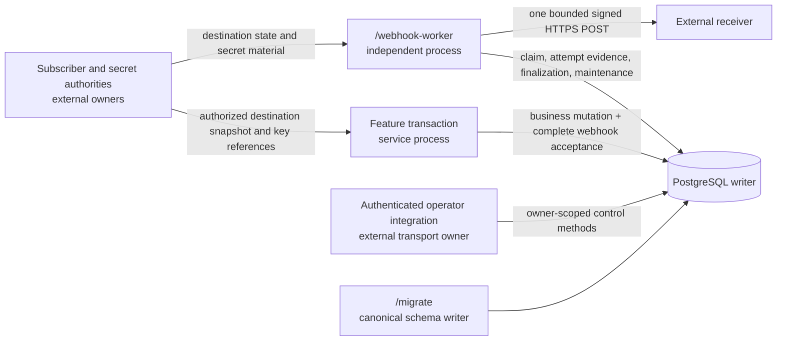

# Outbound webhook delivery — Technical Design

status: ready
macro phase: Technical Design
behavioral authority: [`../spec.md`](../spec.md), ready SHA-256
`f3805950687cf60c55cf4af80c358d3435564b58bc4e38ce7ba8e7ea492f9720`
evidence authority: [`../research/synthesis.md`](../research/synthesis.md), SHA-256
`8be73a3f02e70cca18ba435ccde5beec5a9526fd0d7b7938bd9e636b1b1f2b23`
repository baseline: `40e6d212799ae8677b675339929c559246536181`

## Outcome and selection

Select a distinct PostgreSQL event, fan-out, delivery, attempt, and operator
authority in `internal/infra/postgreswebhook`, with an independently deployed
`/webhook-worker`. The same service writer database is the only durable engine
dependency. The profile adds no broker, Redis, second database, provider
control plane, subscriber API, portal, or public operator transport.

The baseline acceptance boundary is one caller-owned PostgreSQL transaction.
Before it opens, the feature freezes the exact event bytes and the external
subscriber authority supplies the complete bounded destination snapshot. Inside
the transaction, the webhook store inserts the event, fan-out header, and every
delivery member or recognizes the same prior intent. The store never begins,
commits, rolls back, or retries the caller transaction. `Accept` is the caller's
final SQL operation; after it returns the caller immediately commits or rolls
back and executes no further SQL in that transaction. This is the smallest
boundary that closes W2 and bounds the clock serialization interval without a
lossy post-commit call or a default expansion reconciler.

Inline expansion is admitted only under configured positive caps for payload
bytes, fan-out members, total stored acceptance bytes, and transaction time.
PostgreSQL failure or cap exhaustion rejects or leaves the caller with the
existing unknown-commit reconciliation path; it never accepts a partial fan-out.
If representative measurement shows the bounded transaction cannot fit the
service writer's latency, WAL, vacuum, connection, or recovery envelope, reopen
System / Integration Design and compare a durable event-plus-snapshot expansion
reconciler. Do not silently move expansion after commit.

The reusable engine ceilings are structural, not production defaults. Every
enabled profile supplies equal or lower positive values:

| Ceiling | Hard engine maximum and derivation |
| --- | --- |
| Exact payload | `256 KiB`, reusing the current durable-envelope byte ceiling. |
| One destination intent | `8 KiB` canonical bytes, including the at-most-`2048`-byte URL and every 256-byte-bounded identity/policy text. |
| Fan-out members | `1000`, reusing the current bounded PostgreSQL relay batch ceiling. |
| Whole prepared acceptance | `256 KiB + 1000*8 KiB + 64 KiB` canonical bytes. Preparation checks this formula before allocating delivery IDs or opening a transaction. |
| Attempts and concurrency | `100` attempts per cycle; `256` global and `256` per destination, matching current bounded relay safety ceilings. Per-destination may not exceed global. |
| One fair-claim page | Positive and at most `256` destination candidates. A page that advances candidates but creates no attempt commits that progress before another page begins. |
| Acceptance store operation | Positive and at most `30s`, the configured PostgreSQL statement timeout, and the caller's remaining deadline. No store statement or retry gets a fresh budget. |

These bounds cap allocation, SQL parameters/rows, connection occupancy, and
WAL amplification even before an adopter supplies a lower workload envelope.
They make no latency, throughput, vacuum, or production-capacity promise.
Representative proof below these ceilings may lower the supported values;
evidence that even the lowered admitted envelope cannot meet the shared-writer
budget reopens the inline-expansion decision.

Business-event meaning, event selection, subscriber authorization, endpoint
verification, destination lifecycle, key provisioning, payload privacy, and
receiver deduplication remain external authorities. A business owner that
cannot share this PostgreSQL transaction must first own a durable idempotent
handoff and reconciliation source; its relay may call the same acceptance
primitive, but that integration is not part of the baseline profile.

Specification does not reopen: this design preserves receiver wire behavior,
identity/finality, retry/disable/redrive, retention/privacy, lifecycle, and
profile meaning from W1-W17. Research does not reopen because no named
candidate, outbox, or security evidence condition changed. A later concrete
self-hosted or managed product selection, a mandated external control plane, or
new scale evidence that excludes PostgreSQL reopens Research and System Design.

## Affected deployment graph and placement



| Node or edge | Current -> target | Authority and boundary |
| --- | --- | --- |
| Runtime image | `/service`, optional sibling workers, and `/migrate` -> the same image plus optional `/webhook-worker` | `build/docker/Dockerfile`; every binary is a separate entrypoint built from the exact image. |
| Service writer | No generic webhook handoff -> optional feature-owned transaction calls `postgreswebhook.Store.Accept` | Feature owns business mutation and event semantics; the store owns only durable webhook acceptance and readback. The empty template wires no producer. |
| PostgreSQL | Existing service writer -> ten logically distinct webhook relations in the same database | PostgreSQL server UTC and constraints own durable identity, clocks, fencing, and state. `/migrate` remains the only schema writer. |
| Webhook worker | Absent -> separately deployed `/webhook-worker` | Worker bootstrap owns config, pool, static environment secret resolver, dynamic-destination transport, diagnostics, readiness, drain, and maintenance. |
| Subscriber edge | No generic subscriber management -> still none | An adopter supplies authorized snapshots and audited destination/key state changes. The engine never discovers recipients or verifies ownership. |
| Receiver edge | No generic webhook send -> one signed public HTTPS POST per durable attempt | The worker owns DNS/dial enforcement and closed headers; the receiver owns HTTP acceptance, replay-window policy, deduplication, and business processing. |
| Operator edge | No generic operator API -> still none | Store control methods are the transport-neutral boundary. A later authenticated adapter must supply principal, owner scope, roles, audit policy, and rate limits before exposure. |
| Deployment owner | One service definition -> service plus independently scalable worker using the same image | Adopter delivery/SRE owns worker service creation, exact replica/resource caps, one write-home region, writer endpoint, egress policy, and termination envelope. |

Service, worker, migration runner, and PostgreSQL writer are placed in one
adopter-selected write-home region. The receiver is the only required remote
path. No multi-region writer, cross-region worker-to-database path, or regional
failover claim is made without measured budgets and an explicit database
authority. Worker loss accumulates durable backlog; receiver, DNS, TLS, egress,
or secret failure affects eligible deliveries and readiness evidence, not the
service process. PostgreSQL loss closes new acceptance and worker readiness.

## Authority flow

1. A feature owner builds exact versioned event bytes before its transaction.
2. The subscriber authority returns a complete, owner-scoped fan-out snapshot:
   fan-out ID, destination IDs and generations, verified URL snapshots, version
   preferences, signing-authority bindings, and complete delivery/retention
   policy. The engine does not query a current subscriber set later.
3. `PrepareAcceptance` validates all immutable inputs, assigns one stable random
   delivery ID per member with standard-library `crypto/rand.Text`, sorts the
   member set canonically, and computes the protected intent fingerprint. The
   prepared value is reused unchanged across transaction retries.
4. `Store.Accept(ctx, tx, prepared)` writes or recognizes the event, fan-out,
   destination generations, and all deliveries inside the feature transaction.
   Same acceptance identity and fingerprint returns the original IDs; any
   identity collision with different immutable intent is a conflict.
5. After an unknown commit result, the caller preserves the prepared value and
   uses writer-only `ResolveAcceptance`. It returns accepted with the original
   identities, rejected, conflict, `privacy_deleted`, or unknown; a replica,
   cache, or absence during an unavailable writer is not rejection evidence.
6. The worker fairly claims one due delivery, a durable global capacity slot,
   and a fresh fenced attempt in a short transaction. No transaction remains
   open during DNS, secret resolution, HTTP, or backoff.
7. The worker resolves only the referenced active and optional predecessor key,
   validates the whole DNS answer, signs the exact stored bytes, and crosses a
   durable `send_authorized` barrier serialized with disable and lease state.
8. One attempt-scoped transport performs at most one POST. Finalization records
   the strongest observed class under the attempt fence. Failed or stale
   finalization leaves append-only possible-send evidence for reconciliation;
   it never guesses toward success or failure.
9. Operator and maintenance actions use the same owner-scoped store, expected
   state/generation, stable action identity, and audit receipt. They cannot
   change event semantics or receiver wire data.

## Engine-family decision

| Family | Workload, authority, dependency, cost/license, outage, and exit evidence | Disposition |
| --- | --- | --- |
| Current outbox unchanged | One broker-publication row cannot own parent event/fan-out identity, HTTP attempt evidence, per-destination retry and health, rotation, or URL policy. Feature-owned N-row fan-out would leave W2/W10/W12 outside one owner. | Rejected for W1-W17. Its tx-bound append, fencing, sticky ambiguity, bounded telemetry, and lifecycle shapes may be copied as patterns, not imported as webhook semantics. |
| Deliberately generalized durable owner | Avoids a second package name but must generalize broker acknowledgement and HTTP acceptance, retention, response evidence, scheduling, and operator rules. It adds a generic queue API and compatibility surface without a second current policy-level consumer. | Rejected. Similar SQL shape is not common authority. Reopen only if a second present delivery policy proves the same invariants and failure semantics. |
| Distinct PostgreSQL store and worker | Reuses the current writer, pgx, SQLC, Goose, telemetry, and one image; adds no module, license, provider ingress, or external data custody. It adds OLTP rows, WAL, vacuum, connections, worker capacity, and recovery work whose production envelope is not yet measured. | Selected. Admission caps and representative PostgreSQL/process proof are mandatory; no production capacity or SLO claim is made. |
| Svix self-hosted/managed | MIT and mature webhook breadth, but adds its PostgreSQL/Redis/control plane, endpoint authority, upgrades/backups/HA, provider handoff/reconciliation, and exit/export work. Managed use also adds custody, regions, quotas, cost, and provider outage semantics. | Not selected under current inputs. Reopen with concrete version, workload/SLO, ownership, license/support, ingress idempotency, export, and outage evidence. |
| Hookdeck Outpost | Apache-2.0 Go system with delivery features, but adds PostgreSQL plus queue/broker/control-plane surfaces and newer production maturity evidence. Business commit-to-product acceptance remains a separate durable integration. | Not selected; more presently unowned boundaries than the local family. |
| Convoy | Active self-hosted system but Elastic License 2.0, PostgreSQL, Redis-backed jobs, operational control plane, and legal/support gates add boundaries not required by the accepted baseline. | Rejected under current repository and license inputs. |
| AWS EventBridge API Destinations / managed generic eventing | Adds provider ingress handoff, connection/secret custody, quotas/rates, provider retry/status behavior, timeout constraints, DLQ reconciliation, cost, residency, and exit. Its portable status behavior does not match W7 without repository-owned interpretation. | Not selected. Reopen only with product, budget, region/compliance, provider-ingress, outage, and export authorities. |

No broker or event bus is a separate answer: after transport it still needs the
same per-destination HTTP, ambiguity, retention, redrive, and operator authority.

## Durable authorities and minimum state

The future canonical source is the next unclaimed six-digit transactional
Goose migration with stem `_postgres_webhooks`; on the current baseline that is
`migrations/000005_postgres_webhooks.sql`. The post-merge audit repair keeps
that migration immutable and adds
`migrations/000006_postgres_webhook_retention.sql` for upgrade-safe retention,
deadline, and normalized retry evidence. Production rollback remains
fix-and-roll-forward.

PostgreSQL server UTC is authoritative for acceptance, attempt instants, due
times, deadlines, leases, disposition barriers, action times, and cleanup. One
singleton `webhook_clock` row stores the greatest server time consumed by any
successfully committed time-sensitive transaction and a regression flag.

Every acceptance, claim, no-claim fairness-progress, send-authorization,
finalization, operator, recovery, and cleanup transaction first takes the
singleton row `FOR UPDATE`, then samples one `clock_timestamp()`, and treats
that row update as its final durability barrier. Lock acquisition order is
therefore the sampling and commit-time order; waiting behind a valid transition
cannot be mistaken for rollback. A sample below the stored high-water or
any set regression flag rejects and rolls back the whole operation. A successful
operation advances the high-water to its sample in the same commit as its other
durable facts; therefore no later committed operation can record a lower clock.
The periodic observation transaction also locks before sampling: a lower sample
commits only `regression=true`, and a sample at or above high-water
advances the row and clears the flag. A time-sensitive path that detects a lower
sample cannot persist a flag without committing caller-owned work, so it rolls
back and returns the distinct regression error immediately; the worker closes
its local readiness, while the independent observation loop durably publishes
the shared flag. Every other time-sensitive path still compares the retained
high-water and independently fails closed before that publication.

This singleton is an admitted PostgreSQL serialization point, not a throughput
claim. Store-owned transactions hold it only across their bounded transition,
never network I/O or retry wait. Caller-owned acceptance takes it during the
bounded final store operation and holds it through the required immediate
commit/rollback, with no later SQL; fan-out remains capped by the structural
ceiling. Representative contention/latency/WAL proof must
show the adopter's lower acceptance, worker, and cleanup envelope fits. Failure
reopens the inline PostgreSQL family or requires a separately designed monotone
clock authority; implementation may not shard or weaken the guard locally.

A regression closes acceptance/claim/operator admission, makes the worker
unready, leaves deadlines/leases/due times unchanged, and raises one bounded
alert until server time is at or above the retained high-water. The row is never
lowered; rollback therefore cannot decrease recorded age or extend a fixed
deadline through admitted work. Fairness uses the PostgreSQL sequence described
below rather than time. The Go process may measure durations for telemetry, but
its wall clock never moves durable eligibility or extends a deadline.

| Relation | One-row grain and authority |
| --- | --- |
| `webhook_clock` | Singleton durable PostgreSQL UTC commit high-water and regression flag, advanced by every committed time-sensitive transition and checked by the complete observation loop. A separate canonical `webhook_fairness_sequence` supplies strictly increasing cursor values independent of wall time; gaps after rollback are harmless. |
| `webhook_destinations` | One `(owner_scope, destination_id, generation)`; immutable verified URL/event-version/signature-profile and key-authority facts plus monotone control, secret-set, and key-state revisions, active/predecessor references and overlap window, active/paused/disabled/retired disposition, non-null durable `last_considered_sequence`, and audit timestamps. Endpoint change always creates a generation. Key rotation changes only the fenced secret/key-state/control revisions. |
| `webhook_events` | One `(owner_scope, business_event_id)` and unique acceptance identity; exact payload/content type/event type/business schema and envelope versions, origin trace link, accepted time, protected intent fingerprint, retention policy identity, and monotone control revision. It is the active acceptance receipt. |
| `webhook_fanouts` | One `(owner_scope, fanout_snapshot_id)` bound to one event; canonical member count and protected full-set fingerprint. It proves completeness, not current subscriber state. |
| `webhook_deliveries` | One event/fan-out member/destination generation with stable delivery ID and immutable URL/policy snapshot; current cycle number/pointer, next due time, lease/fence, monotone cumulative summary, sendability, and retention eligibility. Uniqueness prevents a second logical member. |
| `webhook_cycles` | One `(owner_scope, delivery_id, cycle_number)` for the automatic cycle and every admitted redrive; append-only accepted-at, fixed deadline, finite attempt/age policy snapshot, cycle kind and authorizing action, current/terminal disposition, and final time. It exists before any attempt, so disabled/paused/secret-blocked zero-attempt expiry remains durable history. A finalized cycle is immutable. |
| `webhook_attempts` | One `(owner_scope, delivery_id, cycle_number, attempt_id)` referencing its durable cycle; append-only attempt instant, fence, signature/key references and signature-header digest, payload digest/size, DNS-set digest and selected address, timing, possible-send marker, bounded response counts/status/`Retry-After` evidence, outcome class, and finalization time. No URL, payload copy, body, secret, or raw signature is stored. |
| `webhook_capacity_slots` | Exactly the configured number of numbered global attempt slots, each carrying the same positive monotone capacity revision. A slot has one lease/fence and attempt owner; claim and expiry/reconciliation make global in-flight capacity durable across replicas. The row set itself is the revision/count authority. Per-destination concurrency is checked while locking its destination row and counting current unexpired attempts. |
| `webhook_operator_actions` | One stable owner-scoped action ID with versioned request fingerprint, actor reference, action, target, expected state/generation, bounded reason, first result, pending/completed irreversible-action state where applicable, and timestamps. Same request replays the result; different reuse conflicts. |
| `webhook_tombstones` | Minimum owner-scoped event-deletion or namespace-retirement identity and last semantic/ambiguity class, stable deletion action ID, action-encoding version, non-content request fingerprint, first disposition, deletion authority, and time. The event form retains acceptance, business-event, fan-out, delivery, and destination-generation identities; the namespace form guards every identity in the retired owner scope. It contains no content, URL, secret, signature, response material, protected note, or reversible content digest. |

Every primary, unique, and foreign-key identity includes `owner_scope`; no
unscoped lookup exists in production queries. Text identities are bounded valid
UTF-8 without control/whitespace where the Specification forbids them and use
exact database comparison. Payload and URL are protected byte/text facts, not
metric labels. Database checks mirror Go limits so a bypassing writer cannot
admit a larger or incomplete envelope.

There is no receipt table separate from the event, DLQ, priority queue, ordered
stream, subscriber registry, endpoint verification table, secret table,
scheduler table, or runtime schema writer. The cycle relation exists only
because W9/W13 require automatic and every redrive cycle, including zero-attempt
expiry, to remain separately interpretable.

## Acceptance and fan-out boundary

`PreparedAcceptance` is the immutable cross-retry value. It contains the
owner/acceptance/business-event/fan-out identities, exact body and versions,
origin link, policy identities, and a canonical destination slice whose members
already have stable delivery IDs. Preparation rejects:

- a missing or duplicate destination generation, incomplete endpoint
  verification receipt, unsupported envelope/signature version, unsafe URL,
  invalid content header, missing policy or signing-authority binding, or owner
  mismatch;
- zero, contradictory, or unbounded retry, age, network-stage, response,
  concurrency, drain, redrive, and retention policy values;
- body, member count, single-member, or total-acceptance size above the profile
  caps; and
- a member set whose canonical encoding or full-set fingerprint is ambiguous.

### Durable canonical bytes

Every durable fingerprint uses canonical encoding `webhook-canonical-v1`:

- `record(tag, fields...)` is the ASCII tag, one `0x00`, then each field as a
  four-byte unsigned big-endian byte length followed by exact bytes;
- integers and durations are canonical unsigned base-10 ASCII; durations are
  whole nanoseconds; booleans are `0` or `1`; absent optional text is zero
  length, never a missing field;
- `list(items...)` is a four-byte unsigned big-endian item count, then each
  already-encoded item as four-byte length plus bytes;
- unordered sets are sorted by their exact encoded item bytes before `list`;
  duplicate items reject admission; strings are stored UTF-8 bytes without
  normalization; and
- the digest is raw SHA-256 over the complete outer record. Encoding tags are
  durable versions; every version referenced by retained events/actions remains
  readable through their horizon.

`webhook-acceptance-intent-v1` orders these fields: owner scope, acceptance ID,
business-event ID, fan-out ID, event type, business schema version, content
type, exact body bytes, delivery-envelope version, subscriber policy revision,
and the canonically sorted destination-intent list. Each
`webhook-destination-intent-v1` orders: destination ID, destination generation,
ownership-verification receipt, exact URL, selection revision, payload-version
preference, signature profile, signing-authority binding, and
`webhook-delivery-policy-v1`. That policy record fixes, in this order: maximum
payload bytes; accepted-content-type set; accepted-business-schema set; maximum
attempts; maximum delivery age; backoff base; backoff cap; `Retry-After` cap;
total attempt, header-time, header-byte, body-byte, per-destination concurrency,
global-concurrency, and drain bounds; redrive attempts and age; payload, active,
terminal-summary, attempt, action, destination-generation, key-reference,
redrive-eligibility, and receiver-dedup horizons; automatic-pause enabled,
eligible-class set, window, threshold, minimum traffic, pause duration,
manual-only recovery, retention effect, and alert policy. Engine-generated
delivery IDs and mutable active/predecessor key generations are excluded; their
own stored identities/revisions govern them.

The acceptance golden vector uses exactly the values below; a list/record cell
means the encoding just defined:

| Field group | Exact value |
| --- | --- |
| Outer fields | `owner-a`, `accept-01`, `evt-01`, `fanout-01`, `order.created`, `1`, `application/json`, body `{"id":"evt-01"}`, envelope `1`, subscriber revision `subrev-7` |
| One destination | `dest-01`, generation `3`, receipt `verify-9`, URL `https://hooks.example.test/orders`, selection `sel-4`, preference `1`, signature `v1`, authority `keys-01` |
| Policy | payload `262144`; content types [`application/json`]; schemas [`1`]; attempts `8`; delivery age `86400000000000`; backoff `1000000000`/`300000000000`; retry-after `3600000000000`; attempt/header/header-bytes/body-bytes `10000000000`/`3000000000`/`16384`/`65536`; destination/global concurrency `2`/`32`; drain `20000000000`; redrive attempts/age `3`/`3600000000000` |

The vector's horizons in
policy order are `604800000000000`, `604800000000000`,
`2592000000000000`, `2592000000000000`, `7776000000000000`,
`7776000000000000`, `604800000000000`, `604800000000000`; automatic pause is
`0`, its class set is empty, and its remaining seven optional fields are empty.
The canonical byte length is `736`; its expected SHA-256 is
`40d72664c74d6e84ce96f82dec63b8471c15d9c3586e59438d586c2dd0d232a2`.

Operator action requests use `webhook-operator-action-v1`, ordered: owner,
actor, action kind, target kind, target ID, target generation, expected
state/generation, reason, protected note, duplicate-risk acknowledgement, and
one action-specific payload record. The stable action ID is the row identity and
is deliberately excluded from its request fingerprint; the row stores the
encoding version beside that digest. The canonical non-secret action vectors use
owner `owner-a`, actor `actor-7`, the targets/expectations below, empty note,
and exact expected SHA-256:

| Action; target; expected; reason; duplicate risk | Payload record fields | Expected SHA-256 |
| --- | --- | --- |
| `destination_state`; destination `dest-01` gen `3`; `11`; `admin_disable`; `0` | `webhook-action-destination-state-v1`: `disabled`, empty pause policy | `acdf9c1ab2e21fbc66c0069002d1b4c9cf01fa742433f2a498120519cfacfd8b` |
| `key_rotation`; destination `dest-01` gen `3`; `11`; `rotate`; `0` | `webhook-action-key-rotation-v1`: secret-set revision `12`, key-state revision `5`, `key-new`, `key-old`, `1700000000`, `1700086400`, deployment receipt `stage-receipt-12` | `28c10f3a83ebed44bf22010f2ff054c5447fd971bd428595deb41f10f3b335ff` |
| `redrive`; delivery `delivery-01` gen `0`; `4`; `remediated`; `1` | `webhook-action-redrive-v1`: attempts `3`, age `3600000000000` | `908fad852adaba75e0fedb5cc3b9b5bed75b088fd039c90a1d45edf5c49df27d` |
| `close_unknown`; delivery `delivery-01` gen `0`; `4`; `stop_recovery`; `1` | `webhook-action-close-unknown-v1`: `closed_unknown` | `20d5e8bdc876f18f8f14297b6014b8676e2c66839510e83ae4718da18cd6d51e` |
| `privacy_delete`; event `evt-01` gen `0`; `2`; `privacy_request`; `0` | `webhook-action-privacy-delete-v1`: `event`, `evt-01`, `minimal_tombstone`, authority `privacy-ticket-44` | `70066ff4fc7faea45b319b0e67b9004be1084a7803295168d21bc0619dda13e2` |
| `namespace_retire`; namespace `owner-a` gen `0`; empty expected; `privacy_request`; `0` | `webhook-action-namespace-retire-v1`: `full_erasure`, authority `privacy-ticket-44` | `002038c16d40dc98ccdb637c9b8067617a7dc13a6bde80b67d419590a831195c` |

The protected acceptance fingerprint is identity-comparison evidence only and
is removed by privacy deletion. Attempt signature evidence is SHA-256 over the
exact emitted `Webhook-Signature` field bytes; the W4 vector below therefore
has evidence digest
`9291ae82facaa14a94ee4b97afcc53014a2cbcb84db650467b2f1c6358d1032f`.
DNS evidence stores one `record("webhook-dns-set-v1", list)` whose items are
sorted canonical 4-byte or 16-byte `netip.Addr` values, not host text; the row
separately stores the selected canonical address bytes. The evidence-only
vector `[2001:db8::1, 192.0.2.1]` has exact canonical bytes
`776562686f6f6b2d646e732d7365742d76310000000020000000020000001020010db800000000000000000000000100000004c0000201`
and SHA-256
`b8885b9ec04d4deff5ba050bc10c60c280fdae844902444fe82e754cab46aaa4`.
Mixed-version readers use the stored tag.

`Store.Accept` first validates the prepared value, then uses the supplied
`pgx.Tx` as its final SQL operation. It takes the exclusive commit-high-water
barrier, then a shared owner-namespace advisory lock and an exclusive business-
event advisory lock. Advisory keys are the first
signed 64 bits of SHA-256 over `record("webhook-lock-v1", owner, kind, id)`;
collisions only over-serialize because every decision afterward compares exact
stored identities. Namespace retirement uses the exclusive namespace form.

Under those guards, namespace and event tombstones are the first data decision.
A match returns `privacy_deleted` with the retained original identities before
active-row recognition or insert. The same guards are used by privacy deletion,
so absence can never race into resurrection. Next, an existing acceptance is
recognized only by fingerprint, complete membership, all original delivery
IDs, and the complete automatic cycle-0 set; missing or partial active evidence
is an integrity conflict. A later disable or key rotation therefore cannot
change an already accepted receipt.

For a new acceptance it locks referenced destination generations in canonical
order. A new generation is inserted only from a complete verified snapshot; an
existing one must match every immutable fact. Active and automatically paused
generations materialize deliveries; an administratively disabled or retired
generation rejects the snapshot. The current capacity row set/revision must
exactly match the producer's immutable webhook config, and its count must not
exceed any member policy's declared global-concurrency ceiling; otherwise
acceptance rejects before inserting event rows.

One PostgreSQL `accepted_at` is used for the event and every member's automatic
cycle `0`. `Accept` inserts event, fan-out header, all deliveries with their
cycle pointer, and all cycle-0 rows with immutable policy, fixed
`accepted_at + maximum_delivery_age` deadline, and attempt budget in the same
caller transaction as the business mutation. No worker may materialize missing
acceptance or cycle evidence. This is the acceptance side of the W2/W8/W10/W11
barriers. A count/hash, identity, delivery, cycle, or deadline mismatch is an
integrity conflict and commits nothing new. The store sends no notification
whose success is needed for durability; worker polling owns wakeup.
The caller immediately commits or rolls back after `Accept` returns. A violation
of this call-order contract is unsupported because it extends the global clock
lock beyond the admitted store envelope. `ResolveAcceptance` commits no time-
sensitive fact and therefore does not take or advance the clock barrier; inside
a store-owned writer transaction it takes the namespace/event guards and
compares tombstone, fingerprint, membership, delivery, and cycle-0 evidence.

All guarded paths use clock -> namespace -> event -> destination -> delivery ->
capacity-slot -> cycle/attempt order, taking only the suffix they need. This
extends the worker lock order and prevents acceptance, control, deletion, and
claim paths from reversing it.

An adopter whose business commit is not in this database must supply a durable
source record before reporting acceptance, a stable acceptance identity, and an
idempotent reconciler that calls this same transaction boundary. Until that
owner and proof exist, the cross-store path is an external blocker and the
claim is narrowed to same-writer atomic acceptance.

## Claim, send, finalization, and reconciliation

### Fair claim and durable attempt

Every destination generation receives
`last_considered_sequence = nextval('webhook_fairness_sequence')` when it is
inserted, so newly admitted rows cannot jump ahead of retained candidates. One
claim transaction selects and locks at most the configured positive
`claim_scan_page` (engine maximum `256`) destination rows by oldest sequence,
then owner/destination/generation as stable tie-break, with an indexed existence
check for at least one due nonterminal delivery. Locked destinations are skipped
so their control or another claim cannot block the page. For each selected row
the transaction rechecks disposition, revision, deadline, retention, redrive
state, and the number of unexpired attempts against that snapshot's
per-destination concurrency. A saturated or newly ineligible candidate receives
`last_considered_sequence = nextval('webhook_fairness_sequence')` and scanning
continues within the fixed page. A global slot shortage ends the page because no
destination can progress.

For the first eligible candidate with a free or safely reconciled global slot,
the transaction advances its sequence, locks its oldest due delivery, claims a
slot under the worker's expected capacity revision, creates the attempt with a
new random ID, increments the delivery fence, and records the PostgreSQL attempt
instant. One page claims at most one delivery. If the page examined candidates
and advanced one or more but created no attempt, it still crosses the clock
barrier and commits a distinct `progress_without_claim` result; the worker may
begin the next bounded page only on its next regular poll interval, so an all-
saturated set cannot create a hot progress loop. If it selected no unlocked
candidate it returns contended/idle without cursor change.
No transaction examines, locks, counts, or writes more than the fixed page, and
rollback loses only that page's progress. After at most
`ceil(candidates_ahead / claim_scan_page)` committed progress pages, a retained
eligible destination reaches the front, excluding finite lock contention and
newly changed eligibility; new insertions start at the tail. A revision mismatch
changes no row, closes claim admission, and makes the worker unready. All claim,
send-barrier, finalize, control, and reconciliation paths take shared rows in
destination -> delivery -> capacity-slot -> attempt order, using only the
needed suffix, so parallel replicas cannot reverse the fairness path into a
deadlock.

The first worker for an empty schema takes an exclusive lock on the capacity
table and inserts exactly `(capacity_revision, global_concurrency)` from its
complete immutable config. Every later startup and complete readiness
observation requires the exact same revision and row count. A lower revision or
same revision/different count fails closed and cannot mutate the table. A
higher revision may replace the row set only under the same exclusive lock,
with zero leased slots, and only when the new count does not exceed the declared
global-concurrency ceiling of any live or redrive-eligible destination
snapshot. Every claim includes the expected revision, so an old replica cannot
claim after the change commits. A normal capacity change therefore drains old
claim admission, waits for zero slots, starts one higher-revision worker to
apply the bounded row-set transition, then starts only matching replicas.
Runtime reload, revision rollback, and per-replica capacity are unsupported.

High volume, saturation, or failure at one destination therefore cannot occupy
more than its admitted concurrency or indefinitely keep another eligible
destination behind it while a global slot exists and bounded progress
transactions commit. Persistent lock contention remains a database degradation
signal, not evidence of selection. `SKIP LOCKED` is only a contention tool
inside this destination-aware page; unordered raw delivery rows are not the
fairness policy. Work is `O(claim_scan_page)` per claim transaction and bounded
by the configured database operation budget. No FIFO or latency/throughput SLO
is claimed.

The lease exceeds the complete DNS/secret/HTTP/finalization bound plus database
acquire/statement and worker join margins. Expiry alone does not free possible
send evidence. Recovery first locks and finalizes the expired attempt as
definitely-not-sent or ambiguous from its durable marker, releases its capacity
slot, and only then makes a later attempt eligible. A stale fence changes zero
rows.

### Secret, DNS, and send barrier

The baseline secret authority is one concrete environment-backed manifest built
from a single `webhooks.static_secrets` raw JSON string; configuration files may
contain only an empty placeholder. The exact environment shape is
`{"revision":12,"entries":[{"owner_scope":"owner-a","destination_id":"dest-01","key_reference":"key-new","secret":"whsec_<padded-base64>"}]}`.
`internal/config` owns source policy and retains the raw string.
`postgreswebhook/secrets.go` strictly decodes that one object, rejects unknown
or duplicate fields, trailing data, non-positive revision, an empty identifier,
and duplicate `(owner_scope,destination_id,key_reference)` entries, and decodes
each `whsec_` value to 32-64 raw bytes. It also rejects the same decoded key
bytes bound to different owner/destination pairs. It then discards the raw
string and retains only the immutable revision and lookup keyed by the complete
owner/destination/reference tuple. Reference guessing or reuse therefore cannot
cross the secret data-access boundary. No config decode hook, resolver
interface, KMS/Vault adapter, or provider registry is added without a present
adopter.

The manifest revision and each destination's required secret-set revision form
the mixed-replica fence. Every complete readiness observation and every claim
transaction compares the worker's immutable manifest revision with the maximum
required revision of any live or redrive-eligible destination, obtained from an
indexed descending query; a lower revision closes all claim admission and
readiness. Claim and send authorization additionally require the exact
owner/destination/reference tuples named by the locked destination state. A
missing tuple at an otherwise sufficient revision is a configuration-integrity
failure, not a per-destination transient outage, and also closes worker
readiness.

Rotation is a fixed roll-forward sequence. Delivery/SRE first deploys one
higher manifest revision containing every currently referenced tuple plus the
new tuple to all eligible worker replicas and produces an authenticated
deployment receipt while the database state remains unchanged. Only then may a
replay-safe `key_rotation` action record that receipt and, under the destination
and send-barrier locks, advance the destination's required manifest revision,
key-state revision, active/predecessor references, and overlap interval. Older
replicas immediately fail the per-claim maximum-revision check; an attempt that
had already crossed send authorization may finish with its captured state, but
no later barrier can emit the retired state. Predecessor retirement uses another
higher staged manifest revision and action; raw predecessor bytes are removed
only in a still-later manifest after no database row references them. Revision
rollback and in-process reload are unsupported; recovery stages another higher
revision containing the required old and new tuples, then rolls state forward.

Before the send barrier, the worker:

1. reads the maximum required manifest revision plus the current destination
   disposition, required manifest revision, and key-state revision;
2. resolves active and, only during declared overlap, predecessor material by
   exact owner/destination/reference tuple;
3. parses the stored absolute HTTPS URL, requires port 443, and resolves all A
   and AAAA answers with a concrete `net.Resolver`;
4. rejects the entire set if any address fails the shared IANA public-address
   predicate, chooses one admitted address, and prepares TLS verification for
   the original hostname; and
5. constructs the exact W4 HMAC input from stored body, stable delivery ID, and
   PostgreSQL attempt seconds, newest generation first.

It then enters a short transaction that locks the destination and delivery,
rechecks the fence, disposition/key/manifest revision, referenced tuples,
deadline, and capacity ownership against the worker's manifest revision, and
sets `send_authorized`/`may_have_sent`. Disable, key rotation, and retirement use
the same row lock. If one commits first, the stale barrier fails and no send
occurs; if the barrier commits first, that bounded in-flight attempt may finish
and record its captured generation as W4/W11 permit.

The authoritative non-secret HMAC v1 interoperability vector is:

| Input | Exact value |
| --- | --- |
| Raw key bytes | ASCII `0123456789abcdef0123456789abcdef` (32 bytes) |
| Receiver presentation | `whsec_MDEyMzQ1Njc4OWFiY2RlZjAxMjM0NTY3ODlhYmNkZWY=` |
| `Webhook-Id` | `test_delivery_01` |
| `Webhook-Timestamp` | `1700000000` |
| Exact body bytes | `{"event":"order.created","id":"evt_01"}` with no newline |
| Exact HMAC input bytes | `test_delivery_01.1700000000.{"event":"order.created","id":"evt_01"}` |
| Padded standard-Base64 digest | `p75LLTWzwS12ldSqW8PVMMr3coNo6m83PGJu/jVFO0U=` |
| Exact single-key header | `v1,p75LLTWzwS12ldSqW8PVMMr3coNo6m83PGJu/jVFO0U=` |

This table, not implementation output, is the golden oracle. The vector uses no
production secret. Test Design must reproduce it byte for byte and add overlap,
retirement, malformed-entry, and cross-destination falsifiers without changing
the canonical result.

### One bounded POST

The attempt creates a fresh `http.Transport`/connection with no proxy,
keep-alive, HTTP/2, redirect, cookie jar, decompression, generic retry, trace
propagation, correlation, or caller headers. Its dial closure ignores later DNS
changes, rechecks the selected `netip.Addr` immediately before connecting, and
dials that address directly while TLS verifies the original hostname. A mixed
or changed answer causes a new attempt, not a fallback dial inside the same one.

The request is exactly one POST with stored body and content type,
`Content-Length`, `Accept-Encoding: identity`, constant
`User-Agent: go-service-template-webhook/1`, and the three W4 fields. There is
no `Idempotency-Key`, authorization, cookie, forwarding, request-ID, trace, or
baggage header. The body is non-replayable to `net/http`, the transport has one
fresh connection, and `CheckRedirect` returns the response without following;
one attempt can issue at most one network request.

One effective context bounds DNS, connect, TLS, write, response headers, raw
body evidence, and close. Headers and non-content body bytes are capped;
2xx finalizes from the safely observed status without consuming a body.
Attempt evidence records bounded counts and the strongest send observation, not
receiver content.

### Finality and retry

The closed W7 classifier is one pure function. It receives only normalized
transport evidence, status, and immutable destination policy. It cannot widen
the portable table, turn redirects/security denial into sends, or infer receiver
business truth. Finalization predicates on owner, delivery, cycle, attempt,
fence, and current state; zero affected rows is stale/conflicting evidence.

Retry scheduling uses PostgreSQL UTC and a pure decorrelated-jitter calculation
fed by standard-library random bytes. It stores the next absolute due time and
releases every claim/slot; no goroutine sleeps through backoff. `Retry-After`
accepts only non-negative decimal seconds or a valid HTTP date, uses valid
response `Date` else the attempt instant, caps the hint, takes the later of hint
and jitter, and never exceeds the fixed cycle deadline or retention boundary.

Each append-only cycle row retains its accepted-at, fixed deadline/budget, and
terminal disposition even when it had no attempt; the delivery points to the
current/latest cycle and retains the monotone cumulative summary. A durable 2xx
can never be downgraded. Without a 2xx, any durable possible-send evidence makes
the cumulative summary `outcome_unknown` forever, even if later attempts are
definitely not sent. Recovery quarantines a delivery whose pointer/summary and
append-only cycle/attempt evidence disagree; an idempotent maintenance pass
recomputes only from stronger durable evidence and never from absence.

## Destination control, redrive, and retention

Destination state changes and operator actions require `owner_scope`, stable
action ID, actor reference, expected destination/delivery generation, and a
bounded reason. The store serializes them with acceptance/claim barriers and
returns the first result on replay. It exposes no authentication or transport.

- Active admits current snapshots and claims.
- Automatically paused is a reserved persisted vocabulary value only. The
  template has no pause engine or pause action; acceptance rejects the flag and
  every pause-policy field until W11 is reopened with a complete policy.
- Administratively disabled excludes snapshots after the authoritative
  revision and blocks new attempts on existing work.
- Retired excludes new snapshots and permanently blocks its old generation.

Redrive takes the clock/namespace/event/destination/delivery guards and admits
one new cycle only when the current cycle is terminal or suspended, no retry,
in-flight attempt, or other redrive is active, and the exact payload,
destination generation, signing/audit evidence, and all redrive/receiver-dedup
horizons remain retained. The same destination generation must still be
authorized, non-disabled/non-retired, acceptable under its stored URL and
transport policy, and resolvable by the current required secret manifest
revision. Actual DNS and dial safety remain volatile send-time checks.

The owner-approved request supplies positive attempts and age at or below the
engine and retained policy ceilings. PostgreSQL computes the new deadline as
the earliest of request age, redrive-eligibility expiry, and every payload,
destination, key, action/audit, attempt-evidence, and receiver-dedup retention
horizon on which a safe send or later interpretation depends. An already
elapsed cap rejects admission. In the same transaction the store appends the
numbered cycle with accepted time, fixed capped deadline, and finite budget,
points the delivery at it, and records the first action result. It never clears
prior cycles, attempts, or the cumulative summary. Same action replay returns
the same cycle; conflicting reuse fails. Claim/send revalidate mutable
destination, manifest, deadline, and retention state, so admission grants no
future-send guarantee.

By default, terminal `http_rejected`, `attempts_exhausted`, `outcome_unknown`,
and remediated `locally_denied` work may be redriven with its required
duplicate-risk acknowledgement. Redriving `http_accepted` remains disabled
unless a separate business/receiver policy expressly accepts the duplicate.
Closing unknown work records `closed_unknown` and stops recovery but never
rewrites the cumulative outcome to accepted or receiver-processed.

Maintenance scheduling is bounded by configured batch and interval and invokes
the exact store owner for:

- expired-attempt reconciliation and safe capacity-slot release;
- deadline exhaustion using definite-versus-ambiguous history;
- readiness/progress observation; and
- dependency-aware retention and privacy deletion.

Ordinary cleanup deletes content only after every dependent delivery is
terminal, non-redrivable, outside its separate horizons, and not legally held.
A cycle row cannot be deleted while a retained delivery summary, attempt, or
operator receipt depends on it; a destination generation cannot be deleted
while any live or redrive-eligible delivery depends on it. Cleanup preserves
foreign-key order and never orphans retained interpretation evidence.

The only baseline privacy targets are one event or a whole owner namespace.
`RequestEventPrivacyDeletion` and `RequestNamespaceRetirement` are owner-scoped,
replay-safe store control methods; an external authenticated adapter supplies
actor, stable action ID, expected identity/state where one exists, deletion-
authority receipt, and bounded reason. There is no delivery- or
destination-only privacy action: destination URL/key-state evidence is shared
across events, so deleting it for one event would corrupt other live deliveries.
Privacy actions admit no protected note; their reason is a closed non-content
code and the authority is an opaque non-secret receipt. Their tombstone request
fingerprint therefore reserves action identity without hashing governed
content. Every operator method checks both live action rows and tombstone action
receipts before admitting an owner-scoped action ID: the same version/fingerprint
returns the retained first disposition, and different reuse conflicts.

An event request takes the clock/shared-namespace/exclusive-event guards and
locks every event delivery in canonical order. In that single PostgreSQL
transaction it blocks every send barrier, conservatively finalizes any already
authorized in-flight attempt as possible-send, writes the permitted event
tombstone including the action/deletion authority, and deletes every event-owned
payload, fan-out, delivery, cycle, attempt, and action fact targeting the event
or one of its deliveries except the equivalent non-content action receipt now
carried by the tombstone.
Shared destination rows remain. Failure commits nothing; unknown commit is
resolved only by writer readback, where tombstone plus absent event content is
the replay receipt and retained content without a tombstone means retry the
same action. No intermediate acceptance state is introduced.

A namespace request instead takes the exclusive namespace guard and records the
namespace-retirement tombstone plus pending action before any batch, which
blocks acceptance, claims, redrive, and other control for the entire scope.
Maintenance then removes all scope-owned active rows in bounded dependency-order
batches while that tombstone prevents resurrection; it is complete only when a
writer inventory proves none remain. Batch uncertainty is idempotently retried,
and any row contradicting the tombstone is quarantined as an integrity conflict.
The permanent namespace block is also the replay fence, while its tombstone
keeps the same action version/fingerprint/first-disposition receipt.
External secret-authority erasure remains a separately checkpointed obligation;
after the database has no reference, Delivery/SRE may stage the higher manifest
that removes those bytes. No tombstone contains a reversible content digest.

## Readiness, drain, and observability

`/webhook-worker` startup fails on disabled webhook or PostgreSQL config,
incompatible schema, missing writer privilege, invalid bounds, invalid or
insufficient owner-scoped secret manifest, capacity revision/count conflict,
unusable diagnostics, or an unsafe termination equation. It opens claim
admission only after one successful writer/schema/clock/capacity/maximum-secret-
revision observation and one successful reconciliation pass.

Readiness is cached. It is true only while the process is accepting claims, the
last complete writer/schema/clock/capacity/claim-progress observation
succeeded, the immutable manifest revision covers the current maximum and all
referenced tuples observed in that pass, the maintenance loop is live, and
observation age is no more than exactly two configured observation intervals. Backlog size,
receiver health, locally denied deliveries, and product SLOs are degradation
signals rather than generic process readiness unless later deployment policy
explicitly owns a threshold.

On SIGTERM, diagnostics remains live while readiness closes and new claims stop.
The worker lets already `send_authorized` attempts finish within their own
budgets, cancels pre-send work, durably finalizes or marks ambiguity, joins all
attempt and maintenance goroutines, closes diagnostics, then telemetry and the
pool. The configured grace period must exceed drain, forced-join, diagnostics,
telemetry, and database cleanup bounds. A goroutine that outlives the hard bound
makes cleanup unsafe; process exit, not dependency close, owns the remaining
resources.

Metrics use only bounded state, outcome, error, operation, and component
vocabularies. No URL, owner/subscriber/destination/delivery ID, status code,
payload, response content, signature, or secret appears in labels. Logs and
traces may carry policy-permitted event/delivery/attempt/action IDs and semantic
classes; payloads, URLs, bodies, addresses, key references, secrets, and raw
signatures are never emitted there. An authenticated diagnostic read may return
the protected key-reference and selected-address evidence already owned by the
attempt row. Attempt spans link locally to the event origin but inject no
receiver trace context. Required signals include
ready/scheduled/in-flight/terminal/disabled counts, oldest age, claim and
observation freshness, capacity saturation, reconciliation divergence,
bounded outcomes/errors, retry/redrive exhaustion, and cleanup progress.

## W1-W17 closure and reopen map

| Rule | Realizing decision; downstream proof boundary |
| --- | --- |
| W1 | `WEBHOOKS=none|durable`; durable requires only `DATABASE=postgres`, adds one package/worker/migration surface, and imports no OUTBOX/MESSAGING/JOBS/OUTBOUND_HTTP policy. Generated-profile matrix must prove residue-free removal and independent retained combinations. |
| W2 | Prepared complete fan-out plus one caller-owned transaction and writer-only readback. A non-shared-store producer is an external handoff/reconciliation checkpoint, not an implicit dual write. |
| W3 | Exact body/content/version/URL/destination facts are immutable rows; retry/redrive reads them only. Unknown retained versions close claims and remain visible. |
| W4 | Exact HMAC v1 fields/grammar and golden vector, DB attempt seconds, owner/destination-scoped immutable manifest, staged monotone rotation fence, active/predecessor barrier, and versioned signature-header evidence. Raw-byte and mixed-replica rotation proof are mandatory. |
| W5 | Shared public-address predicate plus webhook-owned whole-answer resolution, direct selected-IP dial, TLS hostname verification, no proxy/redirect, and deployment egress checkpoint. Controlled DNS/TLS proof is mandatory. |
| W6 | Durable one-send attempt, fresh non-replaying transport, finite stage/body/header/concurrency/drain bounds, and protected bounded evidence. Process-loss stage matrix is mandatory. |
| W7 | One closed pure classifier and immutable bounded vocabulary. No provider/outbox defaults. Exhaustive status and before/after-write proof is mandatory. |
| W8 | Every committed time-sensitive transition advances one serialized PostgreSQL high-water; regression fails closed without moving fixed clocks. Stored deadlines/due times, durable jitter, exact `Retry-After`, no sleeping claims, and monotone age remain. Commit-order/restart/failover/clock-step proof is mandatory. |
| W9 | Fenced append-only attempts, `send_authorized` marker, quarantine/reconciliation, cycle disposition, and monotone cumulative summary. Real PostgreSQL crash/fence proof is mandatory. |
| W10 | Fan-out header count/hash, delivery-per-member uniqueness, non-null sequence fairness in bounded committing pages, revisioned durable global slots, per-destination cap, and no order claim. Saturated-prefix progress/rollback, admitted-load anti-starvation, and multi-replica cap proof are mandatory. |
| W11 | Destination row lock is the acceptance/claim/send barrier; replay-safe state actions; automatic pause off absent policy. Disable/claim/send race proof is mandatory. |
| W12 | Separate stored horizons, dependency-aware cleanup, guarded event deletion and namespace retirement ingress, atomic event tombstone/content erasure, batched namespace erasure under a prior tombstone, and no resurrection. Real PostgreSQL retention/redrive/privacy race proof is mandatory. |
| W13 | Versioned action fingerprint, stable action ID, expected state/generation, complete retained-evidence/admissibility/deadline-cap checks, append-only automatic/redrive cycles including zero-attempt expiry, same body/delivery ID, fresh attempt/signature, and cumulative evidence. Retry/redrive concurrency and replay proof is mandatory. |
| W14 | Owner scope in every key/query and secret tuple, scoped privacy/control methods with no public transport, protected diagnostics, and bounded telemetry. Cross-owner guessing and telemetry disclosure proof is mandatory. |
| W15 | Independent worker, exact two-interval cached readiness, claim closure, bounded drain/join, and unsafe-cleanup exit. External-process proof is mandatory. |
| W16 | Immutable startup snapshot; all policy slots explicit; environment-only scoped secret manifest with monotone mixed-replica fence; monotone capacity revision with exact cross-replica match; empty template admits no destination; endpoint/key changes require authoritative state change plus deployment receipt. Config, capacity-transition, and rotation proof are mandatory. |
| W17 | No import or schema reuse from `postgresoutbox`; only proven local shapes and the extracted address predicate are reused. Outbox behavior and tests remain unchanged. |

Changing any W1-W17 behavior reopens Specification. Measured PostgreSQL
capacity failure, a required external engine/control plane, or inability to
make the selected boundary safe reopens System Design and possibly Research
under its named conditions. A changed package/import/composition/file owner
reopens Go Code / Ownership Design.

## Go responsibility and exact file map

The implementation uses existing pgx, SQLC, Goose, OpenTelemetry, config, and
runtime diagnostic owners plus the Go standard library. It adds no production
module. Test Design may add cases only within the proof owners named below; a
new package or production file requires Go Ownership review.

### New production Go owners

| File | One reason to exist; responsibility and symbols |
| --- | --- |
| `internal/outboundtrust/public_address.go` | Pure shared IANA public-address predicate extracted unchanged from `httpclient`; exports `PublicAddress(netip.Addr) bool`. No URL, resolver, dialer, or HTTP policy. |
| `internal/infra/postgreswebhook/doc.go` | Package audience, transaction, worker/operator, lifecycle, and explicitly absent subscriber/API authority. |
| `internal/infra/postgreswebhook/errors.go` | Closed sentinels and caller-safe error/result vocabulary. |
| `internal/infra/postgreswebhook/canonical.go` | The versioned length-prefixed record/list and SHA-256 primitives used by durable fingerprints; standard library only and no policy field order. |
| `internal/infra/postgreswebhook/acceptance.go` | `Acceptance`, `DestinationSnapshot`, `DeliveryPolicy`, `PreparedAcceptance`, `PrepareAcceptance`, validation, stable IDs, exact acceptance field order, and fingerprint. |
| `internal/infra/postgreswebhook/actions.go` | Operator action request/result values, exact per-action canonical field order, and request fingerprint. No authentication or transport. |
| `internal/infra/postgreswebhook/model.go` | Durable delivery/attempt values and closed state/outcome enums shared by store and worker. |
| `internal/infra/postgreswebhook/store.go` | Concrete `Store`, constructor, shared pool/SQLC access, validity guard, and bounded operation recording. No general repository interface. |
| `internal/infra/postgreswebhook/store_clock.go` | The exclusive commit-time high-water/regression barrier shared by every store transition plus same-package `observeClock`; no Go clock abstraction. |
| `internal/infra/postgreswebhook/store_capacity.go` | Exported exclusive `InitializeOrTransitionCapacity` for bootstrap plus same-package read-only `observeCapacity`; bootstrap invokes initialization before claim admission. |
| `internal/infra/postgreswebhook/store_accept.go` | Guarded tx-bound `Accept` including tombstone-first decision and automatic cycle-0 insertion, plus writer-only complete `ResolveAcceptance`; no transaction lifecycle. |
| `internal/infra/postgreswebhook/store_claim.go` | Bounded-page destination fairness, committed no-claim progress result, global-slot acquisition, attempt/fence creation, and claim-time manifest-revision fence. |
| `internal/infra/postgreswebhook/store_authorize.go` | Security-critical pre-send authorization transaction: recheck attempt/destination/key/manifest/deadline/capacity fences and set the possible-send marker while serialized with control. |
| `internal/infra/postgreswebhook/store_finalize.go` | Fenced ordinary attempt finalization, retry due time, cycle/cumulative summaries, and stale/divergence result. |
| `internal/infra/postgreswebhook/store_recovery.go` | Expired-attempt reconciliation, ambiguous/definite deadline exhaustion, and safe capacity-slot release. |
| `internal/infra/postgreswebhook/store_operator.go` | Exported replay-safe destination state/key rotation and inspect/suspend/redrive control methods under clock/owner/identity/action guards; these are the later authenticated adapter's concrete transport-neutral surface. |
| `internal/infra/postgreswebhook/store_privacy.go` | Exported replay-safe event-privacy and namespace-retirement controls plus same-package tombstone action replay and guarded namespace-deletion batches. |
| `internal/infra/postgreswebhook/store_retention.go` | Ordinary dependency-aware retained-evidence eligibility and cleanup only; no legal/privacy override. |
| `internal/infra/postgreswebhook/signing.go` | Exact W4 HMAC v1 construction, key overlap ordering, and non-replayable signature-header digest. Standard library only. |
| `internal/infra/postgreswebhook/transport.go` | Webhook URL validation, whole-answer resolution, selected-IP TLS dial, closed request headers, one-send POST, stage/response bounds, and normalized evidence. Uses `outboundtrust`, not `httpclient`. |
| `internal/infra/postgreswebhook/retry.go` | Pure W7 classifier, `Retry-After`, decorrelated jitter, deadline/exhaustion, and cumulative-summary evaluators. |
| `internal/infra/postgreswebhook/secrets.go` | Strict raw JSON manifest parsing, immutable revisioned `(owner,destination,reference)` lookup, duplicate/cross-binding rejection, and 32-64-byte `whsec_` decoding; no provider interface. |
| `internal/infra/postgreswebhook/worker.go` | Concrete immutable worker construction and `WorkerResult`; no goroutine, send, or shutdown policy. |
| `internal/infra/postgreswebhook/worker_run.go` | Exported `Run`; repeated bounded claim/progress pages, claim admission, bounded attempt-goroutine ownership, run cancellation, drain/join, and terminal result. |
| `internal/infra/postgreswebhook/worker_attempt.go` | One claimed attempt's ordered secret/DNS/sign/barrier/POST/finalize coordination and attempt-scoped cleanup. |
| `internal/infra/postgreswebhook/worker_maintain.go` | Periodic clock observation, reconciliation, deadline, capacity, retention, and namespace-cleanup scheduling over concrete store owners; it performs no store transition itself. |
| `internal/infra/postgreswebhook/worker_ready.go` | One complete-observation timestamp and the exact two-interval readiness/freshness predicate shared by probes and metrics. |
| `internal/infra/postgreswebhook/telemetry.go` | Bounded metric/log/trace instruments and freshness observation. |
| `internal/infra/postgreswebhook/vocabulary.go` | Single bounded label/error/state vocabulary consumed by telemetry tests. |
| `internal/config/webhooks_config.go` | Removable `WebhooksConfig`, disabled-only defaults, required monotone capacity revision/global concurrency and positive claim-scan page, validation against engine/PostgreSQL/grace ceilings, and the environment-only raw static-secret-manifest JSON string. Missing enabled-profile policy stays invalid. |
| `cmd/webhook-worker/main.go` | Process entrypoint only. |
| `cmd/webhook-worker/internal/bootstrap/run.go` | Config/telemetry/pool/store/secret/worker construction, startup call to `InitializeOrTransitionCapacity` before worker claim admission, and reverse-order cleanup. |
| `cmd/webhook-worker/internal/bootstrap/config.go` | Maps immutable `config.WebhooksConfig` to worker/store/network bounds and process labels. |
| `cmd/webhook-worker/internal/bootstrap/lifecycle.go` | Signal, diagnostics, readiness, drain, forced join, panic containment, and unsafe-cleanup ordering. |
| `cmd/webhook-worker/internal/bootstrap/telemetry.go` | Process telemetry setup/flush using existing runtime owners. |

`acceptance.go` is the only event-handoff surface. `store_*` files separate
normal finalization, failure reconciliation, ordinary retention, and
authority-sensitive privacy erasure because they change and prove independently;
no generic queue layer, engine interface, transport factory, provider registry,
clock abstraction, or subscriber repository is created. `transport.go` is distinct from
`httpclient`: the latter is fixed-authority and pooled, while webhook delivery
requires a per-attempt dynamic authority, whole-answer decision, and direct
dial. They share only the pure public-address rule.

### Existing and generated Go files changed

| File | Exact action |
| --- | --- |
| `internal/infra/httpclient/target_policy.go` | Replace the private public/special prefix tables and predicate with `outboundtrust.PublicAddress`; retain fixed-target URL, private-network, and dial policy unchanged. |
| `internal/infra/httpclient/target_policy_test.go` | Move the public/special address cases from `TestDialAddressGate` to `outboundtrust/public_address_test.go`; retain fixed-target URL/class/dial behavior cases here and prove extraction has no drift. |
| `internal/config/types.go` | Add profile-marked `Webhooks WebhooksConfig`. |
| `internal/config/defaults.go` | Merge the removable disabled-only webhook defaults. |
| `internal/config/validate.go` | Invoke webhook validation under its profile markers. |
| `internal/config/snapshot_contract_test.go` | Extend the immutable schema/default snapshot for the selected section. |
| `internal/config/secret_policy.go` | Extend the existing file-source policy in place so the exact lower-cased path segment `secrets` is secret-like beside `secret`; non-empty `webhooks.static_secrets` file input then returns `ErrSecretPolicy`, while empty file placeholders and environment input retain their current behavior. This is one added switch case with no webhook-specific branch, profile marker, helper, dependency, or new surface. |
| `internal/config/secret_policy_test.go` | Prove non-empty `webhooks.static_secrets` is rejected from files and accepted only from environment input; the existing package-local policy test remains the sole proof owner. |
| `internal/infra/postgres/sqlcgen/postgres_webhooks.sql.go` | Generated SQLC output for webhook statements; never hand edited. |
| `internal/infra/postgres/sqlcgen/models.go` | Generated relation models; never hand edited. |

`internal/infra/postgres/sqlc.yaml`, `cmd/internal/runtimeopts/postgres.go`,
`cmd/internal/runtimeopts/diagnostics.go`, `internal/infra/postgres`, and
`internal/infra/telemetry` are reused unchanged. There is no service bootstrap
edit until a concrete feature composes the acceptance surface.

TD-WH-003 recovery disposition: this edit remains inside Go Code / Ownership
Design because W16 and the configuration-source authority already require the
environment-only value; only the fixed existing-file map was false. The semantic
owner remains `internal/config/secret_policy.go`, its only production caller
remains the file loader, and proof remains in `secret_policy_test.go`. Reopen
Specification only if `webhooks.static_secrets` or its environment-only contract
must change; reopen this ownership decision only if the one-case shared matcher
cannot preserve an existing non-secret key or the profile-removal invariant.

### Test and fixture ownership

| File | Proof owner |
| --- | --- |
| `internal/outboundtrust/public_address_test.go` | One shared current-IANA address corpus, including mapped IPv4 and NAT64 cases. |
| `internal/infra/postgreswebhook/acceptance_test.go` | Bounds, canonical membership, stable IDs, exact intent golden vector, and collisions without PostgreSQL. |
| `internal/infra/postgreswebhook/actions_test.go` | Exact action fingerprint vectors, replay/conflict inputs, and version retention. |
| `internal/infra/postgreswebhook/secrets_test.go` | Strict manifest grammar, tuple scope, duplicate/cross-binding rejection, revision comparison, and no secret leakage. |
| `internal/infra/postgreswebhook/signing_test.go` | W4 golden raw-byte vectors, malformed input, overlap/retirement, constant-time validation fixture, and no secret/signature leakage. |
| `internal/infra/postgreswebhook/transport_test.go` | URL/header policy, whole-answer decision, direct TLS dial, redirects, one-send transport, response bounds, and stage evidence with controlled local DNS/TLS peers. |
| `internal/infra/postgreswebhook/retry_test.go` | Exhaustive W7 table, `Retry-After`, jitter/deadline bounds, and monotone summary. |
| `internal/infra/postgreswebhook/worker_test.go` | Constructor/config/result validation only. |
| `internal/infra/postgreswebhook/worker_run_test.go` | Claim/progress-page continuation, admission, bounded attempt ownership, cancellation, drain/join, and terminal run result. |
| `internal/infra/postgreswebhook/worker_attempt_test.go` | One attempt's stage order, pre-send cancellation, barrier/finalize calls, and cleanup with controlled collaborators; database/network invariants remain in integration tests. |
| `internal/infra/postgreswebhook/worker_maintain_test.go` | Maintenance scheduling, cancellation, non-overlap, and terminal loop failure. |
| `internal/infra/postgreswebhook/worker_ready_test.go` | Startup-not-ready, complete/partial observation, exact two-interval freshness, failed refresh, drain, and restart semantics. |
| `internal/infra/postgreswebhook/telemetry_test.go` | Bounded vocabulary/cardinality and forbidden-content scan. |
| `internal/config/webhooks_config_test.go` | Disabled/complete/incomplete profile validation and bound equations; secret-source enforcement remains solely in `secret_policy_test.go`. |
| `cmd/webhook-worker/internal/bootstrap/run_test.go` | Startup rejection, construction/cleanup ordering, and dependency failure. |
| `cmd/webhook-worker/internal/bootstrap/lifecycle_test.go` | Diagnostics/readiness, unexpected exits, signal drain, panic, forced join, and unsafe cleanup. |
| `cmd/webhook-worker/internal/bootstrap/goleak_test.go` | Package-level worker/bootstrap leak gate matching existing relay/worker ownership. |
| `test/postgres_webhook_acceptance_integration_test.go` | Real PostgreSQL atomic business-commit/fan-out/cycle-0/readback/conflict/tombstone guard and concurrent acceptance/deletion serialization proof. |
| `test/postgres_webhook_admission_integration_test.go` | Real PostgreSQL commit-ordered clock regression, bounded saturated/ineligible fairness-page progress and rollback, capacity initialization/transition, secret-revision fencing, global/per-destination slots, and disable/claim/send authorization barriers. |
| `test/postgres_webhook_recovery_integration_test.go` | Real PostgreSQL fenced finalization, expiry, cumulative ambiguity, deadline, retry/redrive admission/replay, and reconciliation races. |
| `test/postgres_webhook_retention_integration_test.go` | Real PostgreSQL ordinary dependency-aware cleanup and horizon/redrive/legal-hold races. |
| `test/postgres_webhook_privacy_integration_test.go` | Real PostgreSQL event deletion, namespace batch/resume, action replay/conflict, tombstone/readback/no-resurrection, and shared-destination preservation. |
| `test/webhook_network_integration_test.go` | Controlled resolver/dial/TLS/receiver matrix across DNS rebinding, stage failures, ambiguity, response caps, rotation, and one-send proof. |
| `test/webhook_process_integration_test.go` | External `/webhook-worker` startup, cached readiness, PostgreSQL loss/recovery, SIGTERM drain, crash/restart, and exact-image process behavior. |
| `test/postgres_webhook_fixtures_integration_test.go` | Shared PostgreSQL fixture/schema setup and owner-scoped row assertions only. |

Test Design owns the smallest deterministic W1-W17 scenario matrix inside these
fixed proof owners. It may add cases but may not merge these authority-distinct
files, move real PostgreSQL concurrency/finality claims into mocks, duplicate
secret-source policy outside its named owner, or invent another production
seam.

### Non-Go and generated-authority map

| File or surface | Exact future action |
| --- | --- |
| `migrations/000005_postgres_webhooks.sql` | One transactional canonical schema source for the ten relations plus the fairness sequence, checks, foreign keys, uniqueness, indexes, and `Down`; filename uses the reopen rule above. |
| `migrations/000006_postgres_webhook_retention.sql` | Additive upgrade from the merged baseline: separate retained-until authorities, nullable erased payloads, and normalized `Retry-After` evidence; no rewrite of `000005`. |
| `internal/infra/postgres/queries/postgres_webhooks.sql` | All webhook SQLC statements; no runtime SQL outside this owner. |
| `scripts/init-module.sh` | Add `WEBHOOKS=none|durable`, require PostgreSQL for durable, write `template.lock`, remove all webhook files/migrations/tests/docs when none, retain shared `outboundtrust` when HTTP or webhooks needs it, and regenerate SQLC once after sibling profile decisions. |
| `scripts/ci/template-init-check.sh` | Add webhook retained/removal fixtures and an independent `DATABASE=postgres WEBHOOKS=durable OUTBOX=none MESSAGING=none OUTBOUND_HTTP=none` compile/check profile. |
| `build/docker/Dockerfile` and `scripts/ci/runtime-image-build.sh` | Build and verify `/webhook-worker` from the same exact image under profile markers. |
| `Makefile` | Add run/build targets, focused race package set, main coverage exclusion, help, and profile markers; reuse existing SQLC/migration gates. |
| `.golangci.yml` | Permit only the intended `postgreswebhook -> postgres/sqlcgen/outboundtrust/telemetry` and `httpclient -> outboundtrust` import edges; preserve feature-to-infra and sibling-infra bans. |
| `scripts/ci/ci-change-scope.sh` | Route webhook schema/store/worker/network/profile changes to PostgreSQL integration, race, security, runtime-image, and template-init gates; unknown/mixed remains full. |
| `env/.env.example` and `env/config/local.yaml` | Add explicit non-secret engine bounds and an empty secret placeholder; only the environment example shows the revisioned scoped manifest injection shape. No destination is registered. |
| `README.md`, `docs/build-test-and-development-commands.md`, `docs/repo-architecture.md`, `docs/railway-deployment-profile.md` | Document selector, commands, owner row, independent worker service/checkpoints, and the absence of generic subscriber/operator transports. |
| `docs/project-structure-and-module-organization.md` | Admit conditional `internal/outboundtrust`: a standard-library-only public-address predicate shared by fixed-target HTTP and dynamic webhook transport; it owns no URL, resolver, dialer, HTTP, or config policy and is removed when neither consumer profile remains. `.golangci.yml` enforces the two allowed edges. |
| `docs/outbound-webhook-delivery.md` | Canonical adopter/operator guide for tx acceptance, receiver v1 verification, duplicate semantics, policy inputs, secret rotation, diagnostics, retention, and rollout limits. |
| `template-owned.paths` | No edit: existing owned directory/file patterns already cover every new surface. |

`railway.toml` is unchanged: it describes one service and cannot own a derived
adopter's second service identity. The deployment guide makes creating the
separate worker service an external checkpoint instead of pretending the
template has deployed it.

## Dependency direction and change pressures

Allowed imports are acyclic:

```text
feature-owned postgres adapter (future adopter)
  -> postgreswebhook acceptance values + pgx.Tx

cmd/webhook-worker/internal/bootstrap
  -> config, runtimeopts, postgres, postgreswebhook, telemetry

postgreswebhook
  -> postgres/sqlcgen, outboundtrust, telemetry, standard library

httpclient
  -> outboundtrust
```

`postgreswebhook` imports no feature, subscriber, HTTP transport package,
outbox, jobs, inbox, messaging adapter, or command package. The worker has no
reverse dependency on the service. `outboundtrust` imports only `net/netip`.

Triggered Go pressures close as follows:

- package/import/composition: the distinct durable owner and independent
  command keep profile and failure ownership explicit;
- readability/file cohesion: acceptance, store stages, signing, transport,
  retry, worker construction/run/attempt, and telemetry each have one durable
  reason to change;
- errors/nil/context/resource lifetime: constructors reject zero values; one
  effective attempt context and ordered close own every resource;
- mutable ownership/concurrency/lifecycle: PostgreSQL fences and capacity slots
  own cross-process state; the concrete worker joins all goroutines;
- performance/capacity: caps are structural, no scale claim is guessed, and the
  PostgreSQL critical path is benchmark/proof-gated;
- canonical/generated authority: migration and query source are hand-written;
  SQLC output is generated and drift-checked;
- repository-native proof: current config, migration, image, template-init,
  lint, race, security, and integration gates remain the owners.

## Technical Design stop and next owner

### Go Ownership panel receipt

The required complementary panel returned **PASS** in all three independent
lenses on fixed overview candidate SHA-256
`aa0c5e9fe884eadcb55d14067489d0fa04292eabee983198d0adbcfc385ea54f`
with rollout candidate SHA-256
`51ad6f34dc8e169ac81d2bbd07793fc25a92281a10cb08a9b0f1fd82c654fc9b`:

| Lens | Result and evidence boundary |
| --- | --- |
| Responsibility and execution path | **PASS.** Atomic fan-out/cycle-0 acceptance as the caller's final SQL step, readback, tombstone guards, lock-before-sample every-commit clock ownership, bounded committing fairness pages, capacity, claim/authorize/send/finalize/recover, scoped manifest rotation, redrive, retention/privacy, readiness/drain, and external checkpoints have one source and traceable path. Executable PostgreSQL/network/process proof remains downstream. |
| Package and dependency direction | **PASS.** `claim_scan_page` belongs to removable immutable webhook config and existing bootstrap/store consumers; clock and page persistence remain under current SQLC/migration authority; cross-package exports have present callers and same-package helpers remain private. No package/import/composition/profile decision remains. |
| File cohesion, naming, and proof placement | **PASS.** `store_clock.go` owns the commit barrier, `store_claim.go` bounded fairness progress, `worker_run.go` poll-paced continuation, config the page bound, and the admission integration proof their PostgreSQL interaction. Prior claim/authorize, worker, recovery/retention/privacy, extraction, fixture, and cleanup splits remain coherent. |

The panel was read-only and design-scoped. It made no implementation,
executable-proof, deployment, or production-readiness claim.
Only this receipt text follows the reviewed overview candidate; it changes no
design decision, owner, file map, flow, rollout edge, or reopen condition.

### TD-WH-003 focused Go Ownership re-review receipt

The required complementary panel returned **PASS** in all three independent
lenses on fixed recovery candidate SHA-256
`60f991f53d4e0ee9996ee3f1f764a7ff01617e1c51c9e11c8901b929c3a3e0a3`:

| Lens | Result and evidence boundary |
| --- | --- |
| Responsibility and execution path | **PASS.** The existing file loader, shared secret-source matcher, immutable webhook config, and package-local test own file rejection, empty placeholders, environment input, error disclosure, and profile removal exactly once; W16 behavior is preserved. |
| Package and dependency direction | **PASS.** `internal/config/secret_policy.go` remains the sole semantic owner and loader-only composition point; the generic segment case adds no import, cycle, exported surface, generated boundary, or webhook residue. |
| File cohesion, naming, and proof placement | **PASS.** The fixed one-case edit belongs in existing `secret_policy.go`; the profile-marked `secret_policy_test.go` remains the sole proof owner; no helper, production profile marker, new file, or file-shape choice remains. |

The focused panel was read-only and design-scoped. It made no implementation or
T1 acceptance claim. Only this receipt and `status: ready` follow the reviewed
recovery candidate; accepted behavior, system mechanism, downstream test
scenario, ledger scope, and rollout boundaries remain unchanged.

### Independent Technical Design review receipt

Independent Technical Design review returned **PASS** on overview candidate
SHA-256
`0d04f40f530edd6523ad27515d9774735befd925f50b18ec8ec1d4a2d330be43`
and rollout candidate SHA-256
`51ad6f34dc8e169ac81d2bbd07793fc25a92281a10cb08a9b0f1fd82c654fc9b`.
The reviewer reconstructed W1-W17, consumed the compatible Go Ownership panel,
independently reproduced the canonical acceptance/action/HMAC/signature/DNS
vectors, and found no surviving architecture-selection, authority, contract,
clock, fairness/capacity, redrive/privacy, lifecycle, rollout, or proof-
feasibility finding. The evidence was read-only and did not reach executable
PostgreSQL/network/process proof, external-owner closure, deployment, or
production readiness. At that revision, only this receipt and `status: ready`
followed the reviewed pair; neither changed a design decision, owner, flow,
rollout edge, or reopen condition.

Technical Design is complete: the complementary Go Ownership panel and the
independent Technical Design reviewer passed the fixed candidate. The
non-trivial deployment sequence is persisted in [`../rollout.md`](../rollout.md)
as `draft`; its architecture and rollback boundaries are fixed here, while
exact executable proof references must be supplied by the next Test Design
macro phase before it can become `ready` for Planning.

This macro phase does not authorize Test Design, `tasks.md`, migration creation,
code, deployment, or production verification. The next authorized handoff is
Test Design for the reviewed W1-W17 design and rollout gates.
