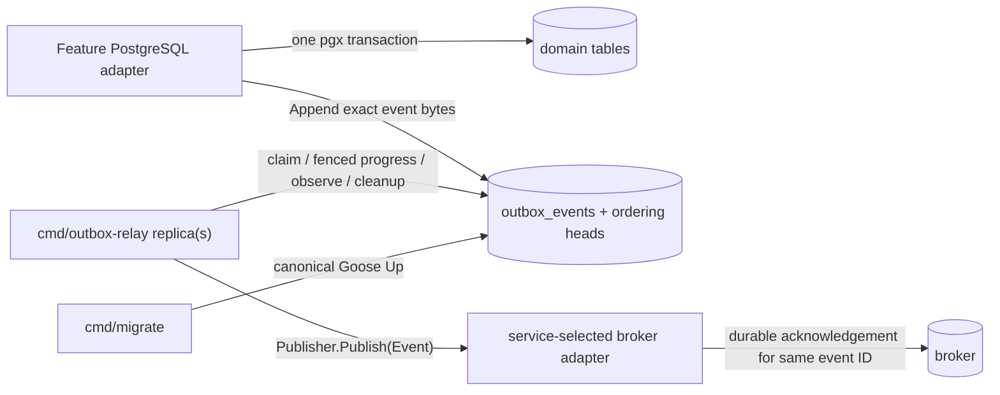
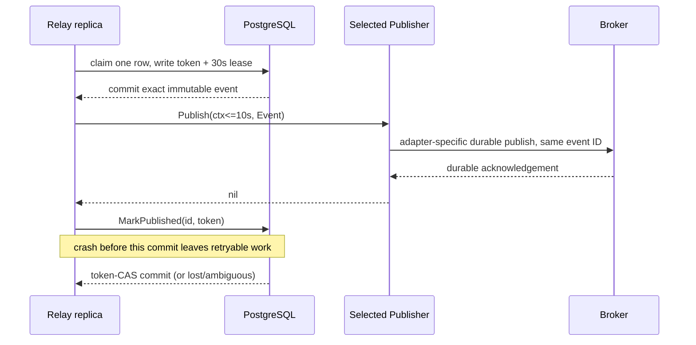

# PostgreSQL transactional outbox V1 design

status: ready

## Drivers and fixed boundaries

| Driver | Forced consequence | Acceptance / reopen boundary |
| --- | --- | --- |
| State and required event intent must agree | Feature mutation and append share one PostgreSQL transaction; no broker call occurs there; the existing transaction owner classifies unknown commit outcomes | Real PostgreSQL rollback, definite commit failure, and transport-loss commit-window proof |
| API survives broker outage | A committed row is the request-path finality boundary; relay owns later publication | API/domain commit continues while PostgreSQL accepts the finite backlog |
| At-least-once, crash recovery, multiple replicas | Short lease claim, publish outside SQL transaction, token-fenced progress update | Crash-after-ack produces the same event ID twice and never loss |
| No broker ownership | Broker-neutral event plus a one-method consumer-owned `Publisher`; no adapter or fallback ships | Missing builder fails relay startup; every selected adapter needs real-broker conformance |
| PostgreSQL 17 and merged migration transition are canonical | Normal transactional Goose migrations; sqlc reads their final schema; neither runtime migrates | Canonical source/history/image rehearsal passes |
| Structurally optional template pack | Every owned byte has an outbox profile marker/path and disappears for `OUTBOX=none` | Initialization purity and byte-stability matrix |
| Bounded work and shutdown | One in-flight event per relay, one-row claims, finite timeouts/retries/cleanup batches | Race/liveness, drain and forced-stop proof |
| Ordering survives event cleanup | A separate durable per-key high-water table owns append monotonicity | Lower/equal late inserts fail after event cleanup; row/byte growth is observed |

The template does not define a production throughput or outage-duration SLO.
V1 therefore fixes correctness bounds and query cardinality, not an invented
replica count or events/second promise. Representative pickup/drain, database
pool-wait, relation/index growth, vacuum, and claim-plan evidence are the
checkpoint for increasing concurrency, adding partitions, or selecting CDC.

## Architecture selection

### Selected: bounded PostgreSQL polling relay

PostgreSQL is both the feature-write authority and the outbox progress
authority. Every relay replica executes the same database claim protocol. A
claim locks at most one eligible row with `FOR UPDATE SKIP LOCKED`, writes a
lease token and server-clock expiry, and commits. The replica then publishes
outside the transaction and records the result with a token-guarded update.

This selection is based on operational fit, not coding convenience:

- the repository already owns PostgreSQL 17, pgx/sqlc, transaction bounds,
  Goose migration runtime, a separate-worker lifecycle, and OpenTelemetry;
- no logical-replication slot, WAL-retention owner, connector runtime, offset
  store, schema-history store, or CDC deployment exists;
- active/active relay replicas and ordinary SQL state make claim ownership,
  expiry, poison, redrive, cleanup, and rollback locally observable and
  independently testable;
- the broker adapter remains outside this capability instead of being selected
  indirectly by a CDC connector.

### Rejected target architectures

| Candidate | Why it loses against the same drivers | Reopen condition |
| --- | --- | --- |
| Debezium/CDC relay | Requires logical WAL, publication/slot lifecycle, offset and schema history stores, WAL-growth alarms, connector deployment and an active/passive publication owner absent from the repository. It does not remove duplicate handling or poison/replay ownership. | An accepted platform owner operates those resources and measured polling load or pickup latency violates an accepted budget. |
| Publish inside the feature transaction | Holds database locks across broker latency and still cannot atomically commit PostgreSQL plus an unrelated broker; failure semantics become dual-write or long-lock ambiguity. | Never for this contract. |
| Long SQL transaction around claim and publish | Serializes/holds row and connection state across broker I/O, harms shutdown, and still duplicates on ambiguous acknowledgement/commit. | Never for this contract. |
| Existing NATS worker/producer as the outbox owner | Couples the pack to a sibling transport and makes `OUTBOX=postgres` depend on `MESSAGING=nats-jetstream`. | A derived service may compose that adapter outside this pack after conformance proof. |
| Generic job framework/dependency | Watermill, PGQ, and River each add ownership or failure semantics that do not match the required transaction seam, fence, ordering, or profile removal; the repository already has the necessary pgx/stdlib/OTel primitives. | A maintained installed runtime becomes platform authority and preserves every fixed contract with less owned code. |

## Components, authority, and deployment graph



| Node/edge | Owner and finality |
| --- | --- |
| Feature adapter -> PostgreSQL | The feature owns the transaction and event meaning. Commit is finality for domain state plus publication intent, not for broker delivery. |
| `outbox_events` | Outbox pack owns immutable envelope and mutable delivery state. PostgreSQL row state is authoritative. |
| `outbox_ordering_heads` | Outbox pack owns the last admitted sequence per key independently of event retention. |
| `cmd/outbox-relay` | Outbox pack owns polling, lifecycle, bounded retries, poison/redrive mechanics, cleanup, and broker-neutral telemetry. It is separately deployable/scalable. |
| `Publisher` -> broker adapter | The relay initiates one immutable occurrence. The selected service adapter owns route mapping, connection security, transport telemetry, and durable acknowledgement. |
| Broker | Durable acknowledgement of the same event ID is authoritative for one publication attempt. PostgreSQL progress may lag and cause a duplicate. |
| `cmd/migrate` | Existing migration runtime exclusively owns schema change. No app or relay auto-migration exists. |

The affected release graph is the canonical additive PostgreSQL migrations, any
feature-writer deployment that begins appending, the separately deployed relay,
and an externally selected broker/adapter. This repository proves the migration,
writer/relay local path, and the accepted NATS adapter's event-ID acknowledgement
path in integration tests. It does not claim deployment, broker topology, ACL,
credentials, capacity, or a production adapter composition.

## Canonical schema

`migrations/000001_postgres_outbox.sql` remains the immutable first canonical
six-digit transactional Goose source. The additive transactional
`migrations/000002_postgres_outbox_ordering_ready.sql` backfills the materialized
head state and replaces the JSON/claim constraints and indexes. SQLC consumes
both files through
`internal/infra/postgres/sqlc.yaml`. Application startup and relay startup only
verify that required relations/columns are present by executing their first
bounded query; they never invoke Goose.

### `outbox_events`

| Column | PostgreSQL type/default | Rule |
| --- | --- | --- |
| `id` | `text PRIMARY KEY` | 1..256 UTF-8 bytes, no control characters; immutable publication identity |
| `event_type` | `text` | 1..256 bytes, no controls |
| `source` | `text` | 1..256 bytes, no controls |
| `destination` | `text` | 1..256 bytes, no controls |
| `schema_name` | `text` | 1..256 bytes, no controls |
| `occurred_at` | `timestamptz` | required; finite and not the Go zero instant, enforced in PostgreSQL as well as Go |
| `payload` | `bytea` | exact valid UTF-8 JSON bytes, 1..256 KiB |
| `metadata` | `bytea DEFAULT '\x7b7d'` | exact valid UTF-8 JSON object bytes, 2..32 KiB |
| `ordering_key` | `text NULL` | 1..256 bytes/no controls; paired with sequence |
| `ordering_sequence` | `bigint NULL` | positive; paired with key |
| `ordering_ready` | `boolean DEFAULT false` | meaningful only for ordered unpublished rows; true only for the current sequence of a key |
| `created_at` | `timestamptz DEFAULT clock_timestamp()` | database receipt time |
| `available_at` | `timestamptz DEFAULT clock_timestamp()` | next eligible server time |
| `cycle_attempt_count` | `integer DEFAULT 0` | resets only on explicit redrive |
| `total_attempt_count` | `bigint DEFAULT 0` | monotonic forensic count |
| `last_attempt_at` | `timestamptz NULL` | server time of last claim |
| `lease_token` | `text NULL` | opaque `crypto/rand.Text()` fencing token |
| `lease_expires_at` | `timestamptz NULL` | server-clock ownership expiry |
| `published_at` | `timestamptz NULL` | durable relay finalization time |
| `poisoned_at` | `timestamptz NULL` | terminal delivery-cycle time |
| `last_error_class` | `text NULL` | bounded relay enum only; never raw error text |
| `redrive_count` | `integer DEFAULT 0` | monotonic operator transition count |
| `last_redrive_id` | `text NULL` | latest retained audit identity for diagnostics |
| `last_redriven_at` | `timestamptz NULL` | server time of latest redrive |

Database checks enforce text limits/control exclusion; pairing and positive
ordering sequence; valid UTF-8/JSON by `convert_from(..., 'UTF8')::json`;
metadata object shape; exact byte caps; the 288 KiB sum over text/payload/
metadata; non-negative counters; and coherent terminal/lease columns. PostgreSQL
cast failure rejects malformed bytes. The `json` cast deliberately matches Go's
JSON validator while preserving exact `bytea`: unlike `jsonb`, it does not reject
valid JSON solely because a number exceeds PostgreSQL `numeric` or a string
contains the escaped zero code point. Go performs the same checks first for a
stable `ErrInvalidEvent`, but SQL constraints are the bypass-resistant authority.

Indexes are limited to current query shapes:

- primary key on `id`;
- unique partial `(ordering_key, ordering_sequence)` for ordered occurrences;
- partial claim index `(available_at, created_at, id)` where unpublished, not
  poison, and either unordered or `ordering_ready`;
- partial ordering-head lookup `(ordering_key, ordering_sequence)` where
  unpublished and `ordering_key IS NOT NULL`;
- unique partial `(ordering_key)` where unpublished, ordered, and
  `ordering_ready`, enforcing one materialized head per key;
- partial cleanup index `(published_at, id)` where published;
- partial poison index `(poisoned_at, id)` where poison.

No index includes payload or metadata. State-changing indexes mean updates will
not generally be HOT; bounded cleanup, autovacuum evidence, and relation/index
growth remain the operational guardrails. V1 has no partitioning.

### `outbox_ordering_heads`

| Column | Type | Rule |
| --- | --- | --- |
| `ordering_key` | `text PRIMARY KEY` | same 1..256 byte/control contract |
| `last_sequence` | `bigint` | positive last admitted value |
| `current_sequence` | `bigint NULL` | current unpublished head, or null when the key has no retained unpublished event |
| `updated_at` | `timestamptz` | server time of admission |

Ordered append first executes one `INSERT .. ON CONFLICT .. DO UPDATE WHERE
last_sequence < excluded.last_sequence RETURNING`. Zero returned rows means an
equal/lower sequence and aborts the feature transaction. Gaps are accepted.
When no unpublished head exists, the same locked statement installs the new
sequence as `current_sequence`; the event insert records whether it is that
head. The event insert follows in the same transaction. Published finalization
locks this same head row before changing the event, then atomically hands
`ordering_ready` to the next retained sequence. Append and finalization therefore
serialize on one row per ordering key without predecessor scans or in-memory
coordination. The high-water row has no automatic cleanup; observation reports
row count and table/index bytes.

### `outbox_redrives`

`audit_id text PRIMARY KEY`, `event_id text NOT NULL REFERENCES outbox_events
(id) ON DELETE CASCADE`, `redriven_at timestamptz`, and `cycle_number integer`
form the idempotency/audit ledger for retained events. A repeated audit ID for
the same event returns the recorded outcome without another transition; use for
a different event is rejected. The ledger is cleaned only when cleanup deletes
its already-published event, so it has the same seven-day post-publication
retention and never extends unfinished-row deletion eligibility.

The Down section drops `outbox_redrives`, then `outbox_events`, then
`outbox_ordering_heads`. It exists only for disposable rehearsal. Production
rollback never runs Down.

## SQL operations and concurrency

Hand-written SQL lives in
`internal/infra/postgres/queries/postgres_outbox.sql`; sqlc-generated code under
`internal/infra/postgres/sqlcgen` is derived authority.

### Append

`Append(ctx, tx, Event)` validates the immutable envelope, advances the ordering
head when present, then inserts the event through queries bound directly to the
caller's `pgx.Tx`. It never starts, commits, or rolls back a transaction. The
feature uses the existing `postgres.Pool.InTx`; any append/statement/commit
failure follows the existing transaction error path and cannot leave one side
committed alone.

The selected feature contract requires the transaction owner to distinguish a
known failed commit from an unknown outcome. `postgres.Pool.InTx` therefore
replaces its `pgx.BeginTxFunc` delegation with the same explicit begin/callback/
rollback/commit sequence and preserves `ErrTransaction` for compatibility:

- begin, callback, and rollback-path errors remain ordinary transaction errors;
- `pgx.ErrTxCommitRollback`, `pgconn.SafeToRetry(err)`, and PostgreSQL errors
  other than SQLSTATE `08007` (`transaction_resolution_unknown`) or `40003`
  (`statement_completion_unknown`) are definite failures and cannot have
  produced the requested commit result;
- any other commit transport/context result additionally wraps the new
  `postgres.ErrCommitUnknown` sentinel. The caller reports ambiguity and does
  not manufacture or retry a new event occurrence.

This classification stays in `internal/infra/postgres`, the only owner that
observes the transaction stage and raw pgx/pgconn result. It is not an outbox
unit-of-work abstraction. Existing callers that only test `ErrTransaction`
continue to work. Focused tests cover callback rollback, deferred-constraint
commit rejection as definite, a definitely-unsent commit, and a connection-loss
commit result as unknown; the integration oracle reads durable state rather
than assuming whether the unknown commit landed.

For deterministic production-path proof, `Pool` owns one unexported commit
function initialized by `New` to `pgx.Tx.Commit`. It is not an option, public
interface, or runtime mode. A same-package integration test replaces it before
concurrent use with a fault function that calls the real commit and then returns
an opaque transport error, proving that `InTx` returns `ErrCommitUnknown` while
an independent connection observes the committed rows. This is the smallest
seam that can model a lost commit response without a protocol proxy or guessing
from a connection-kill race.

### Claim

One statement and transaction performs:

1. Select one row whose `published_at` and `poisoned_at` are null, which is
   unordered or has `ordering_ready = true`, whose `available_at <=
   statement_timestamp()`, and whose lease is null or expired.
2. The materialized `ordering_ready` state keeps retry, lease, recovery, and
   poison heads ahead of every later sequence without a correlated predecessor
   scan.
3. Order by `available_at, created_at, id`; lock the candidate with
   `FOR UPDATE OF outbox_events SKIP LOCKED LIMIT 1`.
4. Update it with a newly supplied token, `lease_expires_at =
   statement_timestamp() + lease_duration`, attempt counters, and
   `last_attempt_at = statement_timestamp()`, then return the exact envelope/state.

The CTE locks a physical candidate only for this short transaction. Committing
the token and expiry creates durable ownership. With one current lease per row,
concurrent replicas either claim different eligible rows or see no work. A
lease is never extended in V1: the 30-second lease exceeds the 10-second
publication attempt plus bounded progress update margin. Increasing publication
timeout must keep that inequality or startup validation rejects the config.

### Token-fenced progress

Every progress statement requires `id`, token, unpublished/not-poison state,
and the same unexpired current lease:

- `MarkPublished` sets `published_at=statement_timestamp()`, clears lease/error;
- `ScheduleRetry` sets server-clock `available_at + jitter`, error class, clears
  lease;
- `MarkPoison` sets `poisoned_at=statement_timestamp()`, error class, clears lease.

For an ordered row, `MarkPublished` is one data-modifying CTE statement. Its
`RETURNING` dependencies first lock the durable head, then apply the token/
expiry fence with the exact ordering identity, move `current_sequence`, and
unblock the next retained row. The next-row read depends on the locked head and
excludes the current sequence, so it does not depend on seeing another CTE's
heap update through the shared statement snapshot. Unknown outcomes retain the
same reconciliation and at-least-once duplicate behavior as the unordered
one-statement update.

Zero affected rows is `ErrLeaseLost`; it never becomes delivery. If the
published-state commit is ambiguous, the relay reads the row after reconnect:
published with no token is success; the same live token is finalized again;
another token or an unfinished/unknown result is left for recovery and may
duplicate. No statement deletes an unfinished row.

### Retry, poison, redrive, cleanup, observation

- Retry uses full-jitter exponential delay in `[0, min(5m, 1s*2^(attempt-1))]`.
  The relay supplies the chosen interval; PostgreSQL supplies absolute time.
- `errors.Is(err, ErrPermanentPublication)` poisons immediately. Timeout,
  disconnect, cancellation, and ambiguous acknowledgement are retryable unless
  process shutdown owns cancellation. Claim 10 ends the delivery cycle as
  poison. Only bounded class enums are stored/labelled.
- `Redrive(ctx, id, auditID)` is one transaction: resolve an existing audit ID
  idempotently, otherwise lock a poison row, insert the retained audit record,
  clear poison/error/lease, reset cycle attempts and availability, increment
  redrive count, and record the latest audit ID/server time. Reuse for another
  event is rejected. There is no HTTP/CLI operator surface in V1.
- Cleanup selects at most 1,000 rows with `published_at < statement_timestamp()-7d`
  using `FOR UPDATE SKIP LOCKED`, deletes only those IDs, and commits. Multiple
  replicas are safe; ordering heads are unrelated and cannot be deleted. An
  incomplete batch returns to the minute cadence; a full batch schedules the
  next bounded batch no later than the poll interval, so retention drain is not
  capped at 1,000 rows/minute.
- Observation is one linear read-only aggregate over materialized state plus
  `min` timestamps and a separate exact high-water count. Table/index byte
  values include events, ordering heads, and redrive ledger through PostgreSQL
  size functions. It runs every five seconds under the existing statement/
  acquire bounds; a failed periodic query preserves the prior sample, advances
  no observation timestamp, and retries from completion without terminating the
  otherwise healthy process. Readiness expires after two observation intervals.

Cleanup and observation are separate relay maintenance tasks. Their normal
cadence is one minute and five seconds respectively; publication never waits
for telemetry export, and cleanup interleaves one bounded batch with publication.

## Relay and acknowledgement sequence



`Publisher` is declared in the consumer package:

```go
type Publisher interface {
    Publish(context.Context, Event) error
}
```

Nil is valid only after durable broker acknowledgement for `Event.ID`.
`ErrPermanentPublication` is the one optional classification seam. The pack
ships no implementation. `cmd/outbox-relay/main.go` deliberately passes no
builder; bootstrap rejects it before config/dependency mutation. A derived
service supplies a builder from its chosen transport package. No noop, logging,
discard, in-memory, or fire-and-forget fallback exists.

An admitted Publisher must stop using the Event and all borrowed dependencies
when `Publish` returns and must react to context cancellation. The relay still
does not trust that promise for process safety. It executes the single current
call in exactly one supervised goroutine. At the ten-second attempt deadline it
cancels the call and gives it one fixed second to return:

- if it returns, timeout or cancellation remains an ambiguous publication
  failure and the token-fenced retry policy applies;
- if it does not return, the relay records no progress transition, starts no
  further claim or goroutine, becomes unready, and returns fatal
  `ErrPublisherStuck` with `cleanupSafe=false`;
- bootstrap then skips Publisher and PostgreSQL cleanup that could race the
  still-running call, completes safe diagnostics and telemetry handling, and
  returns from `main`; process exit is the termination boundary and the
  committed lease later expires.

Ordinary attempts therefore cannot accumulate abandoned goroutines. Adapter
conformance includes prompt cancellation, but a broken adapter degrades to one
unsafe-to-clean process exit rather than an unbounded hang or resource race.

The deterministic publisher harness records attempt IDs/envelopes and controls
error, acknowledgement, blocking, cancellation, and the crash-before-finalize
hook. A separate NATS JetStream integration test maps the same event ID to the
accepted `natsjs.Event` identities and proves that `Producer.Publish` returns
nil only after JetStream `PubAck`; it is removed if either profile is absent and
does not become production composition.

## Relay process and lifecycle

`cmd/outbox-relay` follows the existing worker composition pattern without
sharing broker-specific code:

1. reject a nil `PublisherBuilder` before config load;
2. parse standard config options under the 15-second startup budget;
3. require `outbox.enabled`, `postgres.enabled`, diagnostics address, and a
   valid lease/timeout/drain budget;
4. initialize logger, repository telemetry, PostgreSQL pool, and publisher;
5. verify events, ordering-head, and redrive relations through an initial
   observation, start diagnostics, publish
   ready, then supervise the relay loop;
6. on SIGTERM, publish unready, stop claims, allow the one in-flight publish up
   to the 20-second outbox drain budget, then cancel it; the relay gives the
   Publisher its fixed one-second termination allowance and bootstrap joins the
   relay inside a two-second outer bound. Close publisher and pool only when
   the relay reports `cleanupSafe`, then close diagnostics and telemetry within
   `http.grace_period`; Publisher cleanup is supervised by its own five-second
   bound and a timeout or panic becomes a process error. Validation reserves
   every one of those serial bounds.

An empty fresh observation is ready. A successful sample remains fresh for two
observation intervals, so a valid long-running observation does not make the
process flap unready. A transient broker failure after admission
remains ready while retry/backlog signals change. Database/schema/observation
loss, fatal Publisher panic, relay-loop exit, or drain is unready. Liveness is
process/diagnostics-loop only. A publisher panic is recovered at the loop
boundary solely to return a fatal supervised error; it does not mark retry,
poison, or success. Forced shutdown leaves the committed lease to expire. A
Publisher that does not stop after cancellation produces the same
cleanup-unsafe exit used by the current worker lifecycle; bootstrap never races
dependency cleanup against unknown goroutine ownership.

The process owns one in-flight publication. Replicas are the concurrency knob;
no goroutine pool, channel queue, lease-renewal goroutine, or local durable state
is introduced.

## Configuration

The retained profile adds `config.OutboxConfig` and these canonical keys:

| Key | Default / validation |
| --- | --- |
| `outbox.enabled` | `false`; when true PostgreSQL must be enabled |
| `outbox.poll_interval` | `500ms`, positive |
| `outbox.publish_timeout` | `10s`, positive |
| `outbox.lease_duration` | `30s`, greater than publish timeout, the fixed one-second Publisher termination allowance, acquire timeout, and PostgreSQL statement-timeout headroom |
| `outbox.max_attempts` | `10`, 1..100 |
| `outbox.retry_base` / `retry_max` | `1s` / `5m`, positive and ordered |
| `outbox.observation_interval` | `5s`, positive |
| `outbox.cleanup_interval` | `1m`, positive |
| `outbox.published_retention` | `168h`, positive |
| `outbox.cleanup_batch_size` | `1000`, 1..10000 |
| `outbox.drain_timeout` | `20s`, positive and must fit the existing process grace budget |

These are operational policy inputs, not per-event choices. Environment names
follow the existing `APP__OUTBOX__...` mapping. An initialized template that
retains the pack documents the keys in `env/.env.example`. When the pack is
removed, the type, defaults, validation, environment examples, tests, and docs
are absent.

## Observability and recovery

`internal/infra/postgresoutbox/telemetry.go` registers bounded OpenTelemetry
instruments through the existing meter provider. A background observation
stores the latest immutable snapshot; callbacks never query PostgreSQL.

- `outbox.relay.messages{state}` gauge for eligible, in-progress, retry-wait,
  recovery-due, poison, and published-retained;
- `outbox.relay.oldest.timestamp{state}` gauge;
- `outbox.relay.observation.timestamp` and
  `outbox.relay.last_progress.timestamp` gauges;
- `outbox.relay.ordering_heads` and event/high-water/redrive table/index byte
  gauges;
- operation counter and duration histogram with bounded `operation`, `outcome`,
  and `error.type` enums;
- process-local inflight and readiness gauges.

Every state series is initialized at zero. Fleet queries take `max` over fresh
database-global gauges and sum process counter rates. Event/destination/key/
tenant/error text are not labels. Normal successes are counters, not per-event
logs. Lifecycle, poison, lost-lease recovery, redrive, cleanup failure, and
shutdown logs use fixed messages and bounded fields; payload, metadata, DSN,
credentials, SQL, and raw adapter/database errors are excluded. Entity IDs are
reserved for terminal/recovery/redrive forensics.

Operator recovery is explicit:

1. confirm the state observation is fresh;
2. locate the stopped stage from claim/publish/progress counters;
3. restore PostgreSQL or broker/adapter capability;
4. for poison, correct the cause and invoke an authenticated service-owned
   operation that calls `Redrive` with a unique audit ID;
5. close only after fresh state shows resumed durable progress and requested
   poison/recovery rows have durable outcomes.

No automatic redrive or discard exists. V1 replay means lease-expiry recovery
or explicit poison redrive with the same occurrence ID. A published occurrence
is final in PostgreSQL and cannot be redriven; arbitrary historical replay is
outside this pack.

## Profile and generated ownership

`scripts/init-module.sh` parses `OUTBOX` before mutation, defaults to `none`, and
admits only `none|postgres`. It rejects `OUTBOX=postgres DATABASE=none` before
changing any file. `template.lock` records `outbox = "..."`; same-choice reruns
remain byte-stable and a different choice is rejected.

For `OUTBOX=none`, the initializer removes:

- `cmd/outbox-relay/` and `internal/infra/postgresoutbox/`;
- both `migrations/000001_postgres_outbox.sql` and
  `migrations/000002_postgres_outbox_ordering_ready.sql`, the outbox sqlc query, and current
  outbox-derived sqlc output; it removes `migrations/` when empty;
- the deterministic/real-broker outbox tests and reference transaction proof;
- the outbox doc and its links;
- all marked config/default/env, Make, Docker image, Compose/CI, lint/test, and
  build/help surfaces.

The generic `postgres.Pool.InTx` commit-outcome classification is deliberately
retained under every outbox profile and is excluded from this removal list.

No outbox-specific module dependency is added. The generated sqlc directory is
outbox-owned in this current outbox-only migration template. Initialization occurs
before derived features add their own generated queries, so removing it is
unambiguous. Any future template profile that adds another migration/sqlc owner
must replace this path deletion with regeneration from retained canonical
sources before that profile can merge.

For `OUTBOX=postgres`, markers are removed while content remains. The Docker
build includes `/outbox-relay`; `/migrate` and `/migrations` remain owned by the
PostgreSQL profile. The real NATS integration test is listed in both outbox and
messaging removal sets so either absent capability physically removes it.

## Go code and file ownership

### Runtime package: `internal/infra/postgresoutbox`

| Responsibility | File / shape | Dependency and authority |
| --- | --- | --- |
| Immutable envelope, validation, ID helper | `event.go` | Concrete `Event`; `NewID` uses `crypto/rand.Text`; no domain event definitions |
| Consumer boundary | `publisher.go` | One-method `Publisher`; `ErrPermanentPublication`; no implementation |
| Append/claim/progress/redrive/cleanup/observe | `store.go` | Concrete `Store` over existing `*postgres.Pool`; append accepts `pgx.Tx`; sqlc is generated query authority |
| One-at-a-time loop, retry/drain/crash handling | `relay.go` | Public composition accepts concrete `*Store` and consumer-owned `Publisher`; an unexported store contract is the deterministic fault seam; no clock/factory interface |
| Bounded metrics/logging snapshot | `telemetry.go` | Existing OTel meter/slog; callbacks read memory only |
| Focused unit proof | sibling `_test.go` files | Validation, backoff bounds, panic/cancel/lifecycle, metrics attributes |

The package is infrastructure because it owns PostgreSQL queue mechanics and
broker-neutral relay process behavior, not business decisions. Feature code
does not import it directly. A feature-owned PostgreSQL adapter already imports
infrastructure generated queries and calls `postgresoutbox.Append` while it owns
the transaction; this preserves the repository's feature/infra direction
without adding a speculative feature port.

The relay's unexported store contract is owned by this consumer and mirrors only
the operations its loop invokes. Production construction still requires the
concrete `*Store`; the contract exists solely to make claim, progress, poison,
maintenance, and crash failures deterministic without weakening the required
real-PostgreSQL transaction and locking proof. Reopen this decision if a second
production store appears; it does not authorize another persistence adapter.

### Existing transaction owner: `internal/infra/postgres`

`postgres.go` remains the sole transaction-lifecycle owner. `InTx` gains the
stage-aware commit sequence and exported `ErrCommitUnknown` classification;
existing `ErrTransaction` matching and callback behavior remain compatible.
The concrete `Pool` also owns the unexported commit fault seam described above;
production always installs the real pgx commit function. `postgres_test.go` plus
same-package real-PostgreSQL integration proof own the change. No outbox package
parses pgx/pgconn transport errors.

This stage-aware result is retained generic PostgreSQL infrastructure, not an
outbox-profile surface: it corrects the meaning of the existing `InTx` owner
for every caller and adds no outbox type, config, command, dependency, or
runtime path. `OUTBOX=none` therefore keeps `ErrCommitUnknown` and its focused
generic tests; the initializer neither marks nor removes them.

### Composition: `cmd/outbox-relay`

`main.go` calls `bootstrap.Run(args, nil)` to fail closed in the template.
`internal/bootstrap` owns config loading, diagnostics/readiness, telemetry/pool/
publisher construction, supervision, signals, shutdown order, the relay's
explicit `cleanupSafe` result, and bootstrap integration tests.
`PublisherBuilder` is the only composition seam and returns the publisher plus
bounded cleanup. This mirrors the current worker's explicit missing-handler and
unsafe-cleanup admission without importing its NATS-specific code.

### Canonical and support surfaces

- migrations: immutable `migrations/000001_postgres_outbox.sql` plus additive
  `migrations/000002_postgres_outbox_ordering_ready.sql`;
- query source: `internal/infra/postgres/queries/postgres_outbox.sql`;
- generated: `internal/infra/postgres/sqlcgen/*` via existing `make sqlc`;
- config: existing `internal/config`, `env/.env.example`;
- commands/image: `Makefile`, `build/docker/Dockerfile`, relevant CI/local-image
  assertions;
- template: `scripts/init-module.sh`, `scripts/ci/template-init-check.sh`;
- docs: `docs/postgres-transactional-outbox.md` plus narrow indexes;
- real PostgreSQL proof: `test/postgres_outbox_integration_test.go`;
- process proof: `cmd/outbox-relay/internal/bootstrap/*_test.go`;
- real broker proof: `test/postgres_outbox_natsjs_integration_test.go`.

No broker adapter, inbox, domain event, public redrive endpoint, generic unit of
work abstraction, new dependency, lease renewal, internal work queue, or CDC
scaffolding is added.

## Rollout, rollback, and compatibility

1. For a populated version-1 schema, drain and stop every old relay, quiesce all
   old writers, wait for their transactions to finish, and require every old
   process to exit. The version-1 writer/relay is not compatible with the
   materialized version-2 head state. A fresh database skips this transition.
2. Run the exact built `/migrate` image against the target database, verify
   source/history/status, and require the documented ordering-head invariant
   readback to return zero rows before reopening traffic.
3. Deploy only version-2 writers that append the exact-byte envelope. Never run
   a version-1 writer or relay against schema version 2.
4. Deploy a relay composition only after its selected adapter's real-broker
   event-ID/durable-ack conformance, credentials/topology, and capacity are
   owned externally.
5. Require fresh observation, bounded backlog age/growth, progress, poison,
   relation/index size, vacuum, and database pool evidence before declaring the
   system publication path ready.

After the version-2 fence, the API may precede the relay and backlog. The relay
may precede writers and see an empty queue. Deploy rollback stops writer
behavior and/or relay but preserves schema, rows, ordering heads, and already
published events. Production does not normally run Down. If newly accepted
`json` bytes are incompatible with `jsonb`, `000002` Down fails closed rather
than changing or discarding them; recovery stays on version 2 unless a separate
data transition is reviewed. The V1 envelope remains readable until every unpublished/poison row
and the seven-day published retention window are closed. Incompatible envelope
contraction or ordering-head retirement is a separate migration/release design.

## Proof boundary and decision reopens

- Local completion proves source/schema/config/profile purity, real PostgreSQL
  correctness, deterministic crash windows, current NATS conformance, process
  lifecycle, race/liveness, image content, and current-tree repository gates.
- It does not prove a service-specific domain event, production adapter,
  topology/ACL/credentials, deployment, database durability settings, capacity,
  alert thresholds, or consumer deduplication.
- Increase per-process concurrency or add lease renewal only after a
  representative single-flight replica set misses accepted pickup/drain bounds.
- Add partitioning only after measured relation/index/vacuum or bounded-cleanup
  failure and a proven partition key/lifecycle.
- Retire ordering heads only after a feature supplies a terminal-key contract
  and retained rows/bytes violate an accepted maintenance/storage budget.
- Reopen CDC only under the selection condition above; do not add a dormant
  connector abstraction.
